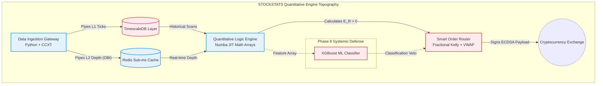

# STOCKSTATS: Quantitative Statistical Arbitrage Engine

## Overview
STOCKSTATS is a proprietary, internally developed algorithmic trading platform built specifically for a **bootstrapped, basement startup**. It is expressly designed to deploy and violently protect personal retirement capital across fragmented global liquidity pools.

We are not building a generic "crypto trading bot." We are building a mathematically rigorous Statistical Arbitrage and Volatility Engine. Every physical trade must mathematically prove a Positive Expected Value ($E(R) > 0$) while surviving predatory institutional High-Frequency Trading (HFT) environments through structural defenses like VWAP micro-slicing and Copula tail-risk algorithms.

## The Pragmatic Roadmap (9 Phases)
Because we are trading our own personal capital, we unconditionally recognize that autonomous trading carries extreme systemic risk. We reject monolithic "Big Bang" deployment. The system is constructed defensively in [9 distinct sequential phases](docs/strategy/00_roadmap.md):

1. **The Ingestion Scrubber:** Point-in-time data gathering and MAD Hampel mathematical filtering.
2. **The Logic Engine ($E(R) > 0$):** GARCH and Cointegration signaling & Shadow Mode forward-testing.
3. **The Grafana Command Center:** Manual execution (Human-in-the-Loop) using visual Phase 1 telemetry.
4. **Risk Matrices & Sizing:** Copula crash detection and Fractional Kelly trade sizing.
5. **The Smart Order Router (SOR):** VWAP slicers and OBI Toxicity vetos.
6. **Systemic Reconciliation:** The UUID State Machine and HTTP 504 Timeout Rescue protocol.
7. **Full Autonomy (Basement Server):** Severing the UI and physically isolating the core engine.
8. **Machine Learning Overlays:** XGBoost Meta-Labeling to mathematically veto False Positives.
9. **Cloud VPC Migration (AWS):** Shifting the proven architecture to Tokyo for sub-millisecond latency.

---

## ⚡ The Definitive Technology Stack
STOCKSTATS entirely rejects Enterprise Java and legacy generic web stacks in favor of high-velocity Quantitative Mathematics:
*   **The Math Engine:** Python 3.11+ natively compiled to C-level machine code via **Numba (LLVM)**.
*   **The Command UI:** Next.js (React/TypeScript) utilizing Zustand state and TradingView WebGL arrays.
*   **The Quantitative Ledger:** TimescaleDB (Relational PostgreSQL) strictly isolated via Docker allocations.
*   **The High-Frequency Cache:** Redis (Pub/Sub Event Bus and L2 Order Book depth arrays).
*   **DevOps Architecture:** Strictly Dockerized Microservices. Zero "Standard VM" installations.

---

## 📚 Core Architecture Blueprints (The Strategies)
The system's structural topography is heavily documented in the `docs/strategy/` directory:

1. [Strategy 00: The Roadmap](docs/strategy/00_roadmap.md)
2. [Strategy 01: Project Vision & Scope](docs/strategy/01_project_vision_and_scope.md)
3. [Strategy 02: Data Architecture](docs/strategy/02_data_architecture.md) (TimescaleDB, Redis, Microsecond Aggregation)
4. [Strategy 03: Mathematical Models Summary](docs/strategy/03_mathematical_models.md)
5. [Strategy 04: Notification Engine](docs/strategy/04_notification_engine.md)
6. [Strategy 05: Execution and Risk](docs/strategy/05_execution_and_risk.md) (**Cancel-on-Disconnect**)
7. [Strategy 06: Internal Operations](docs/strategy/06_internal_operations.md) (**Poison Seed API Rotation**)
8. [Strategy 07: Frontend and Navigation](docs/strategy/07_frontend_and_navigation.md)
9. [Strategy 08: Backend Architecture](docs/strategy/08_backend_architecture.md)
10. [Strategy 09: Technology Stack](docs/strategy/09_technology_stack.md)
11. [Strategy 10: Manual Trading Phase 1](docs/strategy/10_phase_3_manual_trading.md) (**The Bootstrapped MVP**)
12. [Strategy 11: Database Schema & Ledgers](docs/strategy/11_database_schema_and_ledgers.md) (**Off-Site S3 WAL Backup**)
13. [Strategy 12: Execution Sprints and Tickets](docs/strategy/12_execution_sprints_and_tickets.md) (**The Master Task Tracker**)
14. [Strategy 13: Team Orientation and Training](docs/strategy/13_team_orientation_and_training.md)
15. [Strategy 14: Shadow Paper Trading](docs/strategy/14_paper_trading_and_forward_testing.md)

---

## 🧠 The Quantitative Engine (The Models)
The mathematical frameworks that generate Alpha are distinctly documented in the `docs/models/` directory.

### Core Signal Generation
* [Model 01: GARCH(1,1) Volatility Indexing](docs/models/01_garch_volatility.md)
* [Model 02: Cointegration & Statistical Arbitrage](docs/models/02_cointegration_arb.md)
* [Model 03: Hidden Markov Macro Regimes](docs/models/03_hmm_macro_regimes.md)
* [Model 07: Kalman Filter Dynamic Hedging](docs/models/07_kalman_filter_hedging.md)
* [Model 08: Ornstein-Uhlenbeck (OU) Half-Life](docs/models/08_ou_process_half_life.md)

### Execution & Microstructure Defense
* [Model 04: VWAP Distribution & Block Slicing](docs/models/04_vwap_liquidity.md)
* [Model 13: Order State Machine & Reconciliation](docs/models/13_state_machine_reconciliation.md)
* [Model 14: Data Scrubbing & Hampel Filters](docs/models/14_data_scrubbing_hampel.md)
* [Model 15: L2 Order Book Imbalance (OBI) Veto](docs/models/15_order_book_imbalance.md)

### Risk & Capital Matrices
* [Model 05: Expectancy & System Quality Number (SQN)](docs/models/05_expectancy_and_sqn.md)
* [Model 06: Clayton Copulas & Fractional Kelly Sizing](docs/models/06_copula_kelly_sizing.md)
* [Model 12: Parametric Value at Risk (VaR)](docs/models/12_value_at_risk_var.md)

### Auditing & Meta-Labeling
* [Model 09: Fractional Differencing Arrays](docs/models/09_fractional_differencing.md)
* [Model 10: XGBoost Meta-Labeling Engine](docs/models/10_xgboost_meta_labeling.md)
* [Model 11: Deflated Sharpe Ratio Backtesting](docs/models/11_deflated_sharpe_backtesting.md)

---

## Execution Status
As of **Sprint 1**, the structural blueprint is 100% complete and verified. The absolute next step is to open the terminal and execute `docker-compose up -d` to physically scaffold the TimescaleDB and Redis containers.
