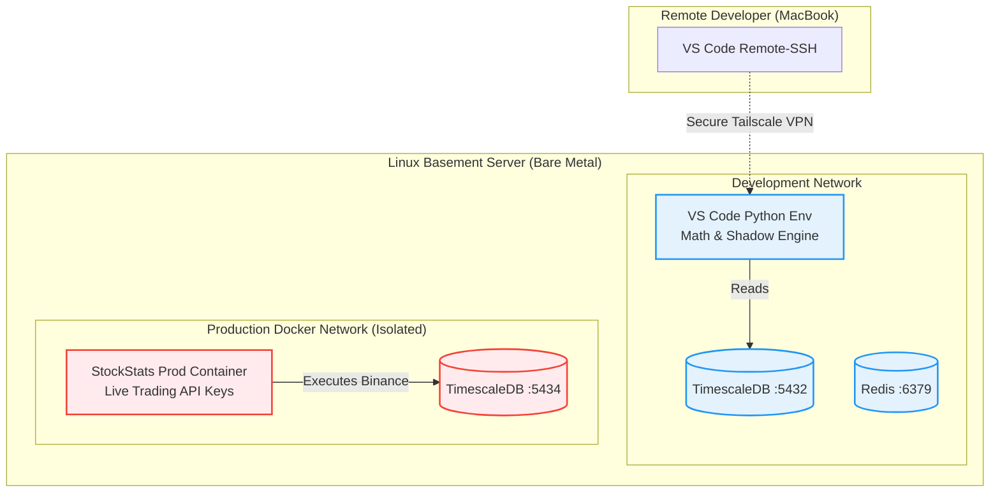

# Sprint 1 Implementation: Infrastructure & DevOps

## The Objective
Before a single line of quantitative mathematics is written, we must pour the concrete foundation. This Master Sprint Document defines the exact physical servers, the remote collaboration environments, the CI/CD pipelines, and the physical directory scaffolding required to host STOCKSTATS.

This document consolidates six distinct architectural pillars:
1.  **Hardware Sizing:** What physical machines run the code.
2.  **Environment Isolation:** 12-Factor App methodology for Dev/Staging/Prod.
3.  **Remote Collaboration:** Tailscale VPN and VS Code Remote environments.
4.  **Git Workflows:** Trunk-Based Development and Code Reviews.
5.  **AI Integration:** How humans and Agents collaborate.
6.  **Core Scaffolding:** Building TimescaleDB, Redis, and Python locally.

---

## Pillar 1: Hardware & Infrastructure Sizing Matrix

As we transition from theory to execution, the physical machines running the STOCKSTATS codebase must scale alongside the software phases. 

### 1.1 Sprints 1-5: The Phase 1 MVP (Centralized Basement Server)
We prioritize cost and iteration speed. Instead of developers working in silos on laptops, we utilize a **Centralized Basement Server** (DevBox & Data Hub) from Day 1.

*   **Persistent Data Ingestion:** The server runs TimescaleDB 24/7. This guarantees an unbroken dataset of L1 ticks.
*   **VS Code Remote Development:** Developers write code directly on the server's compute cycles via SSH.

**Minimum Hardware Specifications:**
*   **CPU:** 8+ Cores (e.g., Intel i7/i9, AMD Ryzen 7/9). Simulates execution loops and handles simultaneous SSH sessions.
*   **RAM:** 32-64 GB. TimescaleDB and Pandas matrices consume massive memory.
*   **Storage:** 1 TB NVMe SSD. Mandatory to prevent TimescaleDB I/O queuing.
*   **Network:** Stable 500+ Mbps Fiber connection. 

### 1.2 Sprints 6-9: Autonomous Execution (Production Deployment)
For the foreseeable future, **Production will run alongside Development on the Basement Server**. A strong local server can handle both workloads brilliantly, provided they are heavily guarded by strict Docker boundaries.

*   **Machine Type:** The existing Centralized Basement Server.
*   **The Docker Mandate:** Production logic does *not* execute natively. It runs inside a locked Linux Docker Container (`stockstats-prod-engine`). If the dev team crashes the system with a memory leak during testing, Docker limits guarantee the Production Engine is unaffected.
*   **Future Note on Latency Arbitrage:** In Phase 8, when sub-millisecond latency becomes a limiting factor, we can migrate the `stockstats-prod-engine` Docker container to an AWS VPS in Tokyo (`ap-northeast-1`). Until then, domestic network latency is acceptable for our macroscopic $E(R)>0$ edge.

### 1.3 Sprint 10: Machine Learning (GPU Acceleration)
Compiling XGBoost gradient trees across 100 boosting rounds is slow on a standard CPU. However, if the Basement Server has a high-end dedicated GPU (e.g., NVIDIA RTX 3090 / 4090), we do not need AWS Cloud.

*   **GPU:** The local NVIDIA card inside the Basement Server.
*   **Cost Strategy:** Zero marginal cost. We train the trees locally, save the `meta_model.json`, and pass it locally to the Production Container.

---

## Pillar 2: Environment Management & CI/CD

An algorithmic trading machine with direct API access to retirement accounts cannot be tested "live." We adhere to the **12-Factor App Methodology**, strictly separating Configuration (`.env`) from Code.

### 2.1 The Three Isolated Environments (Single Bare-Metal)
Because all three stacks live on the identical Basement Server, we achieve isolation entirely through **Docker Networking** and **Port Mapping**.

1.  **🟢 Development (DEV):** 
    *   **Architecture:** Runs natively via VS Code remote (`python3 ingest.py`). Connects to `localhost:5432` (Dev Timescale).
    *   **Keys:** Binance Testnet or Read-Only Mainnet keys.
    *   **Execution:** Blocked. `STOCKSTATS_EXECUTION_MODE=SHADOW`
2.  **🟡 Staging / Paper Trading (UAT):** 
    *   **Architecture:** Runs inside a Docker Container (`stockstats-staging`). Connects to `localhost:5433` (Staging Timescale).
    *   **Goal:** Forward-testing over 30 days. Uses Read-Only Mainnet Keys. Trades route exclusively to the local SQL `shadow_execution_ledger` to simulate slippage without risking capital.
3.  **🔴 Production (PROD):** 
    *   **Architecture:** Runs completely headless inside an isolated Docker Container (`stockstats-prod`). Connects to an incredibly secure `localhost:5434` (Prod Timescale bindings limited to the Docker Bridge).
    *   **Keys:** Binance Mainnet TRADING Keys (Withdrawals disabled at exchange).

### 2.2 GitHub Actions / Local Scripts (CI/CD)
*   **CI (Testing):** Before merging to `main`, GitHub Actions runs `flake8`, `black`, and `pytest`. If mathematical validation fails (e.g., Hampel filter returns wrong MAD), GitHub physically blocks the "Merge" button.
*   **CD (Deployment):** Merging a PR into `main` signals the Basement Server to `git pull`, rebuild the Production Docker image (`docker build -t stockstats-prod .`), and hot-swap the internal container.

---

## Pillar 3: Remote Development Environment

This section provides the implementation steps for configuring the Basement Server for a distributed team.

### 3.1 Network & User Setup
1.  **Tailscale VPN:** Install Tailscale on the Ubuntu Server (`sudo tailscale up`) and all developer laptops to create a zero-config encrypted peer-to-peer intranet. No router port-forwarding required.
2.  **User Provisioning:** No `root` access. Create isolated Linux profiles: 
    ```bash
    sudo adduser dev_alice
    sudo usermod -aG sudo dev_alice
    sudo usermod -aG docker dev_alice
    ```
3.  **SSH Key Injection:** The Admin pastes the developer's `id_ed25519.pub` into `/home/dev_alice/.ssh/authorized_keys`.

### 3.2 The VS Code Remote-SSH Workflow
Developers code locally on Macs, executing physically on the Basement Server.
1.  Install **Remote - SSH** in Visual Studio Code.
2.  Add the Host to `~/.ssh/config` using the Tailscale IP and the specific `User dev_alice`.
3.  Connect to Host -> Open Folder `/opt/stockstats/` (Shared repository namespace with `775` permissions).
4.  Non-developer Traders simply open Chrome and navigate to `http://<tailscale-ip>:3000` to view live Grafana panels.

---

## Pillar 4: Git & GitHub Collaboration Workflows

We utilize a rigorous **Trunk-Based Development** model.

1.  **The `main` Branch is Sacred:** Direct commits to `main` are strictly prohibited via GitHub Branch Protection.
2.  **Feature Branches:** Every ticket becomes an isolated branch (e.g., `feat/2.1-garch-volatility`). Branches live $< 48$ hours.
3.  **Pull Requests (PR):** Every PR must be reviewed by at least one other human or the AI Architect. PRs must contain mathematical validation proofs.
4.  **Squash and Merge:** Approving a PR crushes the messy commit history into one atomic commit on `main`.

---

## Pillar 5: Antigravity AI Integration

The system is cooperatively engineered between human experts and the Antigravity AI Agent. To prevent "hallucinated" architectures:

1.  **Context Injection:** Tell the AI explicitly which docs to read before asking it to code. *"Read `02_sprint_2_ingestion_engine.md` and execute Step 1."*
2.  **The View-File Loop:** Ask the AI to read the current state of a `.py` file before modifying it.
3.  **Planning vs. Execution:** Explicitly dictate the mode. If the AI is writing `.md` blueprints, do not prompt it to deploy a Docker container in the same command. Let the AI state its mode.

---

## Pillar 6: Core Infrastructure Scaffolding

With DevOps workflows locked, we physically build the Phase 1 Foundation: the TimescaleDB/Redis backend and the strict Python virtual environment.

### 🗺️ Infrastructure Architecture (Basement Server Topology)



---

### Step 6.1: Directory Scaffolding & Configuration
Create the secure repository skeleton on the Basement Server:

```bash
mkdir -p backend/core backend/ingestion backend/execution backend/database
mkdir -p docker-volumes/timescaledb docker-volumes/redis
```

Create `.env` (Never commit this):
```env
POSTGRES_USER=stockstats_admin
POSTGRES_PASSWORD=super_secure_dev_password_123!
POSTGRES_DB=stockstats
POSTGRES_HOST=localhost
POSTGRES_PORT=5432
REDIS_HOST=localhost
REDIS_PORT=6379
STOCKSTATS_EXECUTION_MODE=SHADOW
```

Create `.gitignore`:
```gitignore
.env
venv/
__pycache__/
docker-volumes/
.DS_Store
```

### Step 6.2: The Dockerized Storage Layer
Create `docker-compose.yml` to isolate the dual-database structure:

```yaml
version: '3.8'
services:
  timescaledb:
    image: timescale/timescaledb-ha:pg15-latest
    container_name: stockstats_timescaledb
    environment:
      - POSTGRES_USER=${POSTGRES_USER}
      - POSTGRES_PASSWORD=${POSTGRES_PASSWORD}
      - POSTGRES_DB=${POSTGRES_DB}
    volumes:
      - ./docker-volumes/timescaledb:/home/postgres/pgdata/data
    ports:
      - "5432:5432"
    restart: unless-stopped

  redis:
    image: redis:7-alpine
    container_name: stockstats_redis
    command: redis-server --save 60 1 --loglevel warning
    volumes:
      - ./docker-volumes/redis:/data
    ports:
      - "6379:6379"
    restart: unless-stopped
```
Execute logic: `docker-compose up -d`

### Step 6.3: The Python Quantitative Core
Isolate the math engine.
```bash
python3.11 -m venv venv
source venv/bin/activate
```

Create `requirements.txt` locking the Numba/Numpy versions:
```txt
ccxt[async]==4.2.35      # Async Exchange Websockets
numpy==1.26.4            # Array manipulation (Must match Numba requirements)
pandas==2.2.1            # Time-series DataFrames
numba==0.59.1            # LLVM Math Compiler for Hampel/GARCH
asyncpg==0.29.0          # Async PostgreSQL Driver (Fast Inserts)
redis==5.0.3             # Async Redis Pub/Sub
python-dotenv==1.0.1     # Environment variable injection
```
Install: `pip install -r requirements.txt`

---
**⬅️ Previous:** [Implementation Index](00_implementation_index.md) | **Next:** [Sprint 2: The Ingestion Gateway](02_sprint_2_ingestion_engine.md) ➡️
