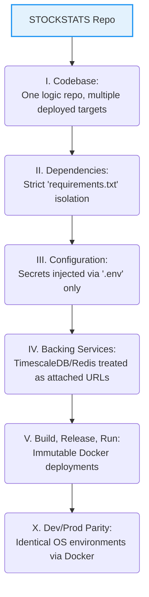
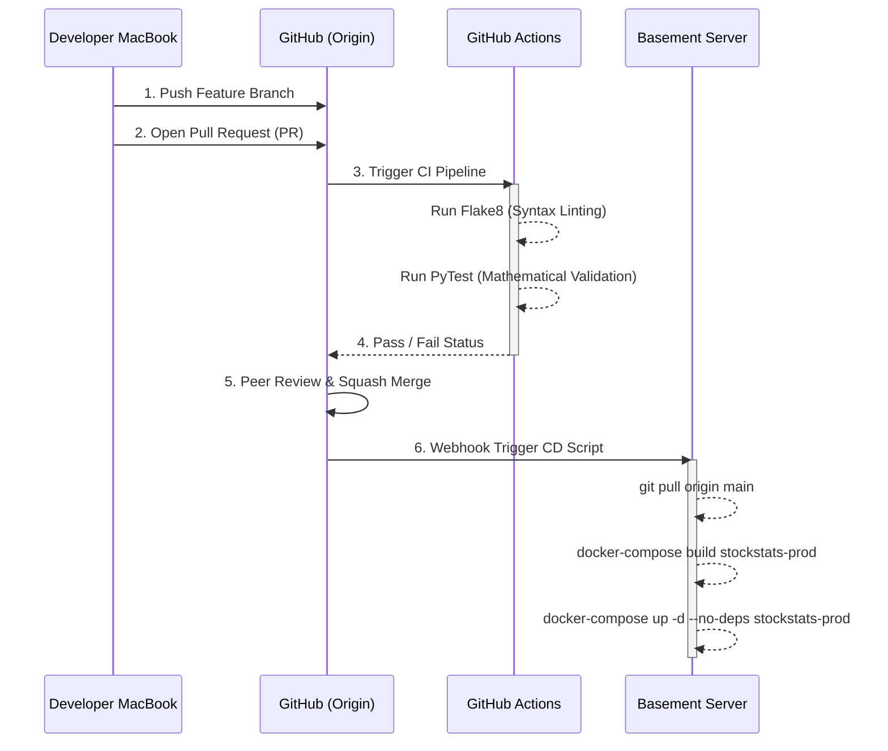
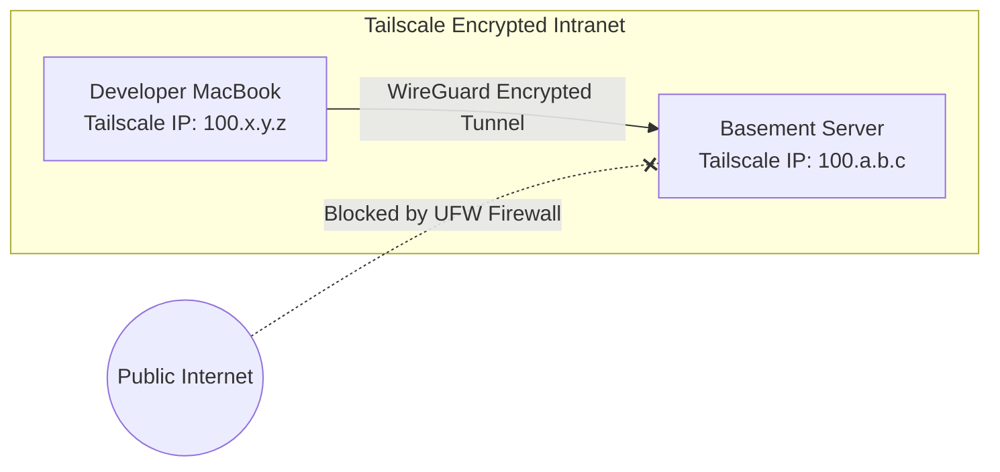
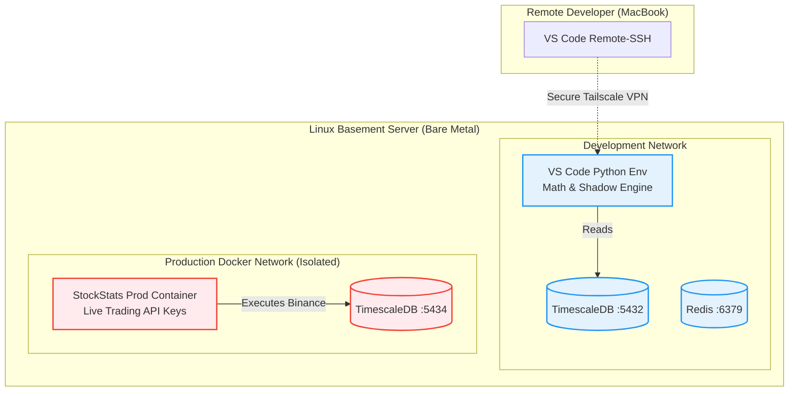

# Sprint 1 Implementation: Infrastructure & DevOps

## The Objective
Before a single line of quantitative mathematics is written, we must pour the concrete foundation. This Master Sprint Document defines the exact physical servers, the remote collaboration environments, the CI/CD pipelines, and the physical directory scaffolding required to host STOCKSTATS.

This document consolidates six distinct architectural pillars:
1.  **Hardware Sizing:** What physical machines run the code.
2.  **Environment Isolation:** 12-Factor App methodology for Dev/Staging/Prod.
3.  **Remote Collaboration:** Tailscale VPN and VS Code Remote environments.
4.  **Git Workflows:** Trunk-Based Development and Code Reviews.
5.  **AI Integration:** How humans and Agents collaborate.
6.  **Core Scaffolding:** Building TimescaleDB, Redis, and Python locally.

---

## Pillar 1: Hardware & Infrastructure Sizing Matrix

As we transition from theory to execution, the physical machines running the STOCKSTATS codebase must scale alongside the software phases. The foundational requirement across all machines is **Ubuntu Server 24.04 LTS**. We do not deploy production code on Windows or macOS.

### 1.1 Sprints 1-5: The Phase 1 MVP (Centralized Basement Server)
We prioritize cost and iteration speed. Instead of developers working in silos on laptops, we utilize a **Centralized Basement Server** (DevBox & Data Hub) from Day 1.

*   **Persistent Data Ingestion:** The server runs TimescaleDB 24/7. This guarantees an unbroken dataset of L1 ticks.
*   **VS Code Remote Development:** Developers write code directly on the server's compute cycles via SSH.

**Minimum Hardware Specifications:**
*   **CPU:** 8+ Cores (e.g., Intel i7/i9, AMD Ryzen 7/9). Simulates execution loops and handles simultaneous SSH sessions without thread blocking.
*   **RAM:** 32-64 GB (ECC Preferred). TimescaleDB and Pandas matrices consume massive memory. Out-Of-Memory (OOM) kills during a live trade are catastrophic.
*   **Storage:** 1 TB NVMe SSD (PCIe Gen 4.0+). Mechanical HDDs or SATA SSDs are strictly prohibited. TimescaleDB continuous aggregations require $> 5,000$ IOPS to prevent I/O queuing during volatile market events.
*   **Network:** Stable 500+ Mbps Fiber connection. 

### 1.2 Sprints 6-9: Autonomous Execution (Production Deployment)
For the foreseeable future, **Production will run alongside Development on the Basement Server**. A strong local server can handle both workloads brilliantly, provided they are heavily guarded by strict Docker boundaries.

*   **Machine Type:** The existing Centralized Basement Server.
*   **The Docker Mandate:** Production logic does *not* execute natively. It runs inside a locked Linux Docker Container (`stockstats-prod-engine`). If the dev team crashes the system with a memory leak during testing, Docker `cgroup` limits guarantee the Production Engine remains unaffected.
*   **Future Note on Latency Arbitrage:** In Phase 9, when sub-millisecond latency becomes a limiting factor, we can migrate the `stockstats-prod-engine` Docker container to an AWS ECS cluster in Tokyo (`ap-northeast-1`). Until then, domestic network latency is acceptable for our macroscopic $E(R)>0$ edge.

### 1.3 Sprint 10: Machine Learning (GPU Acceleration)
Compiling XGBoost gradient trees across 100 boosting rounds is computationally massive for standard CPUs. However, if the Basement Server has a high-end dedicated GPU (e.g., NVIDIA RTX 3090 / 4090), we do not need AWS Cloud.

*   **GPU:** The local NVIDIA card inside the Basement Server running CUDA toolkits.
*   **Cost Strategy:** Zero marginal cost. We train the trees locally, save the `meta_model.json`, and pass it locally to the Production Container.

---

## Pillar 2: Environment Management & CI/CD

An algorithmic trading machine with direct API access to live retirement accounts cannot be tested "in production." To ensure absolute reproducibility, security, and portability across local and cloud environments, STOCKSTATS rigorously adheres to the **12-Factor App Methodology**.

### 2.0 The 12-Factor Mandate

Before deploying any logic, engineers must comply with these non-negotiable architectural constraints for our Python microservices:



**Core Adoptions for STOCKSTATS:**
*   **I. Codebase:** We maintain a single Git repository (`origin/main`). The *exact same Python code* runs in Dev, Staging, and Production.
*   **II. Dependencies:** All Python quantitative libraries (Numba, Pandas) are explicitly declared and locked in `requirements.txt`. There is zero implicit reliance on Ubuntu OS-level packages.
*   **III. Configuration (The Golden Rule):** Binance Trading API keys, `JWT` token salts, and TimescaleDB passwords are **systematically prohibited** from entering the codebase. They must be injected into the Docker containers at execution time via local `.env` bindings.
*   **IV. Backing Services:** TimescaleDB and Redis are treated as loosely coupled attached resources. If the database physical IP changes (e.g., migrating to AWS RDS), the Python codebase does not change; only the `.env` target URL changes.
*   **X. Dev/Prod Parity:** We violently minimize the gap between environments. Development, Staging, and Production operate on the exact same Linux distributions driven by Docker Compose.

### 2.1 The Three Isolated Environments (Single Bare-Metal)
Because all three stacks live on the identical Basement Server initially, we achieve isolation entirely through **Docker Networking** and **Port Mapping**. They must never share a database instance.

1.  **🟢 Development (DEV):** 
    *   **Architecture:** Runs natively via VS Code remote (`python3 ingest.py`). Connects to `localhost:5432` (Dev Timescale).
    *   **Keys:** Binance Testnet or Read-Only Mainnet keys.
    *   **Execution:** Mathematically blocked. `STOCKSTATS_EXECUTION_MODE=SHADOW`
2.  **🟡 Staging / Paper Trading (UAT):** 
    *   **Architecture:** Runs inside a Docker Container (`stockstats-staging`). Connects to an isolated `localhost:5433` (Staging Timescale).
    *   **Goal:** Forward-testing over 30 days. Uses Read-Only Mainnet Keys. Trades route exclusively to the local SQL `shadow_execution_ledger` to statistically verify slippage without risking physical capital.
3.  **🔴 Production (PROD):** 
    *   **Architecture:** Runs completely headless inside an isolated Docker Container (`stockstats-prod`). Connects to an incredibly secure `localhost:5434` (Prod Timescale bindings limited exclusively to the Docker Bridge).
    *   **Keys:** Binance Mainnet TRADING Keys (Withdrawals physically disabled at exchange level).
    *   **Execution:** Fully Live. `STOCKSTATS_EXECUTION_MODE=LIVE`

### 2.2 Continuous Integration & Deployment (CI/CD) Pipeline
We deploy via an immutable, automated pipeline. Humans do not manually SSH into the server to `git pull` the Production container.



*   **CI (Testing):** Before merging to `main`, GitHub Actions runs `flake8`, `black`, and `pytest`. If mathematical validation fails (e.g., the Hampel filter returns the wrong MAD on a mock array), GitHub physically blocks the "Merge" button.
*   **CD (Deployment):** Merging an approved PR into `main` fires a secure webhook to the Basement Server, triggering a bash script to pull the code, rebuild the Production Docker image, and hot-swap the internal container without dropping active websocket connections.

---

## Pillar 3: Remote Development Environment (Zero-Trust)

This section mandates the rigorous cryptographic protocols for remote team access to the Basement Server. We operate under a Zero-Trust architecture.

### 3.1 Network & User Isolation Strategy
The Basement Server has absolutely **no open public ports**. All ingress is blocked at the firewall level.



1.  **Tailscale VPN:** Install Tailscale on the Ubuntu Server (`sudo tailscale up`) and all developer hardware.
2.  **User Provisioning:** The physical `root` account is permanently disabled for SSH. Create isolated Linux profiles dynamically: 
    ```bash
    sudo adduser dev_alice
    sudo usermod -aG sudo dev_alice
    sudo usermod -aG docker dev_alice
    ```
3.  **Cryptographic SSH Keys:** Password authentication is strictly disabled (`PasswordAuthentication no` in `sshd_config`). Developers must generate modern Elliptic Curve keys (`ssh-keygen -t ed25519`). Legacy RSA keys are prohibited. The Admin injects the `id_ed25519.pub` into `/home/dev_alice/.ssh/authorized_keys`.

### 3.2 The VS Code Remote-SSH Workflow
Remote developers compile Python directly on the Basement Server's CPU, avoiding local MacBook dependency bloat.
1.  Install the **Remote - SSH** extension in Visual Studio Code.
2.  Add the Host to `~/.ssh/config` using the Tailscale 100.X IP and the specific `User dev_alice`.
3.  Connect to Host -> Open Folder `/opt/stockstats/`. (The repository namespace rigidly employs `chmod 775` group permissions allowing multi-developer collaboration).
4.  Non-developer Traders simply open Chrome and navigate to `http://<tailscale-ip>:3000` over the VPN to view live Grafana surveillance panels securely.

---

## Pillar 4: Git & GitHub Collaboration Workflows

To maintain a mathematically pristine and auditable codebase across a distributed quantitative team, we enforce strict **Trunk-Based Development** paired with **Conventional Commits** and rigid Pull Request (PR) templates. This is an industry-standard mandate.

### 4.1 Branch Naming Conventions
Every ticket generated from the [Execution Sprints](../strategy/12_execution_sprints_and_tickets.md) becomes an isolated, short-lived branch. Branches must live $< 48$ hours to prevent merge conflicts.
Format: `<type>/<ticket-id>-<short-description>`

**Permitted Types:**
*   `feat/`: A new mathematical model, API endpoint, or systemic feature. *(e.g., `feat/2.1-garch-volatility`)*
*   `fix/`: A patch for a bug or mathematically incorrect logic. *(e.g., `fix/1.5-hampel-nan-error`)*
*   `docs/`: Changes strictly to Markdown documentation. *(e.g., `docs/cloud-migration-update`)*
*   `refactor/`: Code changes that neither fix a bug nor add a feature (e.g., optimizing loop speed). *(e.g., `refactor/numba-array-loop`)*
*   `test/`: Adding or correcting `pytest` matrices.

### 4.2 Conventional Commits Standard
Commit messages act as the immutable ledger of our engineering intent. We strictly follow the [Conventional Commits V1.0](https://www.conventionalcommits.org/) specification.

**Format:**
```text
<type>(<scope>): <subject>

[optional body]
```

**Examples:**
*   ✅ `feat(ingestion): implement CCXT async websocket loop`
*   ✅ `fix(math): correct SQN division by zero error`
*   ✅ `docs(strategy): update Phase 9 cloud migration architecture`
*   ❌ `fixed the bug` (Violates protocol, will be rejected by CI)

### 4.3 Pull Request (PR) Template & Standards
Direct commits to the `main` branch are strongly prohibited. All code enters `main` exclusively via a Pull Request. Every PR description must follow this explicit template:

```markdown
**Ticket:** [Link to Ticket e.g., Ticket 2.1]
**Type:** [Feature | Bugfix | Refactor | Docs]

**1. Description of Changes**
[Explain exactly what structural changes were made to the codebase.]

**2. Mathematical / Logic Validation**
[Provide proof that the math works. e.g., "Ran pytest on statmodels ADF test, returning p-value < 0.05 on mock arrays."]

**3. Breaking Changes?**
[Yes/No. If yes, explain what database schemas or API contracts must be updated.]
```

### 4.4 Code Review & Merge Protocol
1.  **Branch Protection:** `main` requires at least 1 approving review (Human or AI Agent) before merging.
2.  **Continuous Integration (CI):** GitHub Actions will automatically run `flake8`, `black`, and quantitative `pytest` suites. If a PR fails the math tests, the "Merge" button statically locks.
3.  **Squash and Merge Only:** When a PR is approved, we execute a "Squash and Merge." This crushes multiple messy micro-commits from the feature branch into a single, clean, atomic Conventional Commit on `main`.

---

## Pillar 5: AI-Augmented Quantitative Engineering

We treat the AI (Antigravity/Claude) not as a subservient code-generator, but as a Lead Quantitative Architect. However, Large Language Models (LLMs) hallucinate if deprived of strict context parameters. We enforce the following AI collaboration protocols:

1.  **Contextual Anchor Injection:** Never ask the AI to "write a feature" blindly. You must forcefully anchor its context to the Master Strategy. *(Correct Prompt: "Read `docs/strategy/02_cointegration_arb.md` and implement the Johansen matrix in `math_core.py`.")*
2.  **The View-Before-Edit Mandate:** Ensure the AI invokes the `view_file` tool to read the current systemic state of the target file before running a codebase-altering `multi_replace`. Blind edits cause catastrophic indentation failures.
3.  **Strict Mode Separation (Planning vs Execution):** We explicitly separate AI execution boundaries. When the AI is in `PLANNING` mode, it is strictly forbidden from editing physical python files. Only once a technical `implementation_plan.md` artifact is approved by the human operator does the agent shift to `EXECUTION` mode to safely manipulate code.
4.  **Mathematical TDD Integration:** Before the AI writes the strategy function, mandate it to write the `pytest` mathematical proof array first. (e.g., "Write a pytest verifying the Hampel Filter returns a MAD of $X$ given array $Y$, then establish the core function.")

---

## Pillar 6: Core Infrastructure Scaffolding

With DevOps workflows locked, we physically build the Phase 1 Foundation: the TimescaleDB/Redis backend and the strict Python virtual environment.

### 🗺️ Infrastructure Architecture (Basement Server Topology)



---

### Step 6.1: Directory Scaffolding & Configuration
Create the secure repository skeleton on the Basement Server:

```bash
mkdir -p backend/core backend/ingestion backend/execution backend/database
mkdir -p docker-volumes/timescaledb docker-volumes/redis
```

Create `.env` (Never commit this):
```env
POSTGRES_USER=stockstats_admin
POSTGRES_PASSWORD=super_secure_dev_password_123!
POSTGRES_DB=stockstats
POSTGRES_HOST=localhost
POSTGRES_PORT=5432
REDIS_HOST=localhost
REDIS_PORT=6379
STOCKSTATS_EXECUTION_MODE=SHADOW
```

Create `.gitignore`:
```gitignore
.env
venv/
__pycache__/
docker-volumes/
.DS_Store
```

### Step 6.2: The Dockerized Storage Layer
Create `docker-compose.yml` to structurally isolate the dual-database architecture. We explicitly enforce `deploy.resources` to prevent a runaway query from triggering a system-wide OS kernel panic (Out-of-Memory Kill).

```yaml
version: '3.8'
services:
  timescaledb:
    image: timescale/timescaledb-ha:pg15-latest
    container_name: stockstats_timescaledb
    environment:
      - POSTGRES_USER=${POSTGRES_USER}
      - POSTGRES_PASSWORD=${POSTGRES_PASSWORD}
      - POSTGRES_DB=${POSTGRES_DB}
    volumes:
      - ./docker-volumes/timescaledb:/home/postgres/pgdata/data
    ports:
      - "5432:5432"
    deploy:
      resources:
        limits:
          memory: 16G # Prevents DB from starving the Python Engine
    logging:
      driver: "json-file"
      options:
        max-size: "50m"
        max-file: "3"
    restart: unless-stopped

  redis:
    image: redis:7-alpine
    container_name: stockstats_redis
    command: redis-server --save 60 1 --loglevel warning
    volumes:
      - ./docker-volumes/redis:/data
    ports:
      - "6379:6379"
    deploy:
      resources:
        limits:
          memory: 4G # Redis memory bound for OBI caching
    restart: unless-stopped
```
Execute logic: `docker-compose up -d`

### Step 6.3: The Python Quantitative Core
Isolate the math engine.
```bash
python3.11 -m venv venv
source venv/bin/activate
```

Create `requirements.txt` locking the Numba/Numpy versions:
```txt
ccxt[async]==4.2.35      # Async Exchange Websockets
numpy==1.26.4            # Array manipulation (Must match Numba requirements)
pandas==2.2.1            # Time-series DataFrames
numba==0.59.1            # LLVM Math Compiler for Hampel/GARCH
asyncpg==0.29.0          # Async PostgreSQL Driver (Fast Inserts)
redis==5.0.3             # Async Redis Pub/Sub
python-dotenv==1.0.1     # Environment variable injection
```
Install: `pip install -r requirements.txt`

---
**⬅️ Previous:** [Implementation Index](00_implementation_index.md) | **Next:** [Sprint 2: The Ingestion Gateway](02_sprint_2_ingestion_engine.md) ➡️
