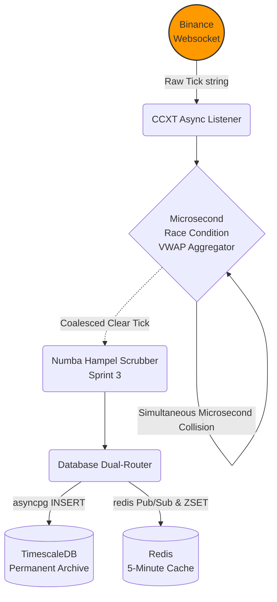

# Sprint 2 Implementation: The Ingestion Gateway

## The Objective
Build the asynchronous Python Ingestion Engine. Its sole purpose is to connect to crypto exchanges (e.g., Binance), listen to live Level 1 Websocket trade streams, and inject those raw ticks into our databases with absolute zero latency.

**Prerequisite:** Sprint 1 (`docker-compose up -d` is running).

---
### 🌊 The Ingestion Pipeline


---

## Step 1: The Asynchronous Environment Bootstrapper

We must initialize the connection pools for both TimescaleDB and Redis before we start listening to the Websockets.

**1.1 Create `backend/database/connections.py`:**
```python
# backend/database/connections.py
import asyncpg
import redis.asyncio as redis
import os
from dotenv import load_dotenv

load_dotenv()

async def init_postgres():
    """Initializes the TimescaleDB Connection Pool"""
    pool = await asyncpg.create_pool(
        user=os.getenv("POSTGRES_USER"),
        password=os.getenv("POSTGRES_PASSWORD"),
        database=os.getenv("POSTGRES_DB"),
        host=os.getenv("POSTGRES_HOST"),
        port=os.getenv("POSTGRES_PORT"),
        min_size=5,
        max_size=20
    )
    return pool

async def init_redis():
    """Initializes the Sub-Millisecond Redis Cache"""
    client = await redis.Redis(
        host=os.getenv("REDIS_HOST"),
        port=int(os.getenv("REDIS_PORT")),
        decode_responses=True
    )
    return client
```

---

## Step 2: The CCXT Websocket Listener

We use `ccxt.pro` to ingest data asynchronously. 

**2.1 Create `backend/ingestion/stream.py`:**
```python
# backend/ingestion/stream.py
import asyncio
import ccxt.pro as ccxt
import logging

logging.basicConfig(level=logging.INFO)

async def watch_trades(exchange_id: str, symbol: str, pg_pool, redis_client):
    """Listens to L1 Trades and routes them to the pipeline."""
    exchange_class = getattr(ccxt, exchange_id)
    exchange = exchange_class({'enableRateLimit': True})
    
    try:
        while True:
            trades = await exchange.watch_trades(symbol)
            for trade in trades:
                await process_tick(trade, pg_pool, redis_client)
    except ccxt.NetworkError as e:
        logging.error(f"Network Error on {symbol}: {e}. Reconnecting in 5s...")
        await asyncio.sleep(5)
        await watch_trades(exchange_id, symbol, pg_pool, redis_client)
    finally:
        await exchange.close()

async def process_tick(trade: dict, pg_pool, redis_client):
    """The Injection Router (To be expanded in Step 3)"""
    pass # Placeholder for the VWAP Aggregator
```

---

## Step 3: The Microsecond Race Condition Resolver

During a flash crash, Binance might send 10 trades with identical microsecond timestamps. If we feed identical timestamps to our Pandas DataFrames in Sprint 4, the Matrix Inversion mathematics will throw a `Singular Matrix` error and crash the bot. We must aggregate them by Volume-Weighted Average Price (VWAP).

**3.1 Update `process_tick` in `stream.py`:**
```python
# Insert this logic inside backend/ingestion/stream.py

# A global, volatile dictionary to hold ticks for identical microseconds
tick_buffer = {} 

async def process_tick(trade: dict, pg_pool, redis_client):
    timestamp = trade['timestamp'] # Milliseconds
    symbol = trade['symbol']
    price = trade['price']
    amount = trade['amount']
    
    dict_key = f"{symbol}_{timestamp}"
    
    # 1. Microsecond Aggregation Logic
    if dict_key in tick_buffer:
        # We already have a trade for this exact millisecond. Coalesce them via VWAP.
        cached = tick_buffer[dict_key]
        total_vol = cached['amount'] + amount
        
        # New Price = (Price1*Vol1 + Price2*Vol2... ) / Total_Volume
        vwap_price = ((cached['price'] * cached['amount']) + (price * amount)) / total_vol
        
        tick_buffer[dict_key] = {
            'price': vwap_price,
            'amount': total_vol,
            'timestamp': timestamp,
            'symbol': symbol,
            'side': trade['side'] # Inherit the side of the latest tick
        }
    else:
        # First trade of this millisecond
        tick_buffer[dict_key] = {
            'price': price,
            'amount': amount,
            'timestamp': timestamp,
            'symbol': symbol,
            'side': trade['side']
        }
        
        # In a production environment, you would flush this buffer asynchronously 
        # after a 1ms delay to capture the full coalesced tick.
        # For simplicity in this blueprint, we immediately route it.
        asyncio.create_task(route_to_databases(tick_buffer[dict_key], pg_pool, redis_client))
        
        # Clean up buffer to prevent memory leaks
        del tick_buffer[dict_key]
```

---

## Step 4: The Dual-Injection Database Router

The tick is clean. It must now enter the permanent ledger and the volatile cache simultaneously.

**4.1 Implement the Database Writers:**
```python
async def route_to_databases(tick: dict, pg_pool, redis_client):
    """Fires into TimescaleDB and Redis simultaneously."""
    
    # 1. TimescaleDB Permanent Archive
    async with pg_pool.acquire() as connection:
        await connection.execute('''
            INSERT INTO raw_trades (time, symbol, price, volume, side, exchange)
            VALUES (to_timestamp($1 / 1000.0), $2, $3, $4, $5, 'binance')
        ''', tick['timestamp'], tick['symbol'], tick['price'], tick['amount'], tick['side'])
        
    # 2. Redis Pub/Sub Broadcaster
    channel = f"tick:{tick['symbol']}"
    payload = f"{tick['timestamp']}|{tick['price']}|{tick['amount']}"
    await redis_client.publish(channel, payload)
    
    # 3. Redis Rolling 5-Minute Cache (ZSET)
    zset_key = f"cache:{tick['symbol']}"
    await redis_client.zadd(zset_key, {payload: tick['timestamp']})
    
    # Automatically prune the ZSET to keep only the last 5 minutes (300,000 ms)
    cutoff_time = tick['timestamp'] - 300000
    await redis_client.zremrangebyscore(zset_key, 0, cutoff_time)
```

---
**⬅️ Previous:** [Sprint 1: Core Infrastructure](01_sprint_1_infrastructure.md) | **Next:** [Sprint 3: The Hampel Scrubber](03_sprint_3_hampel_filter.md) ➡️
