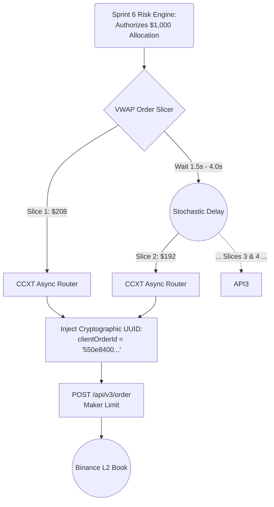

# Sprint 7 Implementation: The Automated Execution Router

## The Objective
We have survived Phase 1 (Manual Trading). We have gathered the Ground Truth data, refined the system, and implemented the Risk Matrices (Sprint 6). 

It is time to automate. Sprint 7 builds the `backend/execution/` service. This completely severs the human UX friction loop. The Risk Engine now sends the authorized $\$180$ allocation directly to the Smart Order Router (SOR), which slices it and routes cryptographic payloads to Binance.

**Reference:** [Strategy 12 (Execution Sprints)](../strategy/12_execution_sprints_and_tickets.md#sprint-5-the-smart-order-router--nextjs-terminal)

---
### ⚔️ The Smart Order Router & VWAP Slicer


---

## Step 1: The Execution Microservice

We instantiate the service responsible for generating REST API calls.

**1.1 Scaffolding:**
Create `backend/execution/` and its core routers.
```bash
mkdir -p backend/execution
touch backend/execution/router.py
touch backend/execution/vwap_slicer.py
```

## Step 2: The CCXT Async Execution Engine

We will utilize the REST API side of `ccxt.pro` to fire secure requests to the broker. CCXT automatically handles the complex ECDSA cryptographic signing required for authenticating with Binance.

**2.1 Initialize the Secure Router (`backend/execution/router.py`):**
```python
import ccxt.async_support as ccxt
import os
import uuid
import logging
from dotenv import load_dotenv

load_dotenv()

async def execute_limit_order(symbol: str, side: str, amount: float, price: float) -> dict | None:
    """Fires a mechanically signed Maker Limit order to the exchange."""
    exchange = ccxt.binance({
        'apiKey': os.getenv('BINANCE_API_KEY'),
        'secret': os.getenv('BINANCE_API_SECRET'),
        'enableRateLimit': True,
    })
    
    # 1. Deterministic UUID Injection (Crucial for State Machine Reconciliation)
    request_uuid = str(uuid.uuid4())
    params = {
        'newClientOrderId': request_uuid # We tag the order to track it globally
    }
    
    try:
        logging.info(f"ROUTING {side} {amount} {symbol} @ {price} [UUID: {request_uuid}]")
        # 2. Fire the mathematical payload
        order = await exchange.create_limit_order(symbol, side, amount, price, params)
        return order
        
    except ccxt.InsufficientFunds as e:
        logging.error(f"EXECUTION VETO: Insufficient Funds for {symbol}.")
    except ccxt.NetworkError as e:
        logging.error(f"EXECUTION VETO: Network timeout. The HTTP 504 Rescue Loop must engage.")
    finally:
         await exchange.close()
         
    return None
```

## Step 3: The VWAP Order Slicer

Because STOCKSTATS relies heavily on preserving the $R$ mathematical expectancy, we cannot use Market Orders (Taker fees). We also cannot dump a massive $\$50,000$ limit order on the book, as HFTs will instantly spoof in front of it. We must slice it.

**3.1 Implement the Slicer (`backend/execution/vwap_slicer.py`):**
```python
import asyncio
from router import execute_limit_order
import random
import logging

async def execute_vwap_block(symbol: str, side: str, total_investment: float, target_price: float, slices: int = 5):
    """
    Slices a parent allocation (e.g. $1000) into 5 smaller child orders ($200)
    and executes them sequentially over time to hide intentions from the L2 book.
    """
    
    amount_per_slice = total_investment / slices
    
    for i in range(slices):
        # 1. Add slight stochastic randomization to the slice size to defeat HFT pattern recognition
        randomization_factor = random.uniform(0.95, 1.05)
        stochastic_amount = amount_per_slice * randomization_factor
        
        # Determine the physical token qty (e.g. 0.05 BTC)
        token_qty = stochastic_amount / target_price
        
        # 2. Fire the Child Order
        logging.info(f"VWAP Slicer [{i+1}/{slices}]: Dispatched.")
        await execute_limit_order(symbol, side, token_qty, target_price)
        
        # 3. Wait asynchronously before firing the next slice (TWAP element)
        if i < slices - 1: # Don't wait after the last slice
            delay = random.uniform(1.5, 4.0) # Wait somewhere between 1.5s and 4s
            await asyncio.sleep(delay)
            
    logging.info(f"VWAP Parent Block Complete for {symbol}.")
```

## Step 4: Connecting the Engine Block

This completes the full Phase 5 Automated Pipeline. The entire system now runs linearly without human intervention:

1.  **Sprint 2 & 3:** The Ingestion Engine pulls and scrubs the WebSocket tick.
2.  **Sprint 4:** The Logic Engine detects a GARCH statistical anomaly on `ETH`.
3.  **Sprint 6:** The Risk Engine Copula verifies `ETH` is safe to trade, and the Kelly formula allocates exactly $\$845$ to the position.
4.  **Sprint 7:** The Execution Engine intercepts the $\$845$ command. It passes it to the `vwap_slicer()`, which breaks it into roughly 5 orders of $\$169$ each, applying cryptographic UUIDs via CCXT, and executing physical Maker Limit trades on Binance.

---
**⬅️ Previous:** [Sprint 6: Risk Matrices (Copula & Kelly)](04_sprint_4_risk_matrices.md) | **Next:** [Sprint 8: The Next.js Command Terminal](05b_sprint_5_nextjs_terminal.md) ➡️
