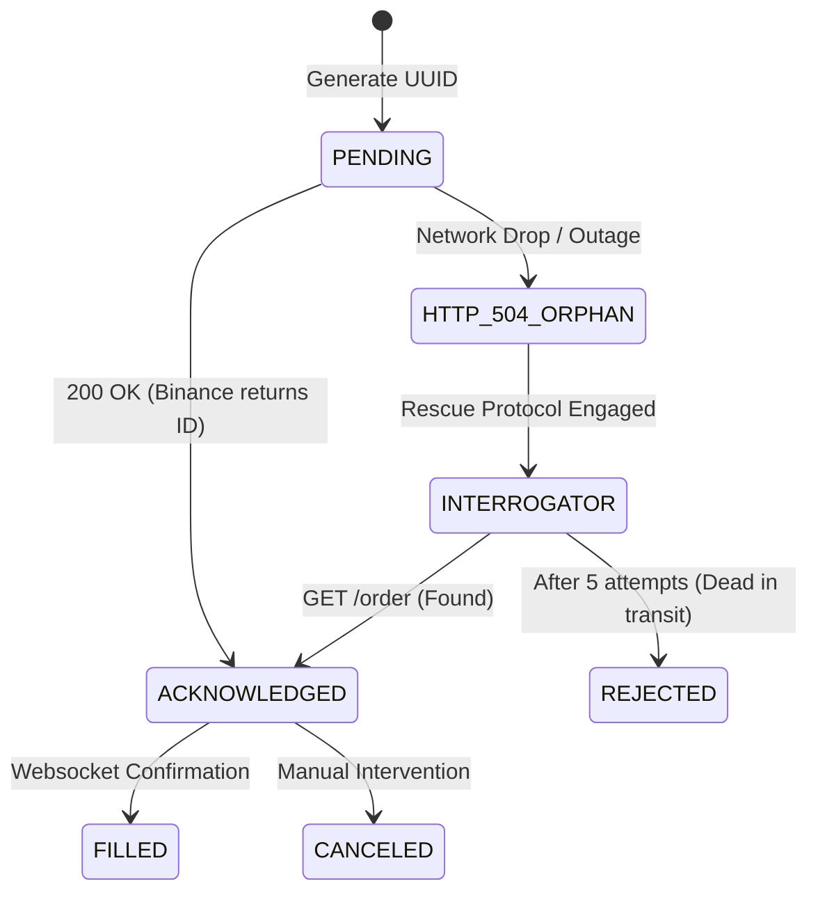

# Sprint 9 Implementation: State Machine Reconciliation

## The Objective
In Sprint 7, we built the Smart Order Router (SOR) that fires cryptographic limit orders to Binance. However, networks fail. Residential ISPs drop packets. Binance APIs crash under load.

If our Python Execution Engine fires a $\$50,000$ order from the Basement Server, but the HTTP connection drops before Binance sends an `ACKNOWLEDGED` receipt back, the system enters a mathematically catastrophic state. Did the order fill? Was it rejected? Is it sitting limit-locked on the exchange?

We must implement a **State Machine Reconciliation Protocol** to deterministically map our internal Immutable Ledger against the external Exchange Matching Engine.

**Reference:** [Model 13 (State Machine Reconciliation)](../models/13_state_machine_reconciliation.md), [Strategy 12 (Execution Sprints)](../strategy/12_execution_sprints_and_tickets.md#sprint-6-systemic-ledger-reconciliation-the-zombie-order-defense)

---
### 🔄 Execution State Machine Lifecycle


---

## Step 1: The Immutable Ledger Schema

We track execution intent across 4 strict state lifecycles: `PENDING`, `ACKNOWLEDGED`, `FILLED`, or `REJECTED/CANCELED`.

**1.1 SQL Definition (`backend/database/migrations/02_execution_ledger.sql`):**
```sql
CREATE TYPE execution_state AS ENUM (
    'PENDING', 
    'ACKNOWLEDGED', 
    'FILLED', 
    'REJECTED', 
    'CANCELED',
    'HTTP_504_ORPHAN' -- Critical Failure State
);

CREATE TABLE execution_ledger (
    client_uuid        UUID PRIMARY KEY, -- The deterministic tracker (Generated Locally)
    exchange_order_id  TEXT,             -- Generated by Binance (Null initially)
    symbol             TEXT NOT NULL,
    side               TEXT NOT NULL,
    qty_requested      DOUBLE PRECISION NOT NULL,
    qty_filled         DOUBLE PRECISION DEFAULT 0.0,
    price_target       DOUBLE PRECISION NOT NULL,
    state              execution_state NOT NULL DEFAULT 'PENDING',
    created_at         TIMESTAMPTZ NOT NULL DEFAULT NOW(),
    updated_at         TIMESTAMPTZ NOT NULL DEFAULT NOW()
);
```

## Step 2: Modifying the Execution Router

We must track the order *before* we route it to the exchange.

**2.1 Modify `execute_limit_order` (`backend/execution/router.py`):**
```python
import uuid
import asyncio

async def execute_limit_order(symbol: str, side: str, amount: float, price: float, pg_pool):
    # 1. Generate the deterministic Client UUID
    request_uuid = str(uuid.uuid4())
    params = {'newClientOrderId': request_uuid}
    
    # 2. Log 'PENDING' immediately BEFORE the network hop
    async with pg_pool.acquire() as connection:
        await connection.execute('''
            INSERT INTO execution_ledger (client_uuid, symbol, side, qty_requested, price_target, state)
            VALUES ($1, $2, $3, $4, $5, 'PENDING')
        ''', request_uuid, symbol, side, amount, price)
        
    try:
        # 3. Fire the Payload
        order = await exchange.create_limit_order(symbol, side, amount, price, params)
        
        # 4. Success -> Advance state to ACKNOWLEDGED
        binance_id = order['id']
        async with pg_pool.acquire() as connection:
            await connection.execute('''
                UPDATE execution_ledger 
                SET state = 'ACKNOWLEDGED', exchange_order_id = $1, updated_at = NOW()
                WHERE client_uuid = $2
            ''', binance_id, request_uuid)
            
        return order
        
    except ccxt.NetworkError as e:
        # 5. DISASTER: TCP Connection Dropped. We do NOT know if Binance received the order.
        logging.critical(f"ORPHANED ORDER DETECTED: {request_uuid}")
        async with pg_pool.acquire() as connection:
            await connection.execute('''
                UPDATE execution_ledger SET state = 'HTTP_504_ORPHAN', updated_at = NOW() WHERE client_uuid = $1
            ''', request_uuid)
        
        # Immediately trigger the Rescue Protocol
        asyncio.create_task(rescue_orphaned_order(request_uuid, symbol, pg_pool))
        return None
```

## Step 3: The HTTP 504 Rescue Interrogator

When an order is flagged as an `HTTP_504_ORPHAN`, the system cannot physically proceed with executing any more logic on that asset until the state is rectified, otherwise it risks catastrophic double-buying.

**3.1 Implement the Interrogator (`backend/execution/reconciliation.py`):**
```python
import ccxt.async_support as ccxt
import asyncio

async def rescue_orphaned_order(client_uuid: str, symbol: str, pg_pool):
    """Aggressively pings Binance via GET to locate a lost physical order using our UUID."""
    exchange = ccxt.binance({...}) # Init connection
    
    max_retries = 5
    for attempt in range(max_retries):
        await asyncio.sleep(2) # Give Binance matching engine 2 seconds to digest
        
        try:
            logging.info(f"Rescue Attempt {attempt+1}: Pinging Binance for UUID [{client_uuid}]")
            
            # The Magic: We query the Exchange passing OUR generated UUID, not theirs
            # Binance supports `origClientOrderId` queries
            response = await exchange.fetch_order(client_uuid, symbol) 
            
            if response:
                # We found it! Re-sync the database state.
                binance_id = response['id']
                actual_state = 'FILLED' if response['status'] == 'closed' else 'ACKNOWLEDGED'
                
                async with pg_pool.acquire() as connection:
                    await connection.execute('''
                        UPDATE execution_ledger 
                        SET state = $1, exchange_order_id = $2, qty_filled = $3, updated_at = NOW()
                        WHERE client_uuid = $4
                    ''', actual_state, binance_id, response['filled'], client_uuid)
                    
                logging.info(f"RESCUE SUCCESS: Orphan [{client_uuid}] safely recovered as {actual_state}.")
                await exchange.close()
                return
                
        except ccxt.OrderNotFound:
            # Not found yet. Try again.
            continue
            
    # If the loop exhausts, Binance never received the payload.
    # The network dropped the HTTP request before it reached their servers. 
    # It is safe to mark as REJECTED and allow the Quantitative Engine to re-evaluate.
    async with pg_pool.acquire() as connection:
         await connection.execute("UPDATE execution_ledger SET state = 'REJECTED' WHERE client_uuid = $1", client_uuid)
    
    logging.warning(f"RESCUE FAILED: Orphan [{client_uuid}] declared DEAD in transit.")
    await exchange.close()
```

---
**⬅️ Previous:** [Sprint 8: The Next.js Command Terminal](08_sprint_8_nextjs_terminal.md) | **Next:** [Sprint 10: XGBoost Machine Learning](10_sprint_10_machine_learning.md) ➡️
