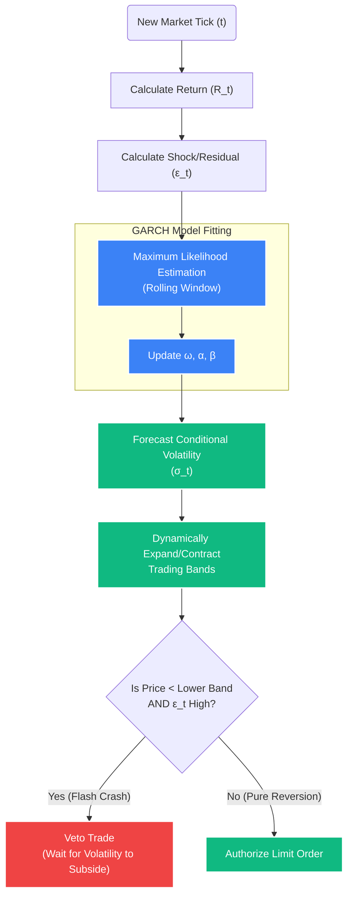

# Deep Dive: GARCH(1,1) Dynamic Volatility Model

## 1. The Core Problem: Static Variance in a Dynamic Market
Most retail trading systems and basic algorithmic models use **Bollinger Bands** or simple Standard Deviation ($\sigma$) to measure volatility and identify mean-reversion entries. 

### The Flat-Tail Flaw
The flaw in simple Standard Deviation is that it assigns an **equal weight** to all data points in the lookback window. 
*   **Example Scenario:** Imagine a market is completely flat for 19 days. On day 20, a catastrophic black swan event occurs, causing the asset to crash by 30%.
*   **The Reaction:** A 20-period simple moving standard deviation will average the 19 days of zero volatility perfectly equally with the 1 day of infinite volatility. The resulting $\sigma$ band will barely expand.
*   **The Result:** The trading model will incorrectly signal that the price has deviated "too far" from the mean, triggering an aggressive `BUY` signal right into the teeth of a structural crash. The portfolio is instantly destroyed.

Financial time-series data exhibits **Volatility Clustering**: large changes tend to be followed by large changes, and small changes tend to be followed by small changes. We need a model that *reacts instantly* to recent shocks but possesses memory of the past.

## 2. The Solution: GARCH(1,1)
**Generalized Autoregressive Conditional Heteroskedasticity (GARCH)** is the institutional standard for forecasting time-varying, conditional volatility. It solves the clustering problem by giving exponentially heavier weight to *recent* shocks while allowing volatility to slowly mean-revert over time.

### A. The Core Mathematical Equation
Unlike static historical variance, the GARCH(1,1) model forecasts the **conditional variance** ($\sigma_t^2$) for the current, immediate period ($t$):

$$ \sigma_t^2 = \omega + \alpha \epsilon_{t-1}^2 + \beta \sigma_{t-1}^2 $$

### B. Deconstructing the Variables & Hyperparameters
*   **$\sigma_t^2$ (Forecasted Variance):** What the model predicts the market's volatility is *right now*.
*   **$\omega$ (Omega - The Baseline):** A constant representing the long-term, underlying structural variance of the asset.
    *   *Calculation:* $\omega = V_L(1 - \alpha - \beta)$ where $V_L$ is the long-run variance.
*   **$\epsilon_{t-1}^2$ (The ARCH Term / The "Shock"):** The squared residual (return) from the *immediately preceding* time period ($t-1$). 
    *   *Real-World Impact:* This is the immediate reaction mechanism. If a massive news candle prints 1 minute ago, $\epsilon_{t-1}^2$ explodes in value, instantly expanding our volatility forecasting bands before the next tick arrives.
*   **$\alpha$ (Alpha):** The weight assigned to the recent shock. Higher $\alpha$ makes the model highly "nervous" and reactive. In equities, $\alpha$ is usually low (~0.05). In crypto, $\alpha$ is often tuned higher (~0.15) to react to sudden liquidations.
*   **$\sigma_{t-1}^2$ (The GARCH Term / The "Memory"):** The variance that was forecast in the previous period. 
*   **$\beta$ (Beta):** The weight assigned to the previous period's volatility. It dictates how long a shock "persists" in the system. High $\beta$ (~0.85) means the market has a long memory; a crash today will keep the bands wide for days.

### C. The Stability Constraint
For the model to be mathematically stable and reliably mean-reverting over the long term, the system enforces a strict parameter bound: 
**$\alpha + \beta < 1$**

If $\alpha + \beta \ge 1$, the model implies that volatility shocks are permanent (Integrated GARCH, or IGARCH), meaning the standard deviation bands would expand forever and never contract, permanently paralyzing the trading engine.

### D. Half-Life of a Volatility Shock
We can calculate exactly how long a volatility shock will take to decay by half using the persistence ($\gamma = \alpha + \beta$):

$$ \text{Half-Life} = \frac{\ln(0.5)}{\ln(\alpha + \beta)} $$

If $\alpha = 0.10$ and $\beta = 0.80$, $\gamma = 0.90$. The half-life is $HL = \ln(0.5) / \ln(0.90) \approx 6.57$ periods. The system knows exactly how long to wait before normalizing trading volume.



## 3. Implementation in STOCKSTATS (The Logic Tree)

When the Quantitative Engine runs in real-time, it completely ignores Bollinger Bands. It continuously fits the GARCH(1,1) model against an actively sliding window of normalized tick data.

### Step 1: Calculate the Residuals
For every new candle/tick $t$, calculate the continuous compounded return:
$$ R_t = \ln\left(\frac{Price_t}{Price_{t-1}}\right) $$

Calculate the residual (deviation from the mean return $\mu$):
$$ \epsilon_t = R_t - \mu $$

*Note: In high-frequency data, $\mu$ is often assumed to be 0 for simplicity and computational speed, as intraday returns are infinitesimally small.*

### Step 2: Fit the GARCH Model (Python)
The engine utilizes the `arch` library in Python to re-estimate the parameters using **Maximum Likelihood Estimation (MLE)**. Standard solvers like L-BFGS-B are employed to find the parameters that maximize the probability of observing the current market data.

```python
import numpy as np
from arch import arch_model

def calculate_dynamic_volatility(returns_array: np.ndarray) -> float:
    """
    Fits a GARCH(1,1) model to the trailing returns array (e.g., last 1000 periods).
    Returns the conditional standard deviation for the immediate current period (t).
    """
    # Initialize GARCH(1,1) with a Constant Mean model
    am = arch_model(returns_array, vol='Garch', p=1, q=1, mean='Constant')
    
    # Fit the model using MLE. disp='off' disables console output for speed.
    # 'update_freq=0' skips intermediary optimization step logging.
    try:
        res = am.fit(update_freq=0, disp='off', show_warning=False)
        
        # Extract the forecasted variance for the end of the array (current tick)
        current_variance = res.conditional_volatility[-1]**2
        
        # We return the conditional standard deviation (sigma)
        return np.sqrt(current_variance)
        
    except Exception as e:
        # Fallback: If MLE fails to converge (e.g., due to perfectly flat data),
        # return the simple standard deviation as a temporary safety net.
        return np.std(returns_array)
```

### Step 3: Dynamic Threshold Generation
The execution engine receives `current_sigma`. This conditional standard deviation is vastly superior to a simple standard deviation.

*   **Upper Band:** $Mean\_Price_t + (Multiplier \times current\_sigma)$
*   **Lower Band:** $Mean\_Price_t - (Multiplier \times current\_sigma)$

The `Multiplier` itself can be dynamic, scaling based on the exact $E(R)$ requirements of the strategy. A standard starting point is $2.0 \sigma$.

### Step 4: The Execution Mandate & The Veto
If a flash crash occurs, the $\epsilon_{t-1}^2$ (Shock) term spikes. The GARCH `current_sigma` instantly expands outward. 
*   **The Trap (Static Bands):** The price would instantly cross the static Lower Band, triggering a catastrophic (and incorrect) "Buy" signal into a falling knife.
*   **The Defense (GARCH):** The Lower Band expands downward *faster* than the price falls. The mean-reversion signal is mathematically suppressed, protecting the portfolio capital. A trade is only authorized when the volatility shock genuinely subsides ($\epsilon_{t-1}^2$ decreases) and the price begins to demonstrably revert against the newly established, wider GARCH bands.

## 4. Edge Cases and Operational Fail-Safes

1.  **Optimization Non-Convergence:** Occasionally, the MLE solver will fail to find a global maximum for $\omega, \alpha, \beta$ within the iteration limit, especially if the input data array is perfectly flat (zero volatility).
    *   *Fail-Safe:* The system utilizes a `try/except` block to catch `ConvergenceWarning`. If the model fails, the system temporarily defaults to a robust Rolling Median Absolute Deviation (MAD) or simple Standard Deviation to ensure the engine never crashes, logging an alert to the Operations API.
2.  **Lookback Window Sizing:** If the rolling window is too small (e.g., $N=50$), the MLE optimizer lacks enough statistical degrees of freedom to accurately fit the distribution. The system hard-codes a minimum historical cache requirement (e.g., $N=1000$ points) from TimescaleDB/Redis before unleashing live executions.
