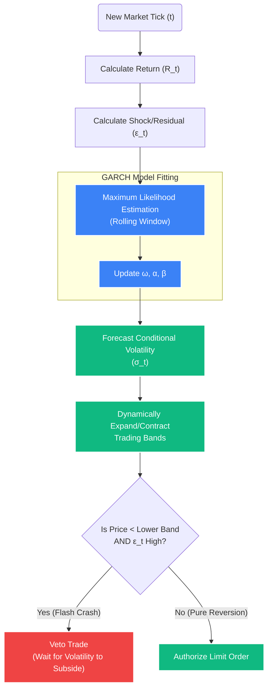

# Deep Dive: GARCH(1,1) Dynamic Volatility Model

## 1. The Problem with Standard Deviation (Simple Moving Variance)
Most retail trading systems and basic algorithmic models use **Bollinger Bands** or simple Standard Deviation ($\sigma$) to measure volatility and identify mean-reversion entries. 

The flaw in simple Standard Deviation is that it equally weights all data points in the lookback window. If a market is quiet for 19 days, and then suddenly experiences a massive crash on day 20, a 20-day Simple Standard Deviation will barely move. The model will incorrectly signal that the price has deviated "too far" from the mean, triggering a buy signal right in the middle of a catastrophic structural crash.

Financial time-series data exhibits **Volatility Clustering**: large changes tend to be followed by large changes, and small changes tend to be followed by small changes. We need a model that *reacts instantly* to recent shocks.

## 2. The Solution: GARCH(1,1)
**Generalized Autoregressive Conditional Heteroskedasticity (GARCH)** is the institutional standard for forecasting time-varying volatility. It solves the clustering problem by giving mathematically exponentially heavier weight to *recent* shocks.

### A. The Core Equation
The GARCH(1,1) model forecasts the conditional variance ($\sigma_t^2$) for the current period ($t$):

$$ \sigma_t^2 = \omega + \alpha \epsilon_{t-1}^2 + \beta \sigma_{t-1}^2 $$

### B. Deconstructing the Variables
*   **$\sigma_t^2$ (Forecasted Variance):** What the model predicts the market's volatility will be *right now*.
*   **$\omega$ (Omega - The Baseline):** A constant representing the long-term, underlying variance of the asset.
*   **$\epsilon_{t-1}^2$ (The ARCH Term / The "Shock"):** The squared residual (return) from the *immediately preceding* time period ($t-1$). This is the crucial component. If a massive news candle just occurred 1 minute ago, $\epsilon_{t-1}^2$ explodes in value, instantly expanding our volatility forecasting bands.
*   **$\alpha$ (Alpha):** The weight assigned to the recent shock. Higher $\alpha$ makes the model more "nervous" and reactive.
*   **$\sigma_{t-1}^2$ (The GARCH Term / The "Memory"):** The variance that was forecast in the previous period. 
*   **$\beta$ (Beta):** The weight assigned to past volatility. Higher $\beta$ means volatility "persists" longer after a shock.

*Note: For the model to be stable and mean-reverting over the long term, $\alpha + \beta$ must be $< 1$.*



## 3. Implementation in STOCKSTATS (The Logic Tree)

When the Quantitative Engine runs in real-time, it does not use static standard deviations for the Mean Reversion bands. It continuously fits the GARCH(1,1) model over the rolling tick data.

### Step 1: Calculate the Residuals
For every new candle/tick $t$, calculate the return:
$R_t = \ln(\frac{Price_t}{Price_{t-1}})$
Calculate the residual (deviation from the mean return $\mu$):
$\epsilon_t = R_t - \mu$

### Step 2: Fit the GARCH Model (Python)
The engine will utilize the `arch` library in Python to re-estimate the $\omega$, $\alpha$, and $\beta$ parameters optimally (typically using Maximum Likelihood Estimation - MLE) over a rolling window (e.g., the last 1000 data points).

```python
from arch import arch_model

# Fit a GARCH(1,1) model to the returns series
am = arch_model(returns_array, vol='Garch', p=1, q=1)
res = am.fit(update_freq=0, disp='off')

# Extract the conditional volatility for the current period
current_sigma = res.conditional_volatility[-1]
```

### Step 3: Dynamic Threshold Generation
The execution engine receives `current_sigma`. Note that this is the *conditional* standard deviation, vastly superior to the simple standard deviation.

*   **Upper Band:** $Mean\_Price_t + (Multiplier \times current\_sigma)$
*   **Lower Band:** $Mean\_Price_t - (Multiplier \times current\_sigma)$

### Step 4: The Execution Mandate
If a flash crash occurs, $\epsilon_{t-1}^2$ spikes. The GARCH `current_sigma` instantly expands outward. 
*   *Without GARCH:* The price would instantly cross the static Lower Band, triggering a catastrophic (and incorrect) "Buy" signal into a falling knife.
*   *With GARCH:* The Lower Band expands downward *faster* than the price falls. The signal is suppressed, protecting the portfolio capital. A trade is only authorized when the volatility shock subsides ($\epsilon_{t-1}^2$ decreases) and the price begins to genuinely revert against the newly established, wider GARCH bands.
