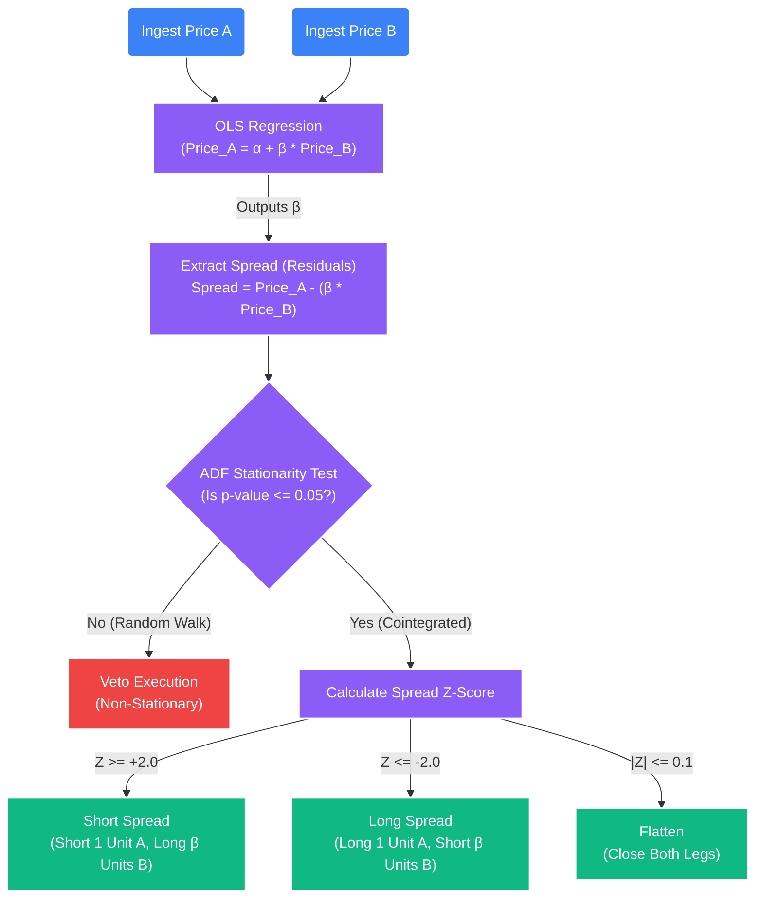

# Deep Dive: Cointegration & Statistical Arbitrage

## 1. The Core Problem: The Flaw of Standard Correlation
When building a "Pairs Trading" or Statistical Arbitrage portfolio, amateur systems rely on **Pearson Correlation** ($\rho$). 

Correlation merely measures if two assets tend to move in the *same direction* over a specific period. However, two assets can be highly correlated while the absolute distance (the "spread") between their prices infinitely diverges. 

If you short Asset A and buy Asset B just because they are "highly correlated," and their actual physical prices structurally drift apart forever, the portfolio takes a 100% loss. Correlation does not imply a bounded distance.

To trade the spread between two assets safely with a positive expectancy ($E(R) > 0$), we must mathematically prove that the spread is **Stationary** (meaning it possesses a constant mean, constant variance, and will always reliably revert to a mean of zero). We achieve this via **Cointegration**.

## 2. The Mathematics of Cointegration
Cointegration exists when a precise linear combination of two non-stationary time series (like the climbing prices of $BTC$ and $ETH$) creates a completely stationary time series (their composite spread).

### A. Step 1: Solving the Hedge Ratio ($\beta$) via OLS
We cannot simply subtract the nominal price of Asset B from Asset A ($Spread \neq Price_A - Price_B$), as they have vastly different nominal values and volatility profiles. We must find the correct scaling factor—the **Hedge Ratio ($\beta$)**—that anchors them together.

We run an Ordinary Least Squares (OLS) linear regression between the two price arrays:
$$ Price_A(t) = \alpha + \beta \times Price_B(t) + \epsilon(t) $$

*   **$\alpha$ (Y-intercept):** The constant offset between the two assets.
*   **$\beta$ (Hedge Ratio):** The slope coefficient. It tells us exactly how many units of Asset B we must buy/short to perfectly hedge 1 unit of Asset A to make the portfolio Delta-neutral.
*   **$\epsilon(t)$ (The Residuals):** The error term of the regression. This is the physical "Spread" that we will trade.

### B. Step 2: Extracting the Spread
We isolate the residual error ($\epsilon(t)$) from the regression equation:
$$ Spread_t = Price_{A}(t) - \beta \times Price_{B}(t) $$

If the assets are truly cointegrated, this specific $Spread_t$ array will oscillate endlessly around a constant mean (typically $0$ if $\alpha$ is subtracted or absorbed).

### C. Step 3: The Augmented Dickey-Fuller (ADF) Stationarity Test
This is the critical "Stop/Go" validation gate for the Quantitative Engine. We must prove the $Spread_t$ array is stationary. We run the Augmented Dickey-Fuller test on the spread.

The ADF test evaluates the presence of a "Unit Root" in an autoregressive model. If a unit root exists, the series is a random walk (non-stationary) and any structural shock is permanent.

$$ \Delta Spread_t = \alpha + \lambda Spread_{t-1} + \sum_{i=1}^p \delta_i \Delta Spread_{t-i} + e_t $$

*   **Null Hypothesis ($H_0$):** $\lambda = 0$. The spread has a unit root (it wanders randomly and will not mean-revert).
*   **Alternative Hypothesis ($H_1$):** $\lambda < 0$. The spread is stationary (it will reliably mean-revert).

If the ADF test returns a **p-value $\le 0.05$** (and the ADF test statistic is more negative than the strict critical value threshold, usually 95% or 99%), we reject the Null Hypothesis. We now possess mathematical proof of cointegration.



## 3. Implementation in STOCKSTATS (Python)

The system uses `statsmodels` to continuously evaluate massive permutations of asset pairs (e.g., BTC/ETH, or Coca-Cola/Pepsi) in background chronological loops.

```python
import statsmodels.api as sm
from statsmodels.tsa.stattools import adfuller

def calculate_cointegration(price_asset_A, price_asset_B):
    # 1. Calculate Hedge Ratio via OLS
    X = sm.add_constant(price_asset_B)
    model = sm.OLS(price_asset_A, X).fit()
    hedge_ratio_beta = model.params[1]
    
    # 2. Calculate the Spread (Residual error array)
    spread = price_asset_A - (hedge_ratio_beta * price_asset_B)
    
    # 3. Test for Stationarity (ADF Test)
    # Autolag='AIC' allows python to dynamically select the optimal number of lag periods
    adf_result = adfuller(spread, autolag='AIC')
    p_value = adf_result[1]
    
    if p_value <= 0.05:
        # Veto lifted. Pair is structurally stable.
        return True, hedge_ratio_beta, spread
    else:
        # Hard Veto. The spread is diverging.
        return False, None, None
```

## 4. The Execution Mandate & The Z-Score
Once a pair is proven cointegrated (p-value $< 0.05$), the Execution Engine converts the real-time physical spread into a normalized **Z-Score** to track how far it has deviated from its historical baseline in standard deviation units.

$$ Z\_Score_t = \frac{Spread_t - \mu_{Spread}}{\sigma_{Spread}} $$

*Note: The standard deviation $\sigma_{Spread}$ should ideally be supplied dynamically by the GARCH model outlined in `01_garch_volatility.md` for maximum elasticity during macro shocks, rather than using a static moving average.*

### Execution Logic
*   **Upper Band Breach ($Z \ge +2.0$):** The spread is abnormally wide (Price A is overpriced relative to Price B). The system executes the $\beta$-adjusted short leg.
    *   *Action:* **Short 1 Unit of Asset A, Long $\beta$ Units of Asset B**.
*   **Lower Band Breach ($Z \le -2.0$):** The spread is abnormally narrow (Price A is underpriced relative to Price B).
    *   *Action:* **Long 1 Unit of Asset A, Short $\beta$ Units of Asset B**.
*   **Mean Reversion Exit ($Z \approx 0$):** When the $Z\_Score$ reverts to $0$ (the mean), both positions are closed simultaneously to capture the spread differential. The trade is completely immune to the overall macro market direction, profiting solely on the local structural convergence.

## 5. Execution Edge Cases & Inter-Model Risks

1.  **Leg Execution Risk (Slippage Parity):** When entering or exiting a StatArb pair, the Execution Engine must submit two separate API orders simultaneously. If the exchange fills Asset A instantly but delays Asset B due to a thin order book, the system is momentarily directionally unhedged ("Legged In" exposure). 
    *   *Defense:* The system uses the VWAP/TWAP algorithmic routers (Model 04) to slice the pair entries symmetrically, pausing the entire block execution universally if one of the asset legs suffers an API timeout or OBI toxicity spike.
2.  **Hedge Ratio Decay:** The $\beta$ coefficient calculated over a 90-day lookback window may shift violently during a sudden fundamental regime change, causing the hedge ratio ($\beta = 1.3$) to become instantly obsolete, dragging the portfolio out of Delta-neutrality.
    *   *Defense:* The production system does *not* use static OLS betas. It utilizes **Kalman Filters** (Model 07) to continually update the $\beta$ coefficient tick-by-tick without lag, ensuring the hedge remains perfectly calibrated to the present microsecond.
3.  **Capital Lockup Risk:** A spread might be statistically stationary, but if it takes 8 months to mean-revert, the trading capital is trapped with a crushing opportunity cost.
    *   *Defense:* The system runs an **Ornstein-Uhlenbeck** AR(1) regression (Model 08) to calculate the specific mathematical "Half-Life" of the spread. If the half-life duration exceeds the strategy's target timeframe capital limits, the execution is automatically vetoed at the gate.
