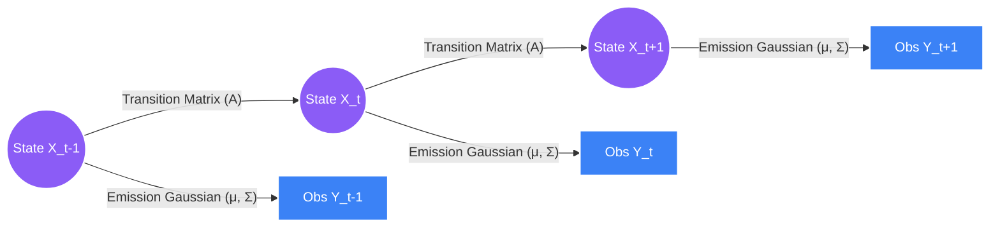
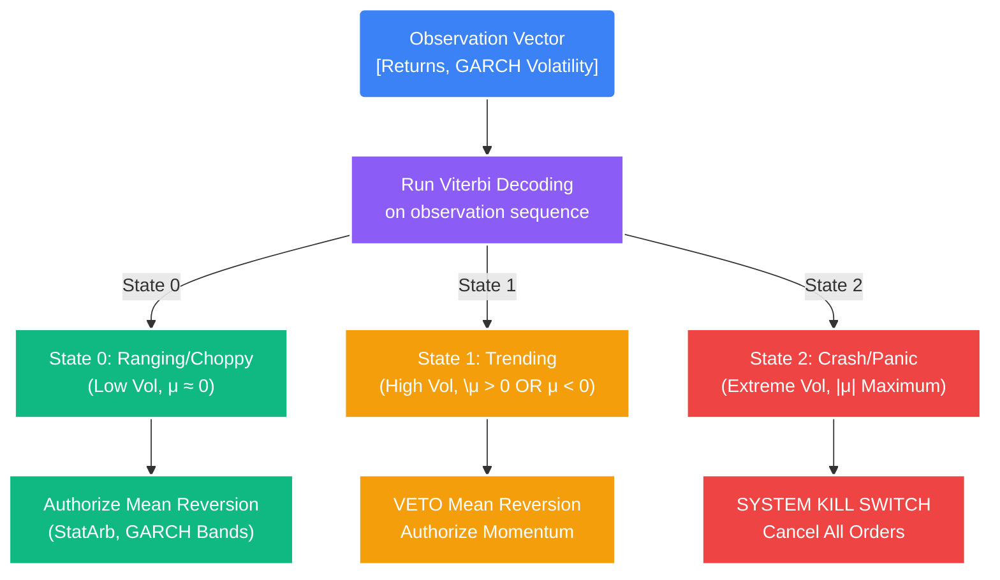

# Deep Dive: Hidden Markov Models (Regime Detection)

## 1. The Core Problem: The Death of Mean Reversion
A perfectly calibrated Mean Reversion algorithm (even one utilizing dynamic GARCH volatility bands) has a fatal mathematical flaw: **Macro Regime Shifts**.

If an asset is trading in a "Choppy/Ranging" environment, buying at the $-2\sigma$ band and selling at the mean is statistically guaranteed to generate profit over a large sample size. However, if macroeconomic news drops (e.g., unexpected inflation data), the market transitions structurally into a "Trending/Breakout" environment.

In a Trending State, the price will blow through the $-2\sigma$ band, the $-3\sigma$ band, and the $-5\sigma$ band, trending downwards for weeks. If the system fails to mathematically recognize that the fundamental *state* of the market has changed, it will continuously buy the dips, averaging down into a catastrophic account liquidation.

We need a model that continuously answers one question: **"What Regime are we in right now?"**

## 2. The Solution: Gaussian Hidden Markov Models (HMM)
A **Hidden Markov Model** is an unsupervised machine learning model used to describe the evolution of observable events that depend on internal factors, which are not directly observable (hidden states).

*   **Observable Emissions ($Y$):** The data we can see. For STOCKSTATS, this is a 2D vector: `[Period_Returns, Realized_Volatility]`.
*   **Hidden States ($X$):** The actual Market Regime, which we cannot see but must infer (0: Ranging, 1: Bull Trend, 2: Bear Trend, 3: Crash).

### A. The Markov Property (Amnesia)
The core assumption of HMM is the *Markov Property*, which states that the probability of transitioning to the next state depends *only* on the current state, completely ignoring all historical states prior to the current one. 

Mathematically:
$$ P(X_{t+1} | X_t, X_{t-1}, \dots, X_1) = P(X_{t+1} | X_t) $$

The market has no long-term structural memory; how the regime behaves in the next 5 minutes is overwhelmingly dictated by how it is behaving right now.

### B. The Mathematics: Three Pillars of the HMM

To fully define an HMM, we need three distinct sets of probabilities:

#### 1. The Initial State Probabilities ($\pi$)
The probability that the system starts in a specific state at $t=1$.
$$ \pi_i = P(X_1 = i) $$

#### 2. The Transition Probability Matrix ($A$)
A square matrix calculating the likelihood of moving from State $i$ to State $j$.

For a 3-State model (0: Ranging, 1: Trending, 2: Crash):
$$
A = \begin{bmatrix}
P(0 \to 0) & P(0 \to 1) & P(0 \to 2) \\
P(1 \to 0) & P(1 \to 1) & P(1 \to 2) \\
P(2 \to 0) & P(2 \to 1) & P(2 \to 2)
\end{bmatrix}
$$
*Note: Each row must sum to $1.0$. If $P(1 \to 1) = 0.95$, it means once the market enters a Trend, there is a 95% probability it will stay in a Trend for the next time period.*

#### 3. The Emission Probabilities ($B$)
Because our market data is continuous (returns can be any decimal), we use **Gaussian** (Normal) distributions to map the hidden states to our observable data. 

For each hidden state $i$, we calculate a Mean ($\mu_i$) and a Covariance Matrix ($\Sigma_i$).
$$ P(Y_t | X_t = i) \sim \mathcal{N}(\mu_i, \Sigma_i) $$

*   **State 0 (Ranging):** Will have a $\mu$ near $0$ and a very small variance $\Sigma$.
*   **State 2 (Crash):** Will have a highly negative $\mu$ and a massive variance $\Sigma$.



## 3. Implementation in STOCKSTATS

The Quantitative Engine runs the HMM asynchronously alongside the core pricing engine. It requires two distinct phases: **Training (Baum-Welch)** and **Decoding (Viterbi)**.

### Step 1: Fitting the HMM (The Baum-Welch Algorithm)
We use the `hmmlearn` library. Because HMMs are *unsupervised*, we do not tell the algorithm what the states are. We just hand it a massive array of historical `[Returns, Volatility]` and say, "Find 3 distinct mathematical states in this data."

The Baum-Welch algorithm uses an Expectation-Maximization (EM) loop to iteratively guess the Transition Matrix ($A$) and the Gaussian parameters ($\mu, \Sigma$) until it finds the optimal fit that explains the historical data.

```python
import numpy as np
from hmmlearn import hmm

def train_regime_model(historical_observations: np.ndarray) -> hmm.GaussianHMM:
    """
    Trains a 3-State Gaussian HMM on historical data.
    X must be a 2D array of [Returns, Volatility].
    """
    # Define a 3-State Gaussian HMM
    # n_iter controls how many times the EM algorithm loops to find the best fit
    model = hmm.GaussianHMM(n_components=3, covariance_type="full", n_iter=1000)
    
    # Unsupervised Training
    model.fit(historical_observations)
    
    return model
```

### Step 2: Live Decoding (The Viterbi Algorithm)
Once the model is trained, we use it live. When a new candle closes, we pass the newest `[Return, Vol]` array integer to the model. 

The **Viterbi Algorithm** calculates the most likely sequence of hidden states that resulted in the sequence of observations we just saw.

```python
def predict_current_regime(model: hmm.GaussianHMM, current_sequence: np.ndarray) -> int:
    """
    Uses the Viterbi algorithm to predict the hidden state of the most recent tick.
    """
    # model.predict runs Viterbi decoding under the hood
    hidden_states = model.predict(current_sequence)
    
    # Return the state of the ultimate last tick in the sequence
    current_state = hidden_states[-1]
    return current_state
```

### Step 3: The Execution Protocol (The Veto)
The raw output of the HMM (`current_state`) must be mapped strictly to the execution risk profiles.



## 4. Edge Cases: State Label Switching
Because HMM training is unsupervised, the algorithm does not know what a "Crash" is. It just assigns an arbitrary integer (0, 1, or 2) to each distinct mathematical cluster it finds.

**The Danger:** If we retrain the HMM on Monday, it might assign `State 2` to the high-volatility crash environment. If we let the model retrain itself on Friday with new data, the EM algorithm might arbitrarily shuffle the labels, assigning `State 0` to the crash environment. If our hard-coded logic says `if state == 2: SYSTEM_KILL_SWITCH`, we will be entirely blind.

**The Engineering Fix:** We must sort the states programmatically after every single training phase.

```python
def align_states(model: hmm.GaussianHMM):
    """
    Sorts the hidden states by their Gaussian Variance.
    Forces State 0 to ALWAYS be low variance (Ranging), and State 2 to ALWAYS be high variance (Crash).
    """
    # Extract the variances of the first feature (Returns) for all states
    variances = np.array([np.diag(model.covars_[i])[0] for i in range(model.n_components)])
    
    # Sort the indices based on variance from lowest to highest
    sorted_indices = np.argsort(variances)
    
    # Logic matrix to map the old random labels to the new sorted labels
    # 0 = Low Vol, 1 = Med Vol, 2 = High Vol
    return sorted_indices
```
By forcing the states to align with variance thresholds, STOCKSTATS guarantees the Execution Logic remains mathematically robust regardless of unsupervised clustering shuffles.
