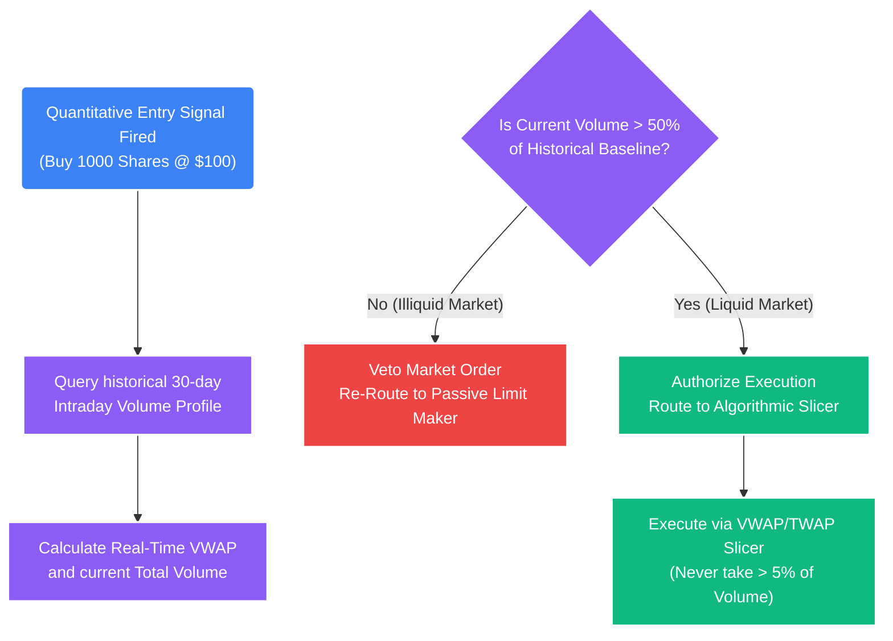

# Deep Dive: Intraday Liquidity Mapping & VWAP

## 1. The Core Problem: The Illiquidity Trap
A mathematical model can generate a perfect Mean Reversion $+2\sigma$ signal with a theoretical Expected Return ($E(R)$) of $3.0R$. However, if that signal occurs during a low-liquidity period (e.g., the lunch hour session in equities, or a Sunday night in crypto), the physical act of exchanging cash for the asset will move the market against the system.

If the Order Book (Level 2 depth) is extremely thin, attempting to buy $100,000 of an asset will "sweep" the available Limit asks across multiple price levels. 
*   **The Trap:** The algorithm's Entry Signal fires at $\$100.00$. The engine submits a Market Order to buy 1,000 shares. 
*   **The Reality:** There are only 100 shares available at $\$100.00$. The remaining 900 shares eat through resting orders at $\$100.05, \$100.20$, and $\$100.50$. The average fill price ends up being $\$100.35$.
*   **The Result:** The system suffers severe **Slippage**. The entry is materially worse than the mathematical model assumed, destroying the $R > 0$ edge and invalidating the backtest.

## 2. Institutional Prevention: Historical Volume Profiling
To prevent sweeping the book, the Quantitative Engine cannot just trade blindly based on price. It must first map the "normal" liquidity for any given asset at the *exact time* the signal occurs.

*   The system analyzes rolling historical data (e.g., the trailing 30 days) to construct an **Intraday Volume Profile**.
*   It calculates the average percentage of total daily volume that executes during a specific 15-minute window (e.g., 10:00 AM - 10:15 AM EST).
*   *Expected Result:* We mathematically know exactly how many dollars the asset is "expected" to trade right now, before we submit an order.

## 3. Volume-Weighted Average Price (VWAP) Normalization
When an algorithmic signal is generated, the Execution Engine checks the current real-time volume against the historical baseline profile using VWAP.

### The VWAP Equation
VWAP is the institutional standard for measuring the true execution price of an asset, as it weights each transaction by its physical volume, preventing small 1-share trades from manipulating the price curve.

$$ P_{VWAP} = \frac{\sum_{j=1}^{n} (P_j \cdot Q_j)}{\sum_{j=1}^{n} Q_j} $$

*   $P_j$: Price of an individual trade $j$
*   $Q_j$: Quantity (Volume) of that specific trade $j$
*   $n$: Total number of trades executed since the daily session open

### The Liquidity Logic Gate
If the current market is functioning on volume ($\sum Q$) that is severely below the historical baseline (e.g., $< 50\%$ of the 30-day average for that specific 15-minute window), the engine flags the environment as **"Illiquid."**

1. If Illiquid: Market orders are VETOED. All executions must be purely passive Limit Orders.
2. If Liquid: The execution is routed to the Smart Order Slicer.



## 4. Algorithmic Order Slicing (The VWAP Router)
If a signal is approved in an optimally liquid environment, the Smart Order Router (SOR) *still* refuses to drop a single, massive block order. It employs a **VWAP Slicer**.

The goal of a VWAP slicing algorithm is to execute a large institutional position slowly over time, matching the market's natural volume curve so that our execution price exactly equals the day's $P_{VWAP}$ metric. This guarantees zero slippage and hides our footprint from predatory High-Frequency Traders (HFTs).

### The Slicing Protocol

1.  **Read L2 Depth:** The system queries the real-time Level 2 Order Book via WebSocket to see exactly how much liquidity sits at the Best Bid/Ask.
2.  **Fractioning:** The system utilizes the historical volume profile to slice the "Parent Order" into dozens of invisible "Child Orders."
3.  **The 5% Rule:** The algorithm is mathematically constrained to *never* constitute more than 5% of the market's total volume in any given 1-minute window.
4.  **Execution Loop:** 
    *   If the engine needs to buy $100,000 of Bitcoin.
    *   It buys $5,000.
    *   It waits a randomized interval (preventing pattern recognition).
    *   It waits for natural algorithmic market makers to replenish the order book.
    *   It buys another $5,000.
    *   It continues traversing the VWAP curve until filled.

### The Python Implementation

```python
def vwap_execution_slicer(total_order_size: float, historical_volume_profile: dict, current_time_window: str) -> float:
    """
    Determines the maximum allowable execution child-slice size for the current 
    minute based on historical volume expectations.
    """
    # 1. Fetch what percentage of daily volume usually trades in this 15-minute chunk
    expected_volume_pct = historical_volume_profile.get(current_time_window, 0.01)
    
    # 2. Fetch the rolling 30-day average daily dollar volume for the asset
    daily_volume_estimate = fetch_current_daily_volume()
    
    # 3. Calculate how much dollar volume we expect the market to absorb right now
    available_liquidity_window = daily_volume_estimate * expected_volume_pct
    
    # 4. VWAP Constraint: We can NEVER be more than 5% of the market's total traded volume
    # Otherwise, we will physically push the price up with our own buying pressure (Self-Slippage).
    max_safe_slice = available_liquidity_window * 0.05
    
    # 5. Routing Logic
    if total_order_size > max_safe_slice:
        # The parent order is too big. Slice it down to the max safe threshold.
        # The remainder will be executed in the next temporal loop.
        return max_safe_slice 
    else:
        # The parent order is small enough to be instantly absorbed by the L2 book without slippage.
        return total_order_size
```

## 5. Exogenous Constraints (The Toxicity Override)
Even if the historical VWAP profile gives a "Green Light" that liquidity *should* be present, the order book can suddenly dry up due to predatory spoofing or a news wipeout.

The Execution Engine pairs the VWAP slicer directly with **Model 15 (Order Book Imbalance - OBI)**. If the OBI metric detects a sudden, massive cancellation of Limit liquidity on our side of the book (a "Vacuum"), the VWAP slicer immediately halts all child order executions to prevent buying into a flash crash.
