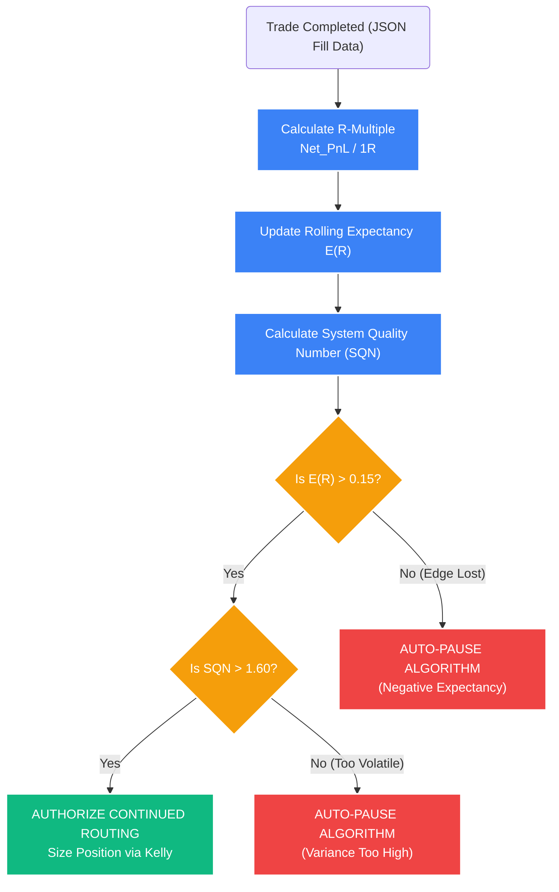

# Deep Dive: Mathematical Expectancy & System Quality (SQN)

## 1. The Core Problem: The Flaw of Win Rates and Dollar PnL
Retail traders evaluate systems based on absolute dollar Profit/Loss or Win Rate percentages. Quantitative systems reject both metrics as statistically meaningless.

*   **Dollar PnL is Arbitrary:** Making $1,000 means nothing unless we know how much capital was risked to make it. Making $1,000 while risking $10,000 is a terrible system (+0.1R). Making $1,000 while risking $100 is a Holy Grail system (+10R).
*   **Win Rate is Deceptive:** A system that wins 90% of the time but loses $10 on its single loss to make $1 on its nine wins carries a negative mathematical expectancy. It will eventually blow up the account. (This is the classic "picking up pennies in front of a steamroller" short-volatility trap).

You cannot build a scalable quantitative engine on dollars or win rates. You need a normalized, scale-invariant unit of measurement.

## 2. The Solution: R-Multiples (Risk Units)
The foundation of the STOCKSTATS execution engine is the **Initial Risk ($1R$)**. Every single trade outcome, regardless of the asset class or the nominal dollar size of the account, is normalized to this value.

By mathematically stripping away the nominal dollar value, the quantitative engine evaluates the pure, unadulterated "Edge" of the statistical signal.

### A. Defining $1R$
$1R$ is the absolute maximum capital you are willing to lose if the algorithm is wrong and the trade is stopped out.

$$ 1R = |Entry\_Price - Stop\_Loss\_Price| \times Position\_Size $$

*   *Note: In the Execution Engine, the Position Size is derived dynamically using Copulas and fractional Kelly sizing (Model 06) so that $1R$ always equals a fixed percentage of the total portfolio equity (e.g., exactly 1.00% of the account).*

### B. Calculating the R-Multiple Outcome
Once a trade concludes, the result is divided by the initial risk.

$$ R\_Multiple = \frac{Net\_Realized\_Profit}{1R} $$

*   If a trade risks $500 ($1R$) and makes $1,500, the outcome is **+3.0R**.
*   If a trade risks $10,000 ($1R$) and makes $30,000, the outcome is *also* **+3.0R**.
*   If a trade hits its stop loss and loses its full risk amount with zero slippage, the outcome is **-1.0R**.

## 3. Mathematical Expectancy ($E(R)$)
Expectancy answers one simple question: *Over a large sample size of 100+ trades, how many R-multiples does this specific algorithm win per single trade execution?*

### The Master Equation
$$ E(R) = (P_w \times \overline{W_R}) - (P_l \times |\overline{L_R}|) $$

*   $P_w$: Probability of Winning (Win Rate, e.g., 0.40 or 40%)
*   $\overline{W_R}$: Average Winning R-Multiple (e.g., +2.5R)
*   $P_l$: Probability of Losing (Loss Rate, e.g., 0.60 or 60%)
*   $\overline{L_R}$: Average Losing R-Multiple (Assuming strict risk management, this is usually near -1.0R)

*Example Calculation:*
$$ E(R) = (0.40 \times 2.5) - (0.60 \times 1.0) = 1.0 - 0.6 = +0.40R $$
This algorithm generates +0.40R per trade. If we are risking 1% of our account per trade ($1R = 1\%$), we mathematically expect to grow the account by 0.4% every time the algorithm fires a signal, regardless of whether that specific sequential trade wins or loses.

### The Execution Mandate
**Every Strategy Pod in the STOCKSTATS platform must maintain a rolling $E(R) > 0.15$ factoring in all friction (spread, maximum slippage, and exchange taker fees).** 
If the trailing 100-trade $E(R)$ drops below $0.15$, the state machine automatically halts the strategy.

## 4. System Quality Number (SQN)
A system with a positive $E(R)$ can still be un-tradable if the variance (the wild swings between huge wins and huge losses) is too high. High variance causes massive drawdowns that trigger global VaR Kill Switches.

To measure the "smoothness" and reliability of the statistical edge, we calculate the System Quality Number (SQN), developed by Dr. Van Tharp. 

### The Equation
SQN measures the relationship between the Expectancy of the system and the Standard Deviation of its returns, normalized by the frequency of trades.

$$ SQN = \frac{\sqrt{N} \times E(R)}{\sigma_R} $$

*   $\sqrt{N}$: The square root of the number of trades in the sample (Velocity/Frequency). A system that trades 1,000 times a year is mathematically more reliable than one that trades 10 times. (Note: To normalize SQN for comparison, $N$ is often capped at 100).
*   $E(R)$: The Expectancy calculated above.
*   $\sigma_R$: The Standard Deviation of the entire array of R-multiples generated by the system (the Variance). 

### The Logic Matrix (For N=100)
STOCKSTATS grades every sub-algorithm using this table:
*   **SQN < 1.6:** Poor / Un-tradable. Variance is too high or Expectancy is too low. Engine shuts down routing.
*   **SQN 1.6 - 2.0:** Average. Tradable, but requires minimal leverage.
*   **SQN 2.0 - 3.0:** Excellent. The system is highly reliable and smooth.
*   **SQN > 3.0:** Holy Grail. The equity curve is virtually a straight line. Maximum leverage authorized.

## 5. Excursion Optimization (MAE / MFE)
Most algorithms try to optimize their signals. STOCKSTATS optimizes its *structure*. To maximize $E(R)$ without changing the entry logic, the system uses continuous background audits on closed trades to optimize the physical location of the mathematical Stop Loss ($1R$).

We analyze two metrics for every historical trade:
*   **Maximum Adverse Excursion (MAE):** The maximum paper loss a trade experienced before eventually closing as a winner. It tells us how much "heat" the trade took.
*   **Maximum Favorable Excursion (MFE):** The max paper profit a trade reached before reverting and hitting the stop loss. It tells us how much money was left on the table.

### Structural Optimization Protocol

If the system analyzes the last 500 winning trades and plots their MAE distribution:

1.  **Observation:** The algorithm notices that 95% of all historical winning trades never suffered a Maximum Adverse Excursion larger than $-0.4R$. (Meaning, if a trade went against us by more than 40% of our Stop Loss distance, it was ultimately destined to become a full $-1.0R$ loser).
2.  **The Adjustment:** The algorithm's current stop loss is demonstrably too wide. It is absorbing unnecessary risk. The system autonomously tightens all future Stop Losses for this algorithm from $1.0R$ to $0.5R$.
3.  **The Result:** By cutting the physical distance of the Stop Loss in half, the position size (number of shares) can mathematically be *doubled* while keeping the total portfolio dollar risk identical. 
4.  **Expectancy Explosion:** For the exact same Target Price, the resulting R-Multiple on a winning trade just doubled from $+2.0R$ to $+4.0R$. The global $E(R)$ and SQN skyrocket, all without altering a single line of the GARCH or Cointegration entry criteria.

