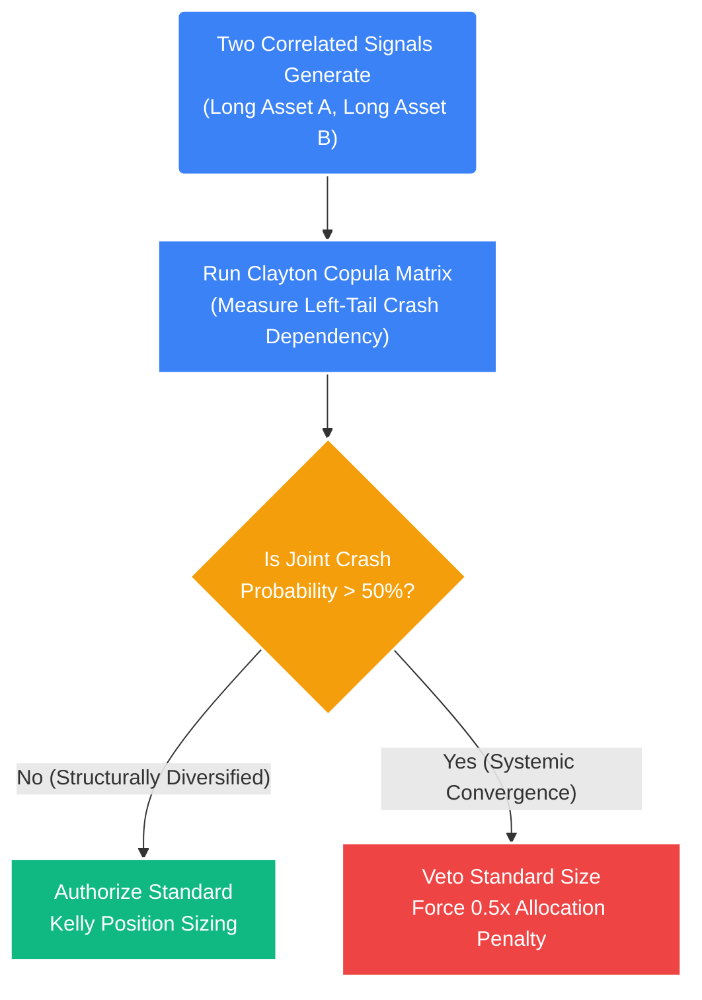

# Deep Dive: Multi-Asset Correlation & Fractional Kelly Sizing

## 1. The Core Problem: The Failure of Pearson Correlation
Standard portfolio theory (like Mean-Variance Optimization) relies almost entirely on **Pearson Correlation** ($\rho$) to measure diversification and risk. 

The fatal mathematical flaw of Pearson correlation is that it operates strictly on the assumption of **Normal Distributions (Bell Curves)**. It measures the linear relationship between two assets near the center of their distributions.

Financial markets are decidedly *non-normal*. They exhibit "Fat Tails"—extreme outlier events (black swans, 6$\sigma$ crashes) happen exponentially more frequently than a Gaussian bell curve predicts. 

**The Trap:** During a systemic "Fat Tail" liquidity shock (e.g., March 2020), all liquid risk assets historically violently correlate toward $1.0$. If a portfolio relies on standard Pearson correlation to measure its risk exposure, it will believe it is safely diversified when, in reality, it is completely exposed to total ruin.

## 2. The Solution: Copula Correlation
To protect the portfolio from systemic wipeouts, the STOCKSTATS Quantitative Engine abandons standard correlation in favor of **Copula Functions**. Copulas allow the engine to isolate and model the *joint tail dependency* of multiple assets independently from their central distributions.

Rather than asking: *"How correlated are BTC and ETH on an average Tuesday?" (Pearson)*

The Copula calculates: *"If BTC drops 5 Standard Deviations ($\sigma$) in one hour, what is the exact mathematical probability that ETH will simultaneously drop $\ge 4\sigma$?" (Left-Tail Dependence)*

### A. Implementing the Clayton Copula
The system specifically utilizes **Archimedean Copulas** to build its risk matrices. 
*   **Clayton Copula:** Specifically measures and models lower-tail/crash asymmetric dependence. This is the ultimate defensive metric.
*   **Gumbel Copula:** Measures upper-tail/breakout dependence.

### B. The Veto Logic Matrix
Before the Execution Engine sizes a trade, it queries the Copula risk matrix.
If the engine wants to execute a Long position in Asset A and a Long position in Asset B simultaneously:

1.  **Check Clayton Dependency:** Is the lower-tail dependence coefficient between Asset A and Asset B high? ($C_L > 0.7$)
2.  **The Intervention:** If the Clayton Copula proves a high probability that both assets will crash simultaneously during a shock, the Execution Engine will forcefully **halve the standard allocation** for those specific trades to prevent concentrated portfolio ruin.

## 3. Position Sizing: The Kelly Criterion
Once a trade signal is validated and its cross-asset tail-risk is analyzed, the Execution Engine must determine exactly how much capital to allocate. 

Amateur systems use static sizing (e.g., risking 1% or $500 per trade). This is statistically sub-optimal. You must scale your risk strictly in proportion to the mathematical edge of the specific algorithm generating the signal.

The system utilizes the **Kelly Criterion**, a formula that dictates the statistically optimal percentage of a bankroll to wager to maximize long-term geometric compound growth rates, based on the known mathematically proven edge of the system.

### A. The Full Kelly Equation ($f^*$)

$$ f^* = \frac{p(b+1) - 1}{b} $$

*   **$f^*$:** The fraction of the total portfolio equity to allocate to the trade (The Kelly Percentage).
*   **$p$:** The probability of a win (The Win Rate of the specific algorithm generating the signal, dynamically pulled from Model 05).
*   **$b$:** The ratio of the average win to the average loss (The Payoff Ratio, also pulled dynamically via its $\overline{W_R} / \overline{L_R}$).

*Example Calculation:* 
If an algorithm wins 45% of the time ($p = 0.45$) and makes $2.0R$ on average ($b = 2.0$):
$$ f^* = \frac{0.45(2.0+1) - 1}{2.0} = \frac{1.35 - 1}{2.0} = \frac{0.35}{2.0} = 0.175 $$
The "Full Kelly" calculation dictates that mathematically, to maximize growth, we must risk exactly **17.5%** of our entire portfolio on this single trade.

## 4. The Fractional Mandate Constraint (Half-Kelly)
17.5% risk on a single trade is mathematically optimal *if and only if* the input variables ($p$ and $b$) are absolute, known certainties that will never change.

In financial markets, these parameters constantly slide based on unobservable macroeconomic regimes. If Full Kelly suggests risking 17.5% of the portfolio, and the market experiences an unforeseen structural shift that temporarily degrades our Win Rate ($p$) from 45% to 35%, our required optimal fraction drops from 17.5% to almost 0%. Taking an oversized 17.5% position into a regime change results in a catastrophic drawdown, often termed **"Kelly Ruin."**

To mathematically safeguard the capital engine against variance drag and estimation error, the system hard-codes a strict **Fractional Kelly** modifier (usually "Half-Kelly" or "Quarter-Kelly").

$$ Authorized\_Risk = f^* \times 0.50 $$

### The Geometric Curve
The mathematics of the Kelly Criterion form a harsh parabola.
*   Betting exactly $f^*$ maximizes growth.
*   Betting slightly more than $f^*$ (Over-betting) instantly plummets the geometric growth rate into negative territory, mathematically guaranteeing ruin.
*   Betting exactly $0.5f^*$ (Half-Kelly) yields roughly 75% of the maximum possible geometric growth rate, but drastically reduces the volatility and drawdown depth of the equity curve by nearly 50%.

By systematically applying the $0.50$ Fractional multiplier, the engine retains the compounding benefits of dynamic sizing proportional to algorithmic edge, while mathematically eliminating the risk of total ruin caused by the unavoidable statistical variance of financial markets.
