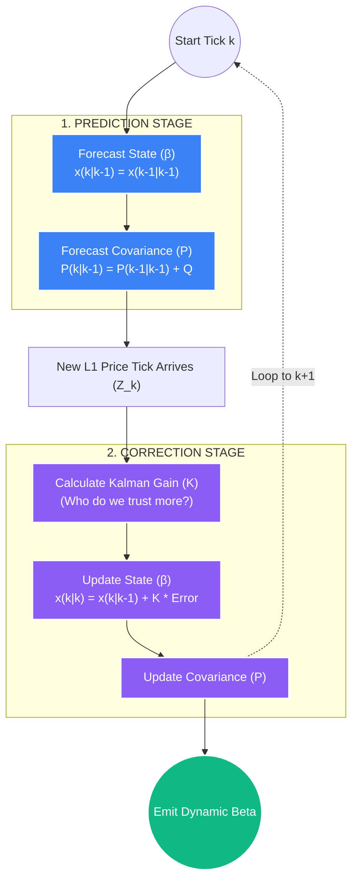

# Deep Dive: Kalman Filters & Dynamic Hedge Ratios

## 1. The Core Problem: The Lag of OLS Regression
In the `02_cointegration_arb.md` whitepaper, we use Ordinary Least Squares (OLS) regression to calculate the Hedge Ratio ($\beta$) between two assets (e.g., how much ETH to short for every 1 BTC we buy). 

The critical flaw in OLS is that it is a **static, structurally backward-looking** metric. OLS assumes the mathematical relationship between Asset A and Asset B is perfectly constant over the entire historical lookback window. 
*   **The Trap:** If you calculate an OLS $\beta$ over a 30-day window, a violent structural regime shift on Day 29 will barely move the $\beta$ average. The Execution Engine will blindly trade using an obsolete, lagging hedge ratio, dragging the purportedly "Delta-neutral" portfolio into massive directional exposure.
*   **The False Fix:** If we simply use a very short moving window (e.g., 2 hours) to calculate OLS, the model becomes hypersensitive to intraday microstructure noise, causing the hedge ratio to whip violently back and forth, incurring ruinous transaction costs.

## 2. The Solution: The Kalman Filter
To survive regime shifts without succumbing to noise, STOCKSTATS abandons static OLS in production. Instead, it utilizes the **Kalman Filter**.

The Kalman Filter is a recursive mathematical algorithm developed for aerospace trajectory tracking (e.g., guiding Apollo rockets and ballistic missiles). In quantitative finance, it is used to dynamically estimate the true "hidden state" of a system (the true Hedge Ratio) from an ongoing stream of noisy observations (the chaotic price ticks).

Unlike OLS, the Kalman Filter updates its estimate of $\beta$ *tick-by-tick* without needing to recalculate or even store the entire historical data window. It mathematically weighs the new data against the historical state to find the optimal smoothing factor.

### A. The Two-Step Recursive Loop (The Math)

The Kalman filter operates in an endless, ultra-fast loop of **Prediction** and **Correction**.

#### Step 1: Prediction (Time Update)
Before a new price tick even arrives, the model forecasts the expected state (what it thinks tomorrow's $\beta$ will be) and the uncertainty of that prediction (Covariance). Because we assume the true beta follows a random walk, the best prediction of tomorrow's $\beta$ is today's $\beta$.

*   **State Prediction:** $\hat{x}_{k|k-1} = \hat{x}_{k-1|k-1}$
*   **Covariance Prediction:** $P_{k|k-1} = P_{k-1|k-1} + Q$  *(where $Q$ is the inherent process noise / volatility of the regime)*

#### Step 2: Correction (Measurement Update)
When the new price tick actually hits the WebSocket, the model calculates the error between what it predicted and what actually happened ($Z_k$). It then calculates the **Kalman Gain ($K$)**—the master variable that mathematically decides whether to trust the *Model's Prediction* more, or the *New Measurement* more.

*   **The Innovation (Error):** $\tilde{y}_k = z_k - H_k \hat{x}_{k|k-1}$
*   **The Kalman Gain:** $K_k = P_{k|k-1} H_k^T (H_k P_{k|k-1} H_k^T + R)^{-1}$  *(where $R$ is the measurement noise / micro-structural exchange slippage)*
*   **The Final State Update (The new $\beta$):** $\hat{x}_{k|k} = \hat{x}_{k|k-1} + K_k \tilde{y}_k$

If the variance of the exchange prices ($R$) is massive, the Kalman Gain $K$ drops toward 0, and the model completely ignores the new tick, trusting its own structural prediction. If the model's own internal uncertainty ($P$) is high, $K$ approaches 1, and the model instantly adapts to the new market prices, snapping the Hedge Ratio to reality without lag.



## 3. Implementation in STOCKSTATS

By utilizing the `pykalman` library, the Python Quantitative Engine completely replaces all rolling-window OLS functions for live StatArb execution.

### The Execution Protocol
1.  **Cold Start Initialization:** The algorithm seeds the starting state by running a standard OLS regression over the first 1,000 data points fetched from TimescaleDB to give the Kalman Filter a baseline $\mu$ and $\Sigma$.
2.  **The Live WebSocket Stream:** As every new tick arrives via CCXT, the Kalman Filter ingests the paired prices.
3.  **The Output Emission:** It instantly outputs an updated, optimally smoothed Hedge Ratio ($\beta_{dynamic}$) and intercept ($\alpha_{dynamic}$).

```python
import numpy as np
from pykalman import KalmanFilter

def calculate_dynamic_kalman_hedge(asset_x_prices: np.ndarray, asset_y_prices: np.ndarray) -> float:
    """
    Ingests paired arrays and returns the exact theoretical Hedge Ratio (Beta) 
    at the very last tick without chronological lag.
    """
    # 1. Define Transition Matrices for a Random Walk Model
    delta = 1e-5
    trans_cov = delta / (1 - delta) * np.eye(2)
    
    # 2. Initialize the Kalman Filter
    kf = KalmanFilter(
        n_dim_obs=1,
        n_dim_state=2,
        initial_state_mean=np.zeros(2),   # State vector contains [Beta, Alpha]
        initial_state_covariance=np.ones((2, 2)),
        transition_matrices=np.eye(2),
        # Stack the X prices against an array of 1s (for the alpha intercept)
        observation_matrices=np.expand_dims(np.vstack([[asset_x_prices], [np.ones(len(asset_x_prices))]]).T, axis=1),
        observation_covariance=1.0,  # Measurement noise R
        transition_covariance=trans_cov # Process noise Q
    )
    
    # 3. Fire the recursive filter over the chronological data stream
    # state_means holds the historical array of [Beta, Alpha] at every individual tick
    state_means, state_covs = kf.filter(asset_y_prices)
    
    # 4. Extract the ultimate, real-time dynamic Beta (Slope) at tick T
    dynamic_betas = state_means[:, 0]
    current_live_beta = dynamic_betas[-1] 
    
    return current_live_beta
```

### The Trading Impact (Total Lag Elimination)
When a paired divergence occurs, the Execution Slicer utilizes the *exact* $\beta_{dynamic}$ calculated at that precise millisecond to size the short leg of the pair. 

If the fundamental relationship between BTC and ETH suddenly shifts due to an Ethereum hard fork, the Kalman Filter's $K$ gain will spike, instantly recalculating the hedge ratio to the new reality within 3 ticks. A moving average OLS would require 29 days to fully clear the old regime data from its window, generating catastrophic false signals the entire time.
