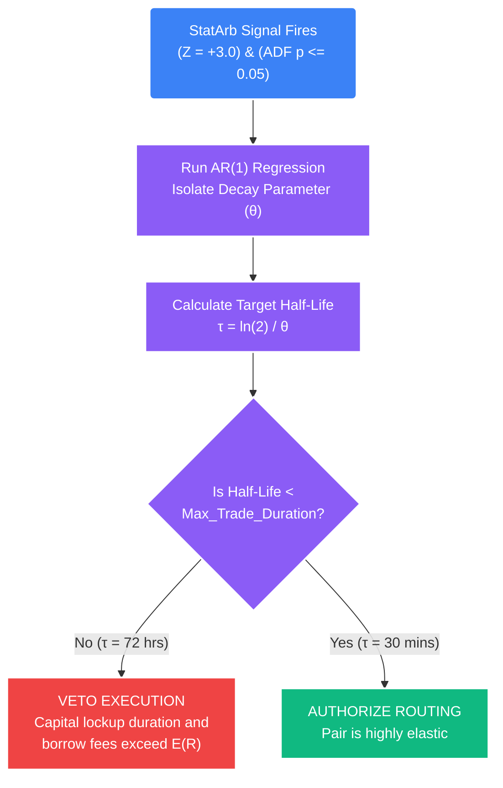

# Deep Dive: The Ornstein-Uhlenbeck (OU) Process & Mean-Reversion Half-Life

## 1. The Core Problem: The Timing Ambiguity of Mean Reversion
A Z-Score $\ge 3.0$ tells you *how far* a price or statistical spread has historically drifted from its baseline mean. 
An Augmented Dickey-Fuller (ADF) cointegration test tells you that the spread possesses a unit root and *will eventually* revert to the mean.

**Neither metric tells you *WHEN* it will revert.** 

*   **The Trap:** If a BTC/ETH paired spread deviates by $3\sigma$, you might authorize a Statistical Arbitrage trade. But if that specific spread mathematical relationship historically takes an average of 6 months to mean-revert, your capital is locked up and illiquid. 
*   **The Cost:** In quantitative trading, time is absolute risk. While locked in a 6-month trade, you accrue ruinous financing fees (borrow rates on the short leg) and expose the portfolio to severe exogenous macro shock risk. Furthermore, your exact $E(R)$ expectancy drops severely because the capital cannot be redeployed into faster, compounding opportunities. 

To solve this, the engine must calculate the exact expected chronometric duration of the trade *before* authorizing entry. We achieve this using the **Ornstein-Uhlenbeck (OU) Process**.

## 2. The Mathematics: The Ornstein-Uhlenbeck Process
The OU process is a continuous-time stochastic process that explicitly models the physical mathematics of mean reversion. It is the exact financial physics equation used to define how violently a stretched rubber band will snap back.

### The Stochastic Differential Equation
The core OU equation defines the continuous change in the spread over an infinitesimal time step ($dt$):

$$ dx_t = \theta (\mu - x_t) dt + \sigma dW_t $$

*   **$dx_t$:** The instantaneous change in the spread's value.
*   **$x_t$:** The current real-time value of the spread.
*   **$\mu$:** The long-term equilibrium mean of the spread (usually $0$ for a normalized Z-Score).
*   **$(\mu - x_t)$:** The physical distance the spread is currently sitting from its mean (The "Stretch").
*   **$\theta$ (Theta - The Speed of Reversion):** A strictly positive constant representing the rate at which the spread decays back toward the mean. This is the holy grail metric. A high $\theta$ means the rubber band snaps back aggressively fast.
*   **$\sigma$:** The volatility (standard deviation) of the shock process.
*   **$dW_t$:** A Wiener Process increment (Brownian motion). This represents the completely random noise entering the market at any given millisecond.

The equation tells us: The spread is constantly being pulled back to the mean ($\mu$) by a force proportional to how far away it is $(\mu - x_t)$ multiplied by its structural rubber-band strength ($\theta$), while simultaneously being buffeted by random unpredictable noise ($\sigma dW_t$).

## 3. Extracting the Half-Life ($\tau$)
From the continuous OU equation, we can mathematically discretize it to run an Autoregressive $AR(1)$ regression on the historical spread arrays. Once we isolate $\theta$, we can calculate the **Half-Life** of the mean reversion.

The half-life represents the exact expected chronological time it takes for the spread to revert exactly halfway back to its mean from any given deviated point.

### The Half-Life Equation
$$ Half\_Life (\tau) = \frac{\ln(2)}{\theta} $$

*If $Half\_Life = 3.5$, it means we statistically expect the spread to cover 50% of the distance back to zero in exactly 3.5 periods (e.g., hours or days, depending on the data frequency).*

## 4. Implementation in STOCKSTATS

### Calculating Theta ($\theta$) in Python
The logic engine runs an ordinary least squares (OLS) regression of the spread's current value against its own previous value (one lag period prior) to find the exact rate of decay.

```python
import numpy as np
import statsmodels.api as sm

def calculate_ou_half_life(spread_time_series_array: np.ndarray) -> float:
    """
    Calculates the Ornstein-Uhlenbeck Half-Life for a given stationary spread.
    Data should be high-frequency (e.g., 1-minute or 5-minute ticks).
    """
    # 1. Calculate the change in the spread from t-1 to t
    # Discretizing the dx_t from the OU stochastic equation
    spread_lag = spread_time_series_array.shift(1).fillna(method="bfill")
    spread_diff = spread_time_series_array - spread_lag
    
    # 2. Add an intercept (Constant)
    X = sm.add_constant(spread_lag)
    
    # 3. Predict the continuous change (spread_diff) using the lagged state (Spread_lag)
    # Regression: delta_Spread = Alpha + Slope * Spread_lag + Error
    model = sm.OLS(spread_diff, X).fit()
    
    # 4. The slope (Coefficient) is equivalent to negative Theta (-θ)
    theta = -model.params[1]
    
    # 5. Failsafe: If theta is <= 0, the series is geometrically diverging, not reverting.
    if theta <= 0:
        return np.inf
        
    # 6. Calculate the actual chronological Half-Life
    half_life = np.log(2) / theta
    
    return half_life
```

## 5. The Execution Protocol (The Funding Veto)
The Half-Life calculation acts as the ultimate liquidity/lockup risk filter before the execution engine routes a market order. By implementing the OU Process, the system formally quantifies the "Cost of Time."

*   **Parameters:** The user defines the specific strategy's maximum allowable time horizon based on current margin borrowing rates (e.g., `Max_Trade_Duration = 4 Hours`).


