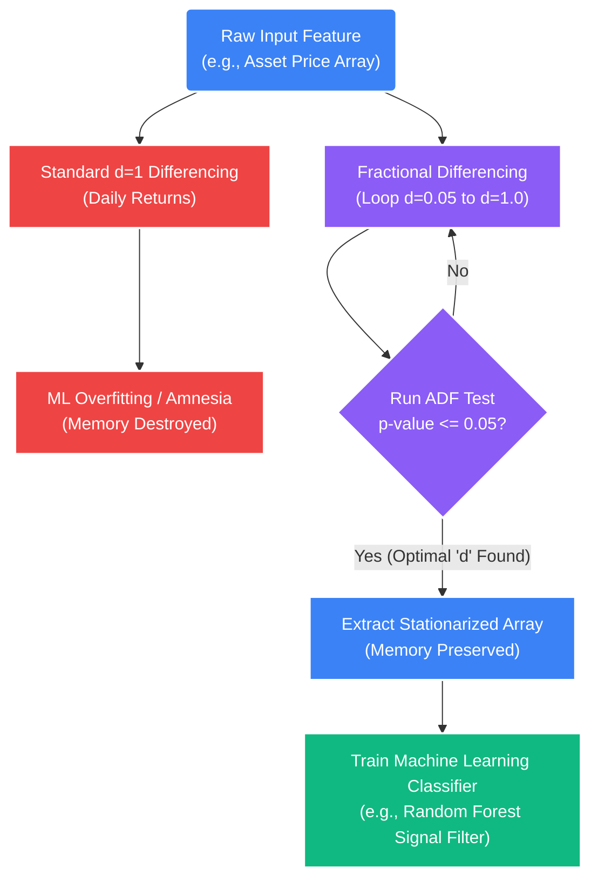

# Deep Dive: Fractional Differencing & Memory Preservation

## 1. The Core Problem: The Stationarity vs. Memory Dilemma
As the STOCKSTATS quantitative system evolves, integrating predictive Machine Learning classification models (like Random Forests, XGBoost, or Neural Networks) alongside the core linear models becomes critical for signal filtering.

Machine Learning models in finance require input array data to be **Stationary** (meaning it has a constant mean and variance over time, independent of when the observation occurred). Feeding raw, trending price data ($Price_t$) to an ML model geometrically guarantees catastrophic failure because financial asset prices are non-stationary random walks. The ML model will just over-fit to the historical trend and blow up the moment the macro regime shifts.

### The Flaw of Integer Differencing ($d=1$)
The standard amateur industry fix to achieve stationarity is taking the first derivative—commonly known as working with "Returns" instead of "Prices".

$$ Return_t = Price_t - Price_{t-1} $$

This is mathematically defined as **Integer Differencing ($d=1$)**. 
*   **The Benefit:** Applying $d=1$ perfectly achieves stationarity. The array of returns will cleanly pass an Augmented Dickey-Fuller (ADF) test.
*   **The Catastrophe:** Integer differencing **destroys all historical memory**. The series is mathematically stripped of its long-term momentum and structural trends. If you train an ML model solely on daily returns, it has absolutely no idea what the physical baseline price was yesterday, last week, or last year. You have meticulously erased the sequence. The ML model becomes amnesic.

## 2. The Quantitative Solution: Fractional Differencing
Introduced to institutional finance by Dr. Marcos Lopez de Prado, **Fractional Differencing** elegantly solves the Stationarity vs. Memory dilemma.

Instead of differentiating an array by an absolute integer ($d=0$ for raw prices, $d=1$ for raw returns), we differentiate by a precise fraction (e.g., $d=0.35$ or $d=0.45$). We apply the absolute minimum amount of mathematical differencing required to *barely* force the array to pass the ADF stationarity test ($\text{p-value} \le 0.05$), while preserving the maximum possible amount of original signal and historical price memory.

### A. The Mathematics: Binomial Expansion of the Backshift Operator
Fractional differencing utilizes a binomial series expansion to apply strictly decaying, exponential weights to historical prices. 
*   Integer differencing ($d=1$) only looks back exactly 1 period: $(1 \times P_t) + (-1 \times P_{t-1})$. The weight of $P_{t-2}$ is $0$.
*   Fractional differencing ($d=0.45$) looks at an *infinite* (or deeply truncated) window of past prices, with the data weights asymptotically bleeding out to zero as you go further back in time.

$$ (1-B)^d = \sum_{k=0}^{\infty} \binom{d}{k} (-B)^k = 1 - dB + \frac{d(d-1)}{2!}B^2 - \frac{d(d-1)(d-2)}{3!}B^3 \dots $$

*   $B$: The Backshift Operator ($B^k x_t = x_{t-k}$). It mathematically shifts the time series backwards.
*   $d$: The Fractional Difference value (e.g., $d=0.45$).

### B. Iterative Weight Calculation
The exact mathematical weight ($w$) assigned to the $k^{th}$ past price observation is calculated iteratively. Your current price always has a weight of $1.0$.

$$ w_k = -w_{k-1} \frac{d - k + 1}{k} $$

**Example Weight Decay ($d = 0.45$):**
*   Today's Price ($w_0$) = $1.0$
*   1 Day ago ($w_1$) = $-0.45$
*   2 Days ago ($w_2$) = $-0.123$
*   3 Days ago ($w_3$) = $-0.063$
*   4 Days ago ($w_4$) = $-0.039$

*Notice how $d=0.45$ still assigns measurable mathematical weight to prices that occurred 4 days ago, preserving a structural tether back through time, whereas $d=1$ abruptly cuts off at Day 1.*

## 3. Implementation in STOCKSTATS

### The Search for the Optimal $d$
The Python quantitative engine runs an automated optimization loop before feeding any feature data to a Machine Learning classifier. It sweeps through potential values of $d$ (from $0.05$ up to $1.00$ in increments of $0.05$). 

For each increment of $d$:
1.  It calculates the fractionally differenced series.
2.  It runs the Augmented Dickey-Fuller (ADF) test.
3.  The engine immediately halts and returns the lowest possible $d$ where the ADF test p-value finally drops $\le 0.05$.

```python
import numpy as np
import pandas as pd
from statsmodels.tsa.stattools import adfuller

def iterative_fractional_differencing_weights(d: float, decay_threshold: float = 1e-5) -> np.ndarray:
    """
    Calculates the infinite sequence of weights required for Fractional Differencing,
    truncating the array once the weight decays below a negligible threshold.
    """
    weights = [1.] # w_0 is always 1
    k = 1
    while True:
        # The iterative formula: w_k = -w_(k-1) * (d - k + 1) / k
        w_new = -weights[-1] * (d - k + 1) / k
        
        # Stop calculating if the historical weight becomes totally negligible
        if abs(w_new) < decay_threshold:
            break
            
        weights.append(w_new)
        k += 1
        
    return np.array(weights).reshape(-1, 1)

def apply_fractional_differencing(price_series: pd.Series, d: float) -> pd.Series:
    """
    Applies the exponential binomial weights to the actual price array.
    """
    weights = iterative_fractional_differencing_weights(d)
    window_width = len(weights) - 1
    
    differenced_array = np.zeros(len(price_series) - window_width)
    
    # Calculate the dot product of the decaying weights against the rolling price window
    for i in range(window_width, len(price_series)):
        window_prices = price_series.iloc[i - window_width : i + 1].values
        # Reverse the prices so the most recent price matches with weight w_0
        differenced_array[i - window_width] = np.dot(weights.T, window_prices[::-1])[0]
        
    return pd.Series(differenced_array, index=price_series.index[window_width:])
```

### The ML Architecture Pipeline



By structurally enforcing Fractional Differencing instead of Integer Differencing across the ingestion pipeline, the STOCKSTATS Artificial Intelligence modules are fundamentally shielded against both regime heteroskedasticity and localized memory erasure.
