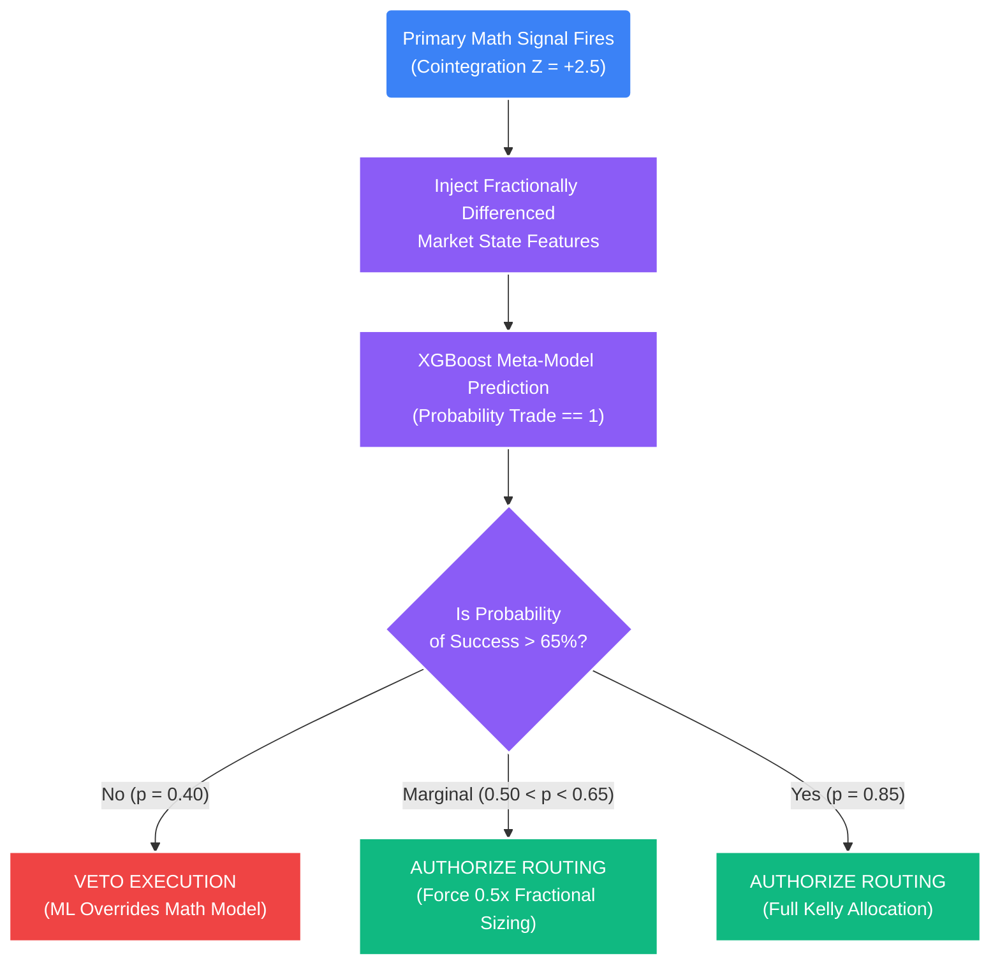

# Deep Dive: Machine Learning Overlays & Meta-Labeling

## 1. The Core Problem: The Danger of Pure Machine Learning
The modern era of amateur algorithmic trading is plagued by "End-to-End" Machine Learning models. Novice quants will feed a Neural Network hundreds of raw price features, slap a target variable on it, and ask the algorithm to predict whether the price will go up or down tomorrow.

**This approach is mathematically doomed to fail in financial markets.** 

Financial data possesses an incredibly low signal-to-noise ratio. End-to-end ML models in trading almost exclusively over-fit to the noise of the specific historical dataset they were trained on. They achieve a 90% Win Rate in backtesting, but suffer catastrophic, account-liquidating failure the moment they hit out-of-sample live data (because the macro-regime inevitably shifts).

**STOCKSTATS does not use Machine Learning to discover trades.** 
The Engine exclusively uses mathematical linear models (OLS, GARCH, Cointegration, Kalman Filters) to discover structural, physical relationships in the market. We use these baseline mathematical models because they are deeply interpretable, grounded in financial reality, and have proven statistical edges that survive regime shifts.

## 2. The Solution: Meta-Labeling
Introduced by Dr. Marcos Lopez de Prado in *Advances in Financial Machine Learning*, **Meta-Labeling** restricts the powerful Machine Learning models strictly to a risk-management and sizing role.

Instead of asking the ML model, *"Should I buy or sell right now?"*
We ask the ML model, *"The core mathematical engine just fired a Buy signal. Based on all available non-linear data, will this specific trade be a Winner (1) or a Loser (0)?"*

This solves the over-fitting problem. The ML model is no longer tasked with predicting complex, chaotic market directions. It is merely tasked with evaluating the localized probability of success for an *already-existing* mathematical signal. 

### A. The Triple-Barrier Method (Creating Labels)
To train our classifier (e.g., Random Forest or XGBoost), we must look back at all historical trades generated by the Primary mathematical signals and label them cleanly. We use the Triple-Barrier Method to account for the physical frictions of trading (Stop Losses, Take Profits, and Expiration).

When a Long signal fires at $t_0$, we place three barriers around the entry price:
1.  **Upper Barrier:** The Take Profit level ($1.5R$ or $2.0R$ target).
2.  **Lower Barrier:** The Stop Loss level ($-1.0R$ Max Adverse Excursion).
3.  **Vertical Barrier (Time):** The maximum trade duration (The OU Half-Life expiration, e.g., 24 hours).

**The Meta-Labeling Rules:**
*   If the price hits the Upper Barrier *first*, we label the trade **1 (Success)**.
*   If the price hits the Lower Barrier *first*, we label the trade **0 (Failure)**.
*   If the price hits the Vertical Time barrier *first* without touching either the TP or SL, we label the trade **0 (Failure)**. We do not tolerate capital lockup.

### B. The Features (Fractionally Differenced)
We feed the ML model hundreds of contextual features that existed at the exact moment ($t_0$) the Primary Signal fired. Crucially, as outlined in `09_fractional_differencing.md`, all of these features are fractionally differenced to ensure physical memory preservation while maintaining mathematical stationarity.
*   *Feature Examples:* Current VIX level, HMM State output (0,1,2), VWAP Deviation, Order Book Imbalance (OBI), localized tick volatility, etc.

## 3. Implementation in STOCKSTATS

### The Execution Protocol (The Artificial Veto)
When a live mathematical Pair-Trade signal (e.g., $Z \ge +2.0$) fires out of the Cointegration engine, it is instantly intercepted by the trained XGBoost Meta-Model before it can reach the Execution Slicer.



### Python Implementation Logic
```python
import xgboost as xgb
import numpy as np

def meta_label_confirmation(primary_signal_detected: bool, current_market_features: np.ndarray, trained_ml_model: xgb.XGBClassifier) -> str:
    """
    Acts as the final Artificial Intelligence gatekeeper before capital is deployed.
    """
    if not primary_signal_detected:
        return "NO_SIGNAL"
        
    # Ask the ML model to predict the probability of success (Label 1)
    # The output is a probability array [Prob_Loser, Prob_Winner]
    probability_of_win = trained_ml_model.predict_proba(current_market_features)[:, 1][0]
    
    # Critical F1-Score Sizing Matrix
    if probability_of_win >= 0.65:
        # The ML model has high mathematical confidence the baseline signal will survive
        return "AUTHORIZE_FULL_KELLY" 
        
    elif 0.50 <= probability_of_win < 0.65:
        # The ML model is unsure. We possess marginal edge.
        return "AUTHORIZE_HALF_KELLY" 
        
    else:
        # The ML model predicts a loss. Veto the mathematical engine.
        return "VETO_HARD_SUPPRESSION"
```

## 4. The Mathematical Impact ($F_1$ Score & Expectancy)
Meta-Labeling physically separates the *Directional Edge* (Base Model) from the *Sizing Edge* (Meta Model). 

By strictly tuning the Machine Learning classifier for **Precision** and its **$F_1$ Score** (minimizing False Positives) rather than aggregate Accuracy, the ML filter successfully blocks losing trades the baseline model wants to take (e.g., stopping the system from buying a $-2\sigma$ dip when the ML contextualizes a macro crash event).

This drastically reduces the Loss Rate ($P_l$). Even if the ML model occasionally blocks a winning trade (a False Negative), suppressing the massive quantity of False Positives mathematically forces the ultimate System Quality Number (SQN) and Expectancy $E(R)$ upward, allowing for much safer, smoother geometric compounded growth.
