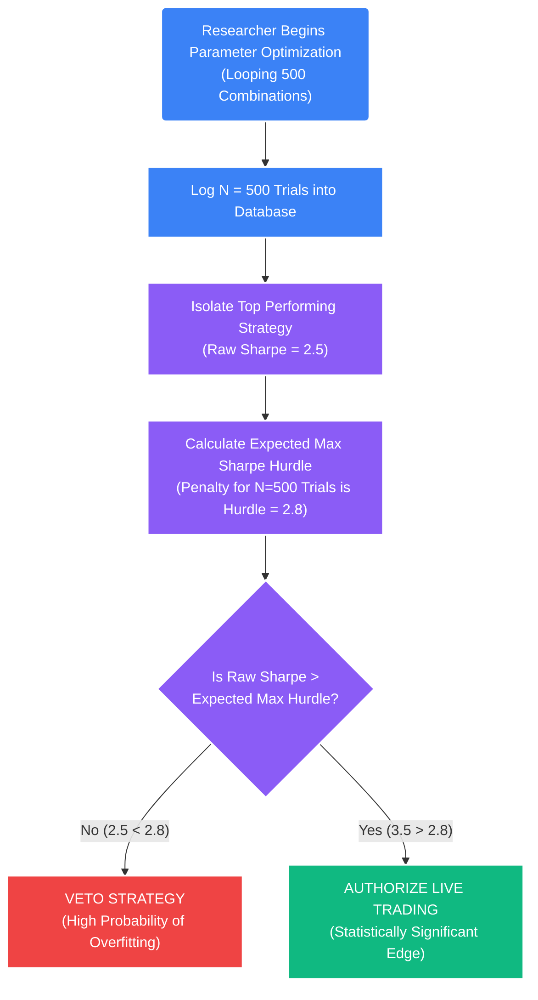

# Deep Dive: Backtesting Rigor & Statistical Deflation

## 1. The Core Problem: The Crisis of Backtesting
A massive percentage of algorithmic trading strategies that show highly profitable, zero-drawdown backtests fail immediately when deployed in live trading. 

This catastrophic failure is rarely due to legitimate macro-market phase changes. It fails because the backtesting environment itself was scientifically flawed, manufacturing an illusion of an edge. To ensure the STOCKSTATS engine produces valid Expected Value ($E(R)$) projections, the backtesting engine is mathematically hard-coded to eliminate three primary biases.

### A. Survivorship Bias
If a researcher backtests a strategy on the current S&P 500 constituents from 2005 to present, the results are mathematically invalid. The current index *only* contains the companies that survived and grew. It ignores companies like Lehman Brothers, Enron, or Blockbuster that went bankrupt and were delisted mid-simulation.
*   **The STOCKSTATS Engine Mandate:** The backtester must exclusively utilize **Point-in-Time** databases. If the system is evaluating a trade on Jan 1st, 2018, it must only query the exact asset universe constituents as they existed *on that specific date*, regardless of whether those assets exist today.

### B. Look-Ahead Bias
Occurs when the backtester accidentally executes trades utilizing target data that would not have physically existed at the exact moment of execution.
*   **The STOCKSTATS Engine Mandate:** All predictive mathematical calculations (e.g., the OLS regression slope, Kalman Filter states, or GARCH variance bands) must be explicitly forced to lag by exactly one chronological tick/candle in the simulation array. 
*   *Example:* If a 1-hour candle closes at `10:00:00 AM`, the algorithmic signal is mathematically generated using that close price. However, the system's execution router can *only* fill the order against the available liquidity and opening price of the `10:01:00 AM` candle.

## 2. The Overfitting Crisis: Multiple Testing Bias
The standard industry metric for measuring risk-adjusted return is the **Sharpe Ratio**. However, the standard Sharpe ratio assumes the strategy parameters were discovered mathematically on the first try.

If a quantitative researcher tests $100$ different parameter combinations (e.g., shifting the StatArb Z-Score trigger from $2.0$ to $2.1$, then to $2.2$, etc.) on the exact same historical dataset, purely by random statistical chance, one of those random configurations will generate an incredible Sharpe ratio of $> 3.0$. 

If the firm deploys that "winning" strategy, it will immediately fail. The high Sharpe was a statistical anomaly caused by **Multiple Testing Bias (Overfitting)** to historical noise.

## 3. The Solution: The Deflated Sharpe Ratio (DSR)
Introduced by Dr. David Bailey and Dr. Marcos Lopez de Prado, the Deflated Sharpe Ratio mathematically penalizes the output of a backtest based entirely on the number of "failed" variants that were silently tested before isolating the winning parameters.

The DSR calculates the probability that the estimated Sharpe Ratio ($\widehat{SR}$) is actually statistically significant, factoring in:
1.  The non-normality of the historical returns (Negative Skewness and Fat-Tailed Kurtosis).
2.  The physical length of the track record (Number of trades/years).
3.  **The Penalty Factor:** The number of independent chronological trials/optimizations (backtests) executed to find the parameters.

### A. Expected Maximum Sharpe Ratio
To calculate the DSR penalty, the system first calculates the Expected Maximum Sharpe Ratio ($E[\max_{SR}]$). This equation dictates what the highest Sharpe Ratio *should* theoretically be mathematically, purely by random chance, after running $N$ trials.

$$ E[\max(SR_N)] \approx E[SR] + \sqrt{V[SR]} \times \left( (1-\gamma)Z^{-1} \left( 1 - \frac{1}{N} \right) + \gamma Z^{-1} \left( 1 - \frac{1}{N} e^{-1} \right) \right) $$

*   $N$: The number of trial backtests run on the dataset.
*   $\gamma$: The Euler-Mascheroni constant ($\approx 0.5772$).
*   $Z^{-1}$: The inverse of the standard normal cumulative distribution.

*Concept:* If you run 1 trial ($N=1$), the threshold for a valid Sharpe is low. If you run 10,000 trials ($N=10000$), the math dictates that the highest random Sharpe will naturally be huge. The strategy must beat *that* massive hurdle penalty to be considered a genuine structural edge.

### B. Implementation Logic

When the STOCKSTATS researchers optimize parameters (e.g., sweeping the ADF p-value threshold from `0.05` to `0.01`), the backtesting engine meticulously logs every single iteration run into a PostgreSQL database table (`backtest_trials`).

**The Execution Mandate:** A mathematical strategy is perfectly formulated and conditionally authorized for live execution *if and only if* the Deflated Sharpe Ratio calculation indicates a $> 95\%$ confidence interval that the edge is real, overcoming the massive penalty of the number of trials ($N$) run to discover it. This uncompromising metric forces the deployment of robust algorithms built purely on sound microstructural economic theory, mathematically exterminating data mining.
