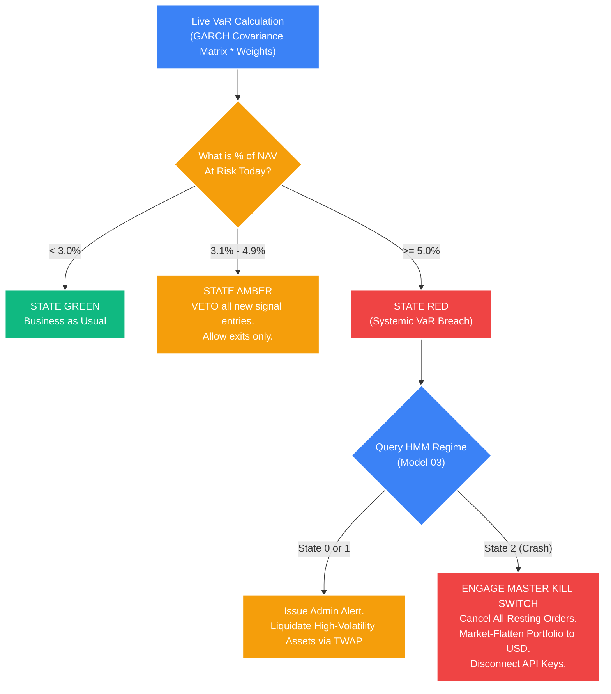

# Deep Dive: Portfolio Value at Risk (VaR) & The Kill Switch

## 1. The Core Problem: Measuring Aggregate Ruin
While the **Fractional Kelly Criterion ($0.5f^*$)** perfectly sizes individual pair positions based on their localized mathematical edge, and **Copulas** measure the exact tail-correlation between two highly specific assets during a crash, we need a singular, unified macroeconomic mathematical metric to govern the survival of the *entire* portfolio entity.

If the engine is simultaneously holding 50 Statistical Arbitrage pairs, 20 Mean Reversion grids, and 5 Momentum breakouts across 15 different asset classes, human intuition cannot comprehend the compounded risk.

**Value at Risk (VaR)** answers the ultimate risk-management question quantitatively:
*"Under normal market conditions, what is the exact maximum dollar amount this entire interconnected portfolio could logically lose over the next 24 hours with a 99% level of statistical confidence?"*

If the calculated 99% VaR exceeds our hard-coded survival threshold for capital drawdowns, the system is deemed structurally unsafe, and the macro kill-switches must be forcefully engaged.

## 2. The Mathematics: Parametric VaR (Variance-Covariance)
The STOCKSTATS system utilizes the Parametric (or Variance-Covariance) method for real-time VaR calculation. Calculating Historical or Monte Carlo VaR is too computationally expensive for a microsecond execution environment. Parametric VaR utilizes linear algebra to calculate aggregate risk instantly, updating tick-by-tick.

### A. The Master Equation
To calculate the total Dollar Value at Risk ($VaR_p$) of an N-asset portfolio over a given time horizon $T$:

$$ VaR_p = Z_{\alpha} \cdot \sqrt{w^T \cdot \Sigma \cdot w} \cdot \text{Portfolio\_Value} \cdot \sqrt{T} $$

### B. Deconstructing the Linear Algebra Vectors
*   **$Z_{\alpha}$:** The Z-score corresponding to our required confidence interval. For a strict 99% confidence level (the 1st percentile of returns), $Z \approx 2.33$.
*   **$w$:** A vertical vector (mathematical array) representing the percentage weights ($[w_1, w_2, \dots, w_n]^T$) of all physically active positions in the portfolio.
*   **$w^T$:** The transpose (horizontal row matrix) of the position weights vector.
*   **$\Sigma$ (The Covariance Matrix):** The master symmetric matrix containing the variance of every single asset on the main diagonal, and the covariance between every pair of assets on the off-diagonals. *Crucially, STOCKSTATS dynamically feeds the real-time localized output of the GARCH(1,1) volatility models directly into this covariance matrix, ensuring VaR expands outwardly immediately the microsecond a market shock occurs.*
*   **$\sigma_p = \sqrt{w^T \cdot \Sigma \cdot w}$:** This matrix multiplication yields the total blended standard deviation ($\sigma_p$) of the combined portfolio, explicitly calculating the mathematical diversification benefits (or lack thereof) between the assets.
*   **$\sqrt{T}$:** The square root of time. Used to scale a 1-day VaR to a 10-day or 30-day VaR.

## 3. Implementation in STOCKSTATS

### Real-Time Python Calculation
The Risk Engine microservice natively continuously polls the live portfolio balances and recalculates the real-time GARCH covariance matrix $\Sigma$.

```python
import numpy as np
import scipy.stats as stats

def calculate_parametric_portfolio_var(
    portfolio_dollar_value: float, 
    weights_vector: np.ndarray, 
    covariance_matrix: np.ndarray, 
    confidence_level: float = 0.99
) -> float:
    """
    Calculates the 1-Day Dollar Value at Risk for the entire active portfolio entity.
    """
    # 1. Get the Z-Score threshold (approx 2.33 for 99% confidence)
    z_score = stats.norm.ppf(confidence_level)
    
    # 2. Linear Algebra: Calculate Portfolio Variance (w^T * Sigma * w)
    # This matrix multiplication mathematically blends the independent GARCH standard deviations.
    portfolio_variance = np.dot(weights_vector.T, np.dot(covariance_matrix, weights_vector))
    
    # 3. Calculate blended Portfolio Standard Deviation (Volatility, sigma_p)
    portfolio_std_dev = np.sqrt(portfolio_variance)
    
    # 4. Calculate Absolute 1-Day Dollar VaR
    var_dollar_amount = portfolio_dollar_value * portfolio_std_dev * z_score
    
    return var_dollar_amount
```

## 4. The Macro Execution Matrix (The Master Kill Switch)
The core output of the VaR calculation ($\text{percentage of NAV at risk}$) governs the global execution state of the entire Trading Desk. 

Assume the rigid structural mandate dictates that the quantitative fund cannot physically risk losing more than $5.0\%$ of its total Net Asset Value (NAV) in a single chaotic 24-hour period.

### The Systemic State Logic

*   **STATE GREEN ($VaR_p \le 3.0\%$ of NAV):** 
    *   *Action:* All quantitative algorithms and strategy pods are fully authorized. New math signals are freely parsed and routed to execution.
*   **STATE AMBER ($VaR_p = 3.1\% - 4.9\%$ of NAV):** 
    *   *Action:* **Risk-Reduction Subroutine.** The execution engine is physically disconnected from entering *new* positions. It is strictly only authorized to route market/limit orders that reduce existing exposure or flatten open trades to push VaR back into the green zone.
*   **STATE RED ($VaR_p \ge 5.0\%$ of NAV):** 
    *   *Action:* **SYSTEMIC BREACH (THE KILL SWITCH).** 



By formally integrating Parametric VaR into the global routing engine, STOCKSTATS guarantees it can survive extreme systemic liquidity drawdowns that destroy retail-level isolated sizing models.
