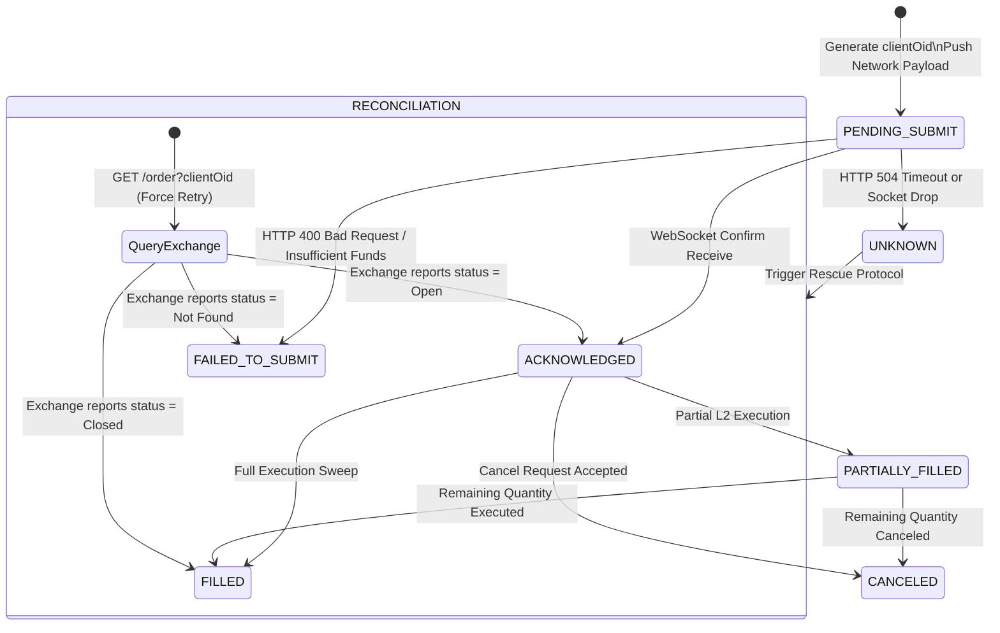

# Deep Dive: Order State Machine & Reconciliation

## 1. The Core Problem: The API Vacuum Illusion
Mathematical quantitative models (like GARCH or Cointegration) operate in a pristine, theoretical vacuum. Their internal logic simply assumes: *"If the Z-Score is $+2.5$ and the Copula $C_L < 0.5$, execute trade to buy $1.00$ Bitcoin."*

However, physiological cryptocurrency exchanges and high-frequency equity brokers are not perfect vacuums. Their physical Execution APIs frequently suffer from systemic degradation:
1.  **Timeouts (HTTP 504 Gateway Timeout):** The algorithm sends the HTTP `POST /buy` payload, but the exchange's matching engine is overloaded by a flash crash. Your physical AWS server never receives a confirmation response.
2.  **Rate Limiting (HTTP 429 Too Many Requests):** The system abruptly hits its REST API bandwidth quota, instantly blocking the execution attempt.
3.  **Partial Fills & Race Conditions:** The algorithm orders $10.0$ BTC. Because it is a competitive High-Frequency Trading (HFT) environment, faster market markers pull their liquidity milliseconds before your order arrives. You are only filled for $2.0$ BTC. The remaining $8.0$ BTC sit orphaned, open on the L2 book as a Maker order, while the price rockets away.

**The Catastrophe:** If the STOCKSTATS Execution Engine naively assumes that a "Timeout" means the order failed, and it autonomously sends the `BUY` command *again*, it will accidentally double its exposure (purchasing $2.0$ Bitcoin instead of $1.0$) if the initial order was actually processed by the exchange engine. This "Zombie Order" double-spend structurally destroys portfolio VaR and bankrupts algorithms.

## 2. The Solution: The Deterministic State Machine
To absolutely guarantee the system never double-spends, over-allocates, or loses track of deployed capital, the STOCKSTATS Execution Engine physically decouples "Signal Generation" from "Order Execution." 

Execution is ruthlessly governed by a strictly audited, one-way **Deterministic State Machine**.

### A. The Cryptographic Client Order ID (`clientOid`)
Every time the Quantitative Logic Engine generates an execution signal, the execution router intercepts it and creates a unique, cryptographically secure UUIDv4 (e.g., `ord-7f8a9b11-c23d`). 

*   **The Ledger Premise:** This UUID is physically written and locked into our local PostgreSQL database ledger *before* the network payload is ever sent to the exchange.
*   **The API Payload:** We rigidly inject this UUID into the exchange execution payload under the `clientOid` (Client Order ID) parameter.

By enforcing the use of `clientOid`, the execution is perfectly idempotent. If we send the `ord-7f8a...` payload twice because of a Timeout, the exchange mathematically rejects the second order as a duplicate, physically preventing the double-spend.

## 3. The Lifecycle States
An individual order instantiated in the PostgreSQL database can *only* exist in one of the following hard-coded enum statuses. It can never skip a step.

1.  `PENDING_SUBMIT`: The UUID is created in our DB. The JSON payload is actively in transit over the network to the exchange API.
2.  `ACKNOWLEDGED`: The exchange WebSocket connection confirmed physical receipt of the `clientOid`, but $0.0\%$ of the order has been filled. It is resting safely on the book.
3.  `PARTIALLY_FILLED`: Execution has begun, but a remainder quantity $Q_r > 0$ exists on the L2 book.
4.  `FILLED`: Complete 100% execution. The state transitions to `POSITION_OPEN`.
5.  `CANCELED`: The order was deliberately killed by our Smart Order Router (SOR), or automatically expired by a Time-In-Force (TIF) instruction like `Immediate-Or-Cancel (IOC)`.
6.  `UNKNOWN`: **(The Danger State)**. A network Timeout occurred. 



*(Note: If the system is running in **Shadow Mode (Strategy 14)**, this entire external state machine is bypassed. The local engine simulates the payload against the Redis L2 book and writes directly to the `shadow_execution_ledger` as `SIMULATED_FILL` or `SIMULATED_REJECT`, completely sidestepping HTTP timeout risks).*

## 4. The Reconciliation Engine (The "UNKNOWN" Rescue Protocol)
If a `PENDING_SUBMIT` order does not physically transition to `ACKNOWLEDGED` or `FILLED` within $N$ milliseconds (usually 2,500ms), the system aggressively overrides it into the `UNKNOWN` state.

**The Golden Rule:** The system is **HARD-LOCKED** by the database transaction manager from sending *any* new orders for that specific asset while an `UNKNOWN` state exists in the ledger. It must enter Reconciliation Mode.

### The Reconciliation Protocol Logic
1.  **Halt & Quarantine:** Immediately pause all incoming mathematical signal ingestion for the affected asset pair.
2.  **Query by UUID:** Send an explicit, forced REST query directly to the exchange API: `GET /order?clientOid=ord-7f8a9b...`
3.  **Resolution Branches:**
    *   *If Exchange says "Order Not Found" (HTTP 404):* We theoretically prove the order died in network transit and never reached the AWS matching engine. We mark our local DB as `FAILED_TO_SUBMIT` and unlock the system to try again on the next signal loop.
    *   *If Exchange returns the Order Record (HTTP 200):* We mathematically prove the order *did* execute. We parse the exact fill price array and execution quantity, forcefully update our local DB to match the exchange (`FILLED` or `PARTIAL`), and resume normal trading operations.

```python
import asyncio
from typing import Dict

async def reconcile_unknown_order(exchange_api, client_order_uuid: str) -> Dict:
    """
    Halts the execution engine and forcibly interrogates the exchange REST API 
    to resolve a Timeout/Unknown state using the deterministic UUID.
    """
    max_retries = 3
    base_delay = 1.0 # Implement Exponential backoff to respect Rate Limits
    
    for attempt in range(max_retries):
        try:
            # Explicitly query by OUR internally generated UUID, not the exchange's mapped ID
            order_status = await exchange_api.fetch_order(
                id=client_order_uuid, 
                params={'clientOid': client_order_uuid}
            )
            
            # Map the response back to our internal State Machine constraints
            if order_status['status'] == 'closed':
                return {"resolution_state": "FILLED", "fill_data": order_status['fills']}
            elif order_status['status'] == 'open':
                return {"resolution_state": "ACKNOWLEDGED", "action": "CONTINUE_SOCKET_MONITORING"}
            elif order_status['status'] == 'canceled':
                return {"resolution_state": "CANCELED", "action": "UNLOCK_SYSTEM"}
                
        except OrderNotFoundException:
            # The exchange matching engine physically never received our POST payload. 
            # It is mathematically safe to retry the trade on the next signal.
            return {"resolution_state": "FAILED_TO_SUBMIT", "action": "UNLOCK_SYSTEM"}
            
        except ExchangeTimeoutException:
            # The exchange REST endpoints are completely broken.
            # Introduce exponential delay (1s, 2s, 4s) before slamming the API again.
            await asyncio.sleep(base_delay * (2 ** attempt)) 
            
    # If 3 sequential API retries timeout, trigger systemic failure.
    # Return to Model 12 (VaR) to drop the ax and engage the Master Kill Switch.
    return {"resolution_state": "CRITICAL_EXCHANGE_FAILURE", "action": "HALT_ALL_TRADING_SEVER_API"}
```

By structurally enforcing a rigorous State Machine mapped to deterministic idempotent UUIDs, STOCKSTATS guarantees absolute parity between the internal PostgreSQL ledger and the external exchange's matching engine, mathematically eliminating the "Zombie Order" double-spend risk inherent in amateur algorithmic codebases.
