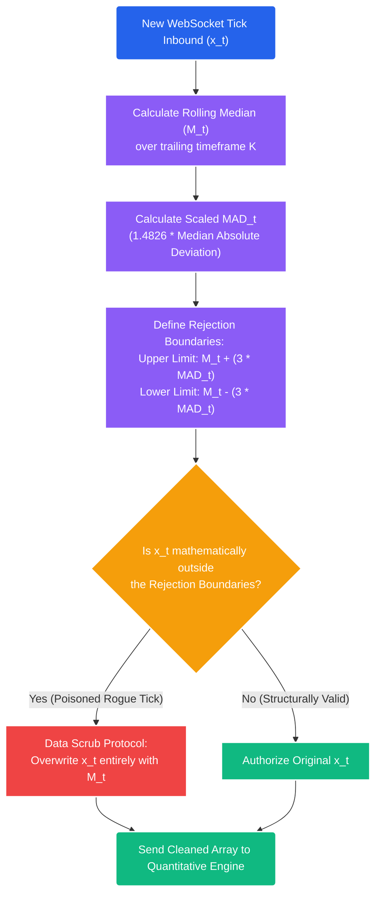

# Deep Dive: Data Scrubbing & The Hampel Filter

## 1. The Core Problem: The Threat of "Dirty Data"
Mathematical quantitative trading systems operate on the strict, unforgiving assumption of **Garbage In $\rightarrow$ Garbage Out**. 

Unlike a discretionary human trader who can visually identify a broken chart candle, recognize it as a data glitch, and ignore it, mathematical formulas (like OLS Regression, GARCH variance matrices, and ADF cointegration tests) are entirely blind. They mathematically process whatever float array is fed into their localized functions.

### The "Rogue Tick" Vulnerability
Exchange Data APIs (especially decentralized crypto exchanges or high-frequency SIP feeds) frequently broadcast "Dirty Ticks" due to matching engine latency or micro-structural packet drops. 

*   *The Crisis:* Assume Bitcoin is trading stably at $\$90,000$. For a single millisecond, a matching engine glitch broadcasts one tick pricing Bitcoin at $\$9.00$, before immediately snapping back to $\$90,000$. 

If this rogue tick enters our `pandas` array without being sterilized:
1.  **Volatility Destruction:** The GARCH(1,1) model will register an unthinkably massive residual error squared ($\epsilon_{t-1}^2$). The mathematical model will immediately expand the $\pm \sigma$ risk bands to infinity. The portfolio risk matrix will freeze, blinding the system to all valid trades for the next several days until the geometric shock decays.
2.  **False Arbitrage:** The baseline statistical Mean Reversion engines will ingest a drop from $\$90,000$ to $\$9.00$, assume the asset is massively "oversold" by $-500\sigma$, and blindly fire a catastrophic `BUY` market order right into the spread, causing an instantaneous realized loss.

## 2. The Solution: Real-Time Outlier Rejection
Before a single integer is allowed to touch the Quantitative Logic Engine, the raw WebSocket data stream must physically route through a militarized **Scrubbing Filter**.

We cannot use standard deviation or classical Z-scores to filter outliers. Why? Because the arithmetic mean ($\mu$) and the standard deviation ($\sigma$) are *themselves* heavily distorted and poisoned by the rogue tick. If $\$9.00$ is in the array, the mean collapses, and the standard deviation spikes, meaning the $\$9.00$ tick might not even register as a $3\sigma$ outlier. 

We must use **Robust Statistics** based exclusively on un-skewable medians.

## 3. The Mathematics: The Hampel Filter
Introduced by Frank Hampel in 1974, the Hampel Filter is the institutional gold standard for real-time, high-frequency time-series data scrubbing. It identifies outliers by measuring absolute deviation from the *rolling median*, completely ignoring the distorted arithmetic mean.

### A. The Equations
1.  **Rolling Median ($M_t$):** For a sliding temporal window of length $k$ (e.g., the last 50 ticks), calculate the absolute median price. The mathematical median is entirely immune to a single $\$9.00$ flash crash.
2.  **Median Absolute Deviation (MAD):** Calculate the median of the absolute mathematical differences between each individual data point in the window and the rolling median $M_t$.
    $$ MAD_t = 1.4826 \times \text{median} \left( |x_{t-i} - M_t| \right) \quad \text{for} \ (i \dots k) $$
    
    *   **The Scaling Constant ($1.4826$):** This specific constant is mathematically derived from the inverse of the cumulative normal distribution function: $1 / \Phi^{-1}(0.75) \approx 1.4826$. It seamlessly scales the raw MAD to be approximately equivalent to one standard deviation ($\sigma$) in a perfectly normal Gaussian distribution, allowing us to use standard Z-score thresholds.

3.  **The Rejection Boundary ($T$):** Establish a strict isolation boundary, typically 3 scaled MADs.
    $$ \text{Threshold} = M_t \pm (3 \times MAD_t) $$

### B. The Logic Gate
If a newly ingested WebSocket tick $x_t$ physically breaches the Threshold boundary, the system **rejects and overwrites** it. The rogue tick is mathematically erased and replaced with the rolling median ($M_t$). This preserves the structural chronological continuity of the array without poisoning the downstream volatility formulas.



## 4. Implementation in STOCKSTATS (High-Performance Python)
Because the Hampel Filter must run sequentially on every single high-frequency tick before passing the data to the trading models, using standard Pandas `.rolling()` functions is computationally too slow (creating bottleneck latency). 

The module is explicitly rewritten using `numba` to compile the loop directly to ultra-fast C machine code via LLVM.

```python
import numpy as np
from numba import njit

@njit
def fast_hampel_filter(price_array: np.ndarray, window_size: int = 50, num_mads: float = 3.0) -> np.ndarray:
    """
    High-frequency Numba-compiled Hampel Filter.
    Calculates the rolling median and Median Absolute Deviation (MAD).
    Replaces mathematically impossible 'rogue ticks' with the localized median.
    """
    n = len(price_array)
    clean_array = price_array.copy()
    
    # We cannot calculate a rolling median for the first 'window_size' elements
    for i in range(window_size, n):
        # Extract the localized historical window
        window_data = price_array[i - window_size : i]
        
        # 1. Calculate the raw structural Median
        rolling_median = np.median(window_data)
        
        # 2. Derive the Absolute Deviations from that Median
        absolute_deviations = np.abs(window_data - rolling_median)
        
        # 3. Calculate Scaled MAD (Standard Normal Constant = 1.4826)
        scaled_mad = 1.4826 * np.median(absolute_deviations)
        
        # 4. Define Thresholds
        upper_bound = rolling_median + (num_mads * scaled_mad)
        lower_bound = rolling_median - (num_mads * scaled_mad)
        
        # 5. The Scrubbing Gate
        current_tick = price_array[i]
        if current_tick > upper_bound or current_tick < lower_bound:
            # The tick is poisoned. Overwrite the array memory strictly with the safe median.
            clean_array[i] = rolling_median
            
    return clean_array
```

By forcibly passing all raw exchange WebSockets through the compiled Numba Hampel Filter *before* algebraic ingestion by the `statsmodels` or `arch` libraries, STOCKSTATS chemically sterilizes its mathematical environment from exchange-level latency glitches and flash crashes, preserving portfolio integrity.
