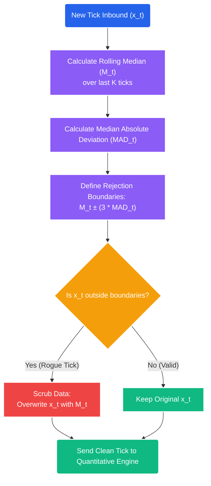

# Deep Dive: Data Scrubbing & The Hampel Filter

## 1. The Threat of "Dirty Data"
Quantitative trading systems operate on the assumption of **Garbage In $\rightarrow$ Garbage Out**. 

Unlike manual traders who can visually identify a broken chart candle and ignore it, mathematical formulas (like OLS, GARCH, and ADF tests) are entirely blind. They process whatever data array is passed into them.

### The "Rogue Tick" Vulnerability
Exchanges—especially decentralized crypto exchanges or high-frequency SIP feeds—frequently broadcast "Dirty Ticks." 
*   *Example:* Bitcoin is trading stably at $90,000. For one millisecond, a glitch on the exchange broadcasts a single tick pricing Bitcoin at $9.00, before immediately snapping back to $90,000. 

If this rogue tick enters our `pandas` array, the GARCH(1,1) model will register an unthinkably massive residual error squared ($\epsilon_{t-1}^2$). The mathematical model will immediately expand the $\pm \sigma$ bands to infinity, blinding the system to all valid trades for the next several days until the shock decays.

Even worse, standard Mean Reversion engines will see a drop from $90,000 to $9.00, assume the asset is massively "oversold," and fire a catastrophic `BUY` market order right into the spread, causing an instantaneous loss.

## 2. The Solution: Real-Time Outlier Rejection
Before a single integer is allowed to touch the Quantitative Logic Engine, the raw WebSockets data stream from the data architecture must pass through a militarized **Scrubbing Filter**.

We cannot use standard deviation or Z-scores to filter outliers, because the mean and standard deviation are *themselves* heavily distorted by the rogue tick. We must use robust statistics based on medians.

## 3. The Hampel Filter
The Hampel Filter is the industry gold standard for time-series data scrubbing. It identifies outliers by measuring absolute deviation from the *rolling median*, completely ignoring the distorted mean.

### The Mathematics
1.  **Rolling Median ($M_t$):** For a sliding window of length $k$ (e.g., the last 50 ticks), calculate the median price. (The median is entirely immune to a single $9.00 flash crash).
2.  **Median Absolute Deviation (MAD):** Calculate the median of the absolute differences between each data point in the window and the rolling median $M_t$.
    $$ MAD_t = 1.4826 \times \text{median} \left( |x_{t-i} - M_t| \right) \quad \text{for} \ (i \dots k) $$
    *(Note: The $1.4826$ constant scales the MAD to be approximately equivalent to one standard deviation in a normal distribution).*
3.  **The Rejection Boundary ($T$):** Establish a threshold, typically $3 \times MAD$.
    $$ Threshold = M_t \pm (3 \times MAD_t) $$

### The Logic Gate
If a new inbound tick $x_t$ breaches the Threshold boundary, the system **rejects and overwrites** it. The rogue tick is replaced with the rolling median ($M_t$), preserving the continuity of the array without poisoning the downstream volatility formulas.



## 4. Implementation in STOCKSTATS (Python)

```python
import numpy as np
import pandas as pd

def apply_hampel_filter(price_array, window_size=50, num_mads=3.0):
    """
    Calculates the rolling median and Median Absolute Deviation (MAD).
    Replaces any mathematically impossible 'rogue ticks' with the median.
    """
    # 1. Calculate the rolling median
    rolling_median = price_array.rolling(window=window_size, center=False).median()
    
    # 2. Calculate the rolling MAD (Median Absolute Deviation)
    # MAD = 1.4826 * median(|x_i - x_mean|)
    rolling_mad = 1.4826 * (
        (price_array - rolling_median).abs().rolling(window=window_size, center=False).median()
    )
    
    # 3. Identify outliers (anything outside of Median +/- (3 * MAD))
    outlier_upper = rolling_median + (num_mads * rolling_mad)
    outlier_lower = rolling_median - (num_mads * rolling_mad)
    
    # Create boolean mask of the dirty data
    is_outlier = (price_array > outlier_upper) | (price_array < outlier_lower)
    
    # 4. Scrub the array (Overwrite outliers with the safe Median)
    scrubbed_clean_array = price_array.copy()
    scrubbed_clean_array[is_outlier] = rolling_median[is_outlier]
    
    return scrubbed_clean_array
```

By forcibly passing all raw exchange data through the Hampel Filter before ingestion by the `statsmodels` or `arch` libraries, STOCKSTATS chemically sterilizes its mathematical environment from exchange-level latency glitches and flash crashes.
