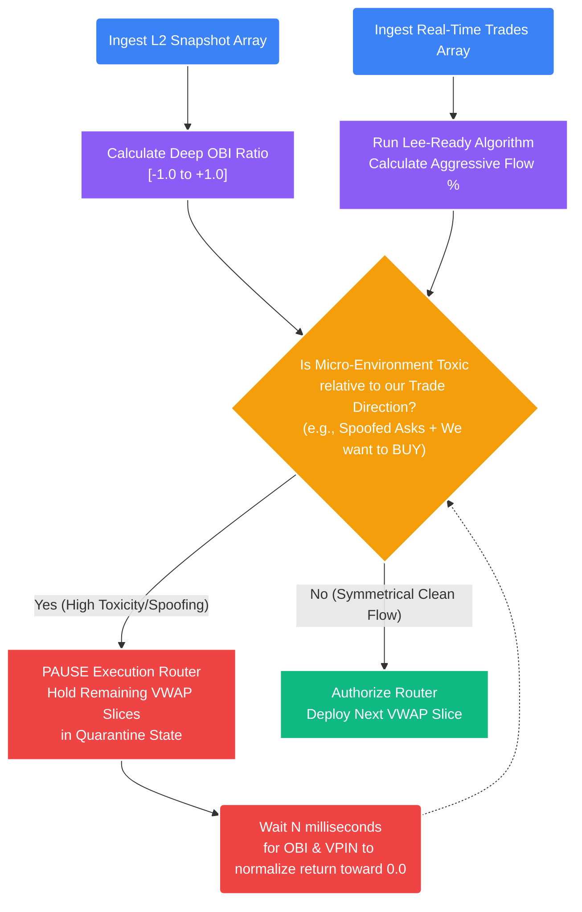

# Deep Dive: Order Book Imbalance (OBI) & Toxic Flow

## 1. The Core Problem: The Microstructure Predator
Our core quantitative models (GARCH, Cointegration, Kalman Filters) are fundamentally "Macro" models. They observe the *outputs* of the market (the historical filled price ticks) to determine structural mispricings. 

However, seconds *before* a physical price tick occurs, there is an invisible, hyper-violent war playing out in the Level 2 (L2) Order Book. Institutional High-Frequency Trading (HFT) firms rely on **Adverse Selection**—they use machine learning to detect when a slower algorithmic trader (like our VWAP execution slicer) is systematically trying to acquire a large amount of an asset, and they weaponize their L2 limit liquidity to trap us.

### The "Spoofing" Trap
1.  **The Trigger:** Our statistical Mean Reversion model fires a mathematically valid `BUY` signal.
2.  **The Slicer:** Our Smart Order Router (Model 04) breaks our $\$100k$ order into 10 smaller slices of $\$10k$. It buys the first slice at $\$90,000$.
3.  **The Predatory Action:** An HFT algorithm detects our steady, algorithmic buying footprint. They utilize "Spoofing"—they instantly place massive fake `SELL` walls at $\$90,001$ to artificially scare other retail traders into selling, while simultaneously pulling their own L2 liquidity from the `BID` side of the book.
4.  **The Trap Closes:** The spread widens aggressively. The price mechanically creeps up to $\$90,010$ because the Bid side is hollow. We are forced to execute our next 9 slices at dramatically worse prices. Once we finish buying, the HFT instantly pulls the fake `SELL` walls, and the true price drops right back to $\$90,000$. 

Our carefully calculated positive Expentancy ($E(R)$) has just been structurally destroyed by **Toxic Flow**.

## 2. The Solution: Order Book Imbalance (OBI)
To survive in predatory high-frequency liquidity pools, our Execution Engine must mathematically evaluate the structural toxicity of the L2 Order Book in real-time, tick-by-tick, *before* authorizing the Smart Order Router to deploy a VWAP slice.

**Order Book Imbalance (OBI)** measures the localized volume pressure between the Best Bid (buyers) and Best Ask (sellers) over the immediate micro-structure levels.

### A. The OBI Mathematical Equation

$$ OBI_t = \frac{\sum_{i=1}^k V_{Bid, i} - \sum_{i=1}^k V_{Ask, i}}{\sum_{i=1}^k V_{Bid, i} + \sum_{i=1}^k V_{Ask, i}} $$

*   **$V_{Bid, i}$:** The resting volume (Quantity) of Limit BUY orders sitting at depth level $i$.
*   **$V_{Ask, i}$:** The resting volume (Quantity) of Limit SELL orders sitting at depth level $i$.
*   **$k$:** The depth of the book analyzed (e.g., $k=5$ means parsing the top 5 physically available levels of the L2 book on both sides).

### B. Interpreting the Output
The OBI formula is a normalized ratio mathematically bound strictly between $[-1.0, +1.0]$.
*   **$OBI \approx 0.0$:** Structural balance. The L2 limit liquidity is symmetrical. True price discovery is occurring.
*   **$OBI = +0.8$:** Extreme Buy Pressure. Massive walls of Limit Bids compared to relatively thin Asks. (Usually artificially precedes a micro-structure price spike).
*   **$OBI = -0.8$:** Extreme Sell Pressure. Heavy Limit Asks weighing down the book, threatening to crush the current spread.

## 3. Order Book Toxicity Profiling (VPIN & Lee-Ready)
HFT algorithms can easily spoof static L2 walls to manipulate OBI. However, they cannot spoof physical *flow* (actual money changing hands). 

To measure the true toxicity of the executions hitting the book, STOCKSTATS utilizes a derivative of **Volume-Synchronized Probability of Informed Trading (VPIN)** combined with the **Lee-Ready Algorithm**.

### The Lee-Ready Algorithm (Tick Classification)
We must classify every raw, real-time tick print as either:
*   **Maker-Buyer:** Aggressive market buy hitting a resting Limit Ask.
*   **Maker-Seller:** Aggressive market sell hitting a resting Limit Bid.

If the mid-price is strictly moving up, the tick is classified as a Buy. If it's strictly moving down, it's a Sell. (If the price is identical to the last tick, the "Tick Test" looks back chronologically until it finds a price change).

### The Trade Flow Ratio Matrix
Once the ticks are classified, the logic engine calculates the rolling Volume Ratio. If the Trade Flow Ratio shifts to 85% aggressive Market Sells over a rolling 5-second window, and the static L2 $OBI$ is simultaneously negative, the system mathematically declares the environment unconditionally **Hostile (Toxic)**.



## 4. Implementation (The VWAP Pause Protocol)

### High-Frequency Polling
The Execution Engine intercepts the VWAP Slicer directly in the order routing loop.

```python
def check_liquidity_pool_toxicity(current_obi_ratio: float, vpin_trade_flow_ratio: dict, target_execution_direction: str) -> bool:
    """
    Evaluates the localized physical micro-structure of the L2 book and aggressive tape. 
    Returns True if the order book is actively hunting our position (Adverse Selection).
    """
    # -------------------------------------------------------------
    # 1. We want to execute a LONG position (Buy Limit/Market)
    # -------------------------------------------------------------
    if target_execution_direction == "LONG":
        # Check 1: Is the book flashing massive fake SELLS against us? (Spoofing)
        # Check 2: Is the aggressive tape heavily weighted to informed market-selling?
        if current_obi_ratio < -0.65 or vpin_trade_flow_ratio['sell_pressure_pct'] > 0.75:
            # The environment is toxic. If we buy right now, we will suffer severe slippage.
            return True 
            
    # -------------------------------------------------------------
    # 2. We want to execute a SHORT position (Sell Limit/Market)
    # -------------------------------------------------------------
    if target_execution_direction == "SHORT":
        # Check 1: Is the book saturated with fake BIDS? (Spoofing)
        # Check 2: Is the tape ripping upward via informed aggressive buying?
        if current_obi_ratio > 0.65 or vpin_trade_flow_ratio['buy_pressure_pct'] > 0.75:
            return True
            
    # The environment is mathematically benign. 
    return False 
```

### Protocol Action
If `check_liquidity_pool_toxicity()` returns `True`:
1. The Smart Order Router **PAUSES execution immediately**. 
2. It quarantines the remaining un-executed capital fractions of the parent order in a `PENDING_HOLD` state.
3. It waits for the OBI metric to mathematically normalize back toward `0.0` (which implies the predatory HFT algorithms have pulled their spoof walls and "turned off").
4. Once the environment is clean, VWAP slicing execution seamlessly resumes, ensuring we enter the market on our own terms, strictly preserving our mathematically projected $1R$ expectancy.
