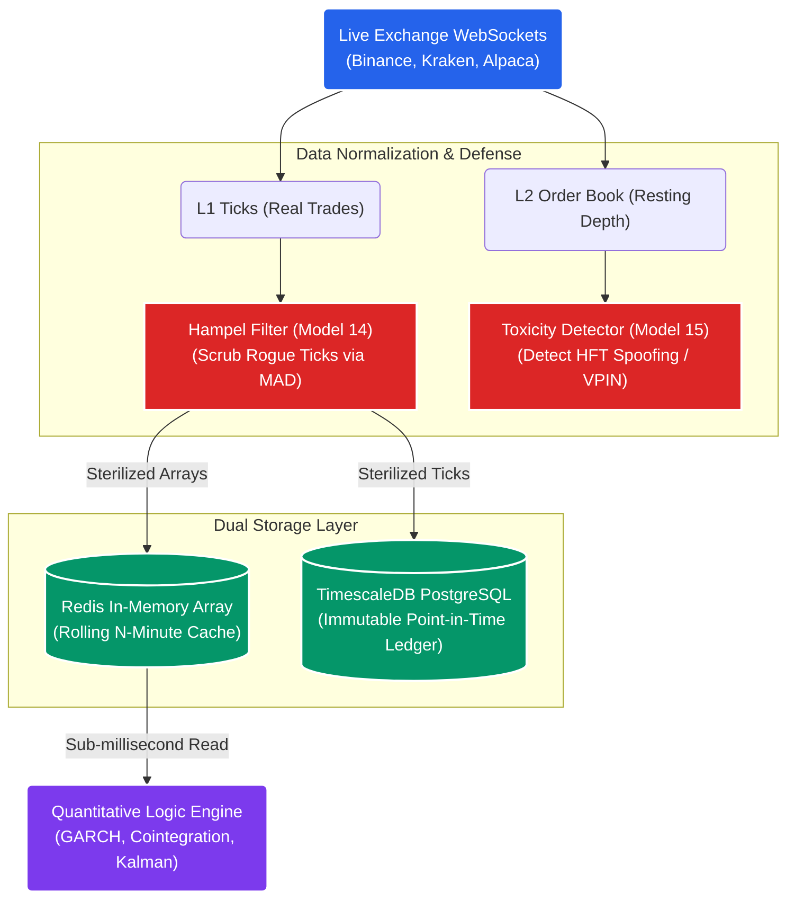
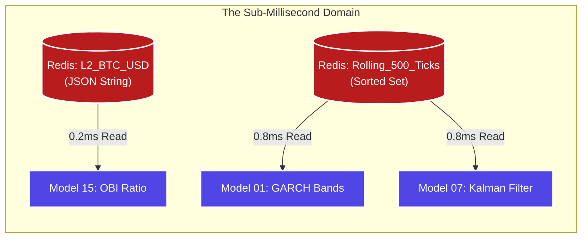
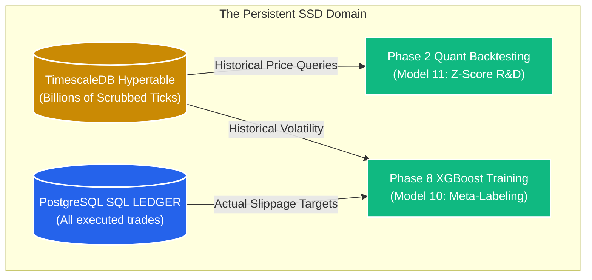

# STOCKSTATS Strategy: Data Architecture & Persistence

## 1. The Core Objective
To design a heavily fortified, ultra-low latency data ingestion and storage pipeline capable of processing real-time market ticks, L2 order book depth, and historical arrays. 

This architecture must perfectly feed the Quantitative Logic Engine while guaranteeing **Zero Point-in-Time Bias** for backtesting and **Zero Toxicity Leakage** for live execution.

## 2. The Data Ingestion Topography

## 3. Deep Dive: Redis vs. PostgreSQL / TimescaleDB
The system strictly decouples the high-frequency trading memory from the permanent backtesting storage. 

If we attempt to run the live quantitative matrices by repeatedly querying the physical disk (PostgreSQL), the `asyncio` loop will bottleneck, resulting in execution latency ($t > 300ms$), fundamentally destroying the $R > 0$ edge. Conversely, if we attempt to store 4 years of historic ticks in RAM (Redis), the AWS server costs will be financially catastrophic.

Therefore, STOCKSTATS mandates a mathematically defined dual-storage architecture.

### A. The Real-Time Execution Cache (Redis)
**Objective:** Sub-millisecond $O(1)$ read/write latency. Redis operates entirely in RAM. It does not know history; it only knows the immediate, actionable present.

**Mathematical Use Cases:**
1.  **L2 Order Book Depth & Imbalance (Model 15):** 
    *   *The Problem:* The exchange WebSocket blasts up to 20 L2 snapshot updates per second. If we write these JSON payloads to Postgres, the disk I/O will freeze.
    *   *The Redis Solution:* The Python script ingests the WebSocket and strictly overwrites a single Redis Key (e.g., `L2:BTC-USD`). The Python Execution Router reads this key in under 0.5ms to instantly calculate the Order Book Imbalance (OBI) toxicity vector before deciding to route a VWAP slice.
2.  **Rolling GARCH Volatility Arrays (Model 01):** 
    *   *The Problem:* The GARCH(1,1) model requires a continuous trailing array of 500 periods (e.g., the last 500 minutes) to calculate variance $\sigma_t^2$ instantly.
    *   *The Redis Solution:* We utilize a Redis `List` or `Sorted Set` to store the active trailing window. As tick \#501 arrives, tick \#1 is aggressively evicted via `LPOP`. The Python engine pulls this exact, pre-formatted 500-unit array into `NumPy` in 1ms, constantly recalculating the volatility bands.
3.  **Active Copula Dependencies (Model 06):**
    *   The rolling 30-day Pearson correlation matrix between all traded assets (BTC/ETH/SOL) is held directly in Redis, allowing the Risk Engine to instantly verify portfolio tail-risk without executing a heavy relational query.

### B. The Point-in-Time Ledger (PostgreSQL & TimescaleDB)
**Objective:** Relational Auditing, Structural Permanence, and Deep Machine Learning Training.

**Mathematical Use Cases:**
1.  **TimescaleDB: Historical Tick Arrays (Model 11 - Rigorous Backtesting):**
    *   *The Problem:* Standard PostgreSQL `B-Tree` indexes collapse when a table reaches 500 million L1 ticks.
    *   *The TSDB Solution:* We convert the standard table into a `Hypertable`, aggressively chunking the data into 1-Day SSD partitions. When our Quant Researchers backtest the **Cointegration (Model 02)** strategy across 2021, TSDB scans only the relevant physical hardware partitions, returning 4 years of ticks 100x faster than standard SQL.
2.  **PostgreSQL: XGBoost Ground Truth (Model 10 & 13):**
    *   *The Problem:* The ML classifier cannot train purely on price. It must train on "Algorithm Intention" vs. "Physical Reality".
    *   *The Postgres Solution:* The `immutable_execution_ledger` definitively logs that the **State Machine (Model 13)** intentionally tried to buy at $\$40,000$ (Theoretical), but the active slippage caused a fill at $\$40,050$ (Realized). This relational difference between Intent and Execution is the exact $Y$-variable target the **XGBoost Classifier (Model 10)** trains against to predict future slippage.
3.  **PostgreSQL: Performance Decay (Model 05):**
    *   Every night, the system runs aggregate SQL `SUM()` queries across the execution ledger to recalculate the System Quality Number (SQN). If the SQN degrades below 1.6, the PostgreSQL framework automatically flags the strategy for human Review. 

## 4. The Scrubbing Gateway (Model 14 Defenses)
Data arriving from various fragmented sources (Crypto CEXs, Equity SIP feeds) contains massive micro-structural noise, dropped packets, and API flash-crash glitches.

Before a single float touches the `TimescaleDB` ledger or the `Redis` cache, the raw Python WebSocket streams pass through heavily optimized Numba JIT-compiled arrays. 
*   **The Hampel Filter:** Completely mathematically scrubs "Rogue Ticks" by calculating rolling Median Absolute Deviations (MAD), overwriting impossible price spikes with localized medians to protect the downstream GARCH variance matrices from freezing.
*   **Normalization:** Strips vendor-specific payload formatting and standardizes it strictly into UTC nanosecond timestamps and uniform ticker symbols (e.g., forcing `BTCUSD_PERP`, `XBTUSD`, and `BTC/USDT` into a single internal `BTC_USD_SWAP` taxonomy).

## 5. External Data Sourcing Types
The system requires specific, institutional-grade external data inputs to calculate the advanced mathematical formulas (GARCH, VWAP) without geographical latency lag. Standard retail-grade historical OHLCV candles (Open, High, Low, Close) are mathematically banned from the core algorithms.

### A. Level 1 (L1) Top of Book (BBO)
*   **Target Consumer:** The *Execution Routing Engine*.
*   **Mathematical Purpose:** Required to calculate the real-time bid/ask spread (the friction coefficient) on every single tick *before* the logic engine authorizes a signal. Vetoes trades if the spread exceeds $E(R)$ tolerances.

### B. Level 2 (L2) Order Book Depth
*   **Target Consumer:** The *Smart Order Router (SOR)* & *Model 15 (OBI)*.
*   **Mathematical Purpose:** The SOR must process L2 depth dynamically to fraction block orders. If the engine needs to execute a $\$50k$ order via VWAP, it must calculate exactly how much volume sits at the immediate Bid/Ask to avoid sweeping the book.

### C. Tick-Level Aggregated Trades (Time and Sales)
*   **Target Consumer:** The *Mathematical Logic Engine*.
*   **Mathematical Purpose:** The GARCH variance models ($\sigma$) and Kalman Hedge Ratios require raw, continuous tick-level inputs to instantly detect volatility structural breaks ($\epsilon^2$) rather than waiting for an arbitrary 1-minute candle to close.

### D. The HFT Race Condition (Microsecond Aggregation)
*   **The Problem:** During a flash crash, Binance might instantly route 400 individual L1 trades within the exact same rolling millisecond. If the system attempts to push 400 identically timestamped ticks into the Redis GARCH array (Model 01), the Python linear algebra matrices (NumPy) will instantly crash due to mathematically impossible 0-time intervals ($dt=0$ causing infinite variance).
*   **The Requirement:** The Ingestion Engine (Service 1) must mandate **Microsecond Tick Aggregation**. Before writing to Redis or TimescaleDB, if $N$ trades arrive with identical microsecond timestamps, they must be mathematically coalesced into a single Volume-Weighted Average Tick. This preserves the exact capital flow without structurally nuking the quantitative matrices.
