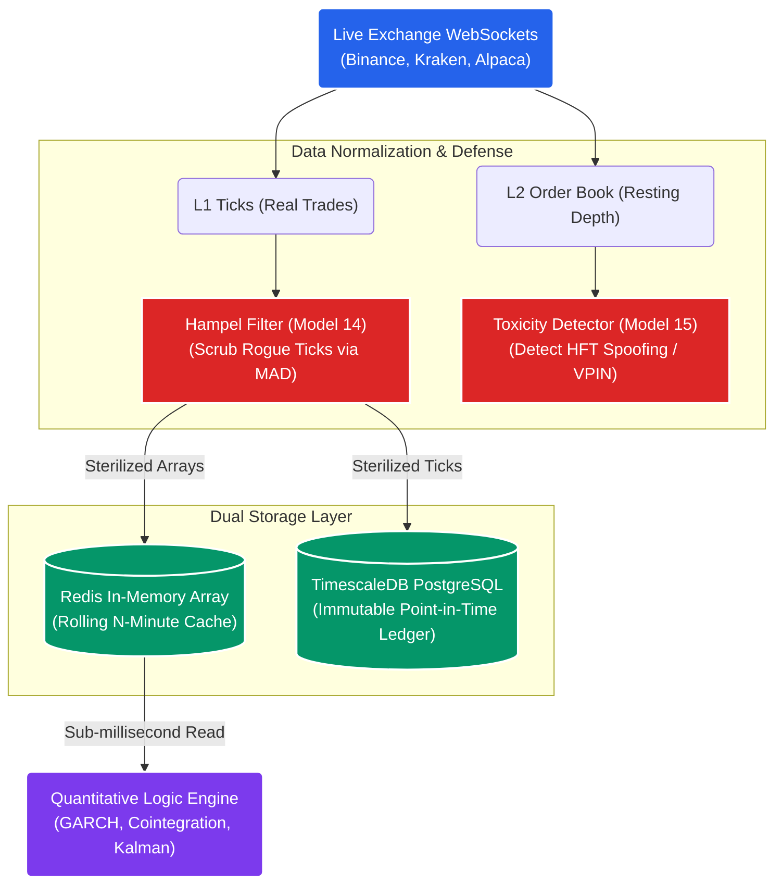

# STOCKSTATS Strategy: Data Architecture & Persistence

## 1. The Core Objective
To design a heavily fortified, ultra-low latency data ingestion and storage pipeline capable of processing real-time market ticks, L2 order book depth, and historical arrays. 

This architecture must perfectly feed the Quantitative Logic Engine while guaranteeing **Zero Point-in-Time Bias** for backtesting and **Zero Toxicity Leakage** for live execution.

## 2. The Data Ingestion Topography

## 3. External Data Types & Market Sourcing
The system requires specific, institutional-grade external data inputs to calculate the advanced mathematical formulas (GARCH, VWAP, Fractional Differencing) without geographical or chronological latency lag. 

Standard retail-grade historical OHLCV candles (Open, High, Low, Close, Volume) are entirely insufficient and mathematically banned from the core algorithms.

### A. Level 1 (L1) Top of Book (BBO)
*   **Requirement:** Continuous real-time WebSocket feeds of the Best Bid and Offer (BBO).
*   **Target Consumer:** The *Execution Routing Engine*.
*   **Mathematical Purpose:** Required to calculate the real-time bid/ask spread (the friction coefficient) on every single tick *before* the logic engine authorizes a signal. If the instantaneous spread exceeds the expected $E(R)$ tolerances, the trade is vetoed.

### B. Level 2 (L2) Order Book Depth
*   **Requirement:** Real-time and historical limit orders resting in the liquidity pool (Depth of Market - DOM), up to $k=20$ levels deep.
*   **Target Consumer:** The *Smart Order Router (SOR)* and *OBI Toxicity Detector (Model 15)*.
*   **Mathematical Purpose:** The SOR must process L2 depth dynamically to fraction block orders. If the engine needs to execute a $\$50k$ order via VWAP, it must calculate exactly how much volume sits at the immediate Bid/Ask to avoid sweeping the book and incurring negative slippage.

### C. Tick-Level Aggregated Trades (Time and Sales)
*   **Requirement:** A massive, append-only stream of every single physically executed trade on the exchange (Price, Size, Timestamp to the millisecond, Maker/Taker flag).
*   **Target Consumer:** The *Mathematical Logic Engine*.
*   **Mathematical Purpose:** 
    *   **GARCH Volatility (Model 01):** The variance models ($\sigma$) require raw tick-level inputs to instantly detect volatility shocks ($\epsilon^2$) rather than waiting for an arbitrary 1-minute candle to "close."
    *   **Kalman Filters (Model 07):** The Hedge Ratio prediction/correction matrices update tick-by-tick.
    *   **Lee-Ready VPIN (Model 15):** The Maker/Taker flags are required to classify ticks as aggressive buying versus aggressive selling to detect Toxic Flow.

## 4. The Scrubbing Gateway (Model 14 Defenses)
Data arriving from various fragmented sources (Crypto CEXs, Equity SIP feeds) contains massive micro-structural noise, dropped packets, and API flash-crash glitches.

Before a single float touches the `TimescaleDB` ledger or the `Redis` cache, the raw data streams pass through heavily optimized Numba JIT-compiled arrays. 
*   **The Hampel Filter:** Completely mathematically scrubs "Rogue Ticks" by calculating rolling Median Absolute Deviations (MAD), overwriting impossible price spikes with localized medians to protect the downstream GARCH variance matrices from freezing.
*   **Normalization:** Strips vendor-specific payload formatting and standardizes it strictly into UTC nanosecond timestamps and uniform ticker symbols (e.g., forcing `BTCUSD_PERP`, `XBTUSD`, and `BTC/USDT` into a single internal `BTC_USD_SWAP` taxonomy).

## 5. Dual Storage Architecture (Cache vs. Ledger)
The system strictly decouples the high-frequency trading memory from the permanent backtesting storage.

### A. The Real-Time Execution Cache (Redis)
*   **Technology:** Redis In-Memory Cluster.
*   **Function:** Holds only the most recent $N$ periods of standardized tick arrays.
*   **Purpose:** The Quantitative Logic Engine queries Redis in sub-milliseconds to actively calculate live rolling standard deviations, Copula matrices, and Cointegration Z-Scores. Data is physically evicted from Redis as it ages out of the dynamic lookback windows to prevent memory leaks.

### B. The Point-in-Time Ledger (TimescaleDB)
*   **Technology:** TimescaleDB (PostgreSQL extension optimized for time-series hyper-tables).
*   **Function:** The immutable, append-only permanent archive of every scrubbed tick and L2 snapshot ever ingested.
*   **Purpose:** Backtesting Rigor (Model 11). To calculate the exact Deflated Sharpe Ratio (DSR) and train the XGBoost Machine Learning Meta-Models, the researchers must be able to query the exact state of the market as it physically existed at `2021-11-04 14:32:01.000 UTC`, completely free of Survivorship Bias or Look-Ahead Bias. TimescaleDB provides the relational power to map ticks to algorithmic executions permanently.
