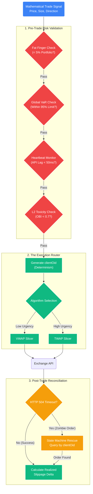

# Execution & Risk Management: Protecting the Capital

## 1. Objective
To define the mechanisms that translate mathematical signals into live market orders while relentlessly protecting the proprietary trading capital from slippage, flash crashes, and algorithmic runaways.

## 2. Order Routing & Execution Algorithms (The Hands)

The system strictly prohibits standard "Market Orders" to prevent unpredictable slippage impact.

### A. Smart Order Routing (SOR)
For crypto, the SOR scans the Level 2 order books of connected exchanges (e.g., Binance, Kraken) simultaneously. It dynamically fractions limit orders across exchanges based on resting liquidity at each price level, absorbing the book without moving the consolidated price.

### B. Execution Algorithms (TWAP / VWAP)
Block orders are algorithmically sliced into micro-orders over a defined duration.
*   **Time-Weighted Average Price (TWAP):** Slices an order evenly over time $T$.
    *   *Logic:* Used to disguise institutional footprint when urgency is neutral.
*   **Volume-Weighted Average Price (VWAP):** Slices an order dynamically based on the historical volume profile of that specific time period.
    *   *Logic:* If 10:00 AM historically accounts for 5% of daily volume, the VWAP algorithm will execute exactly 5% of the block order during that window. This minimizes market impact (slippage) by only taking liquidity when it is statistically abundant.

### C. Urgency & Aggression Profiles
The Mathematical Engine dictates the execution urgency.
*   **High Urgency (Stop Loss / Regime Change):** Aggressive crossing of the spread (paying the Taker fee, executing immediately against resting Limits).
*   **Low Urgency (Mean Reversion Entry):** Passive posting of Limit orders at or below the Best Bid (collecting the Maker rebate), waiting for the market to fill the order.

## 3. Dynamic Risk Management (The Kill Switches)
Algorithm bugs or API failures can destroy capital in seconds. The execution engine is isolated from the logic engine by hard-coded circuit breakers.

### A. Fat Finger & Max Order Limits
*   **Nominal Cap:** A hard-coded cap on the maximum nominal value (e.g., $50,000) or maximum percentage of the total portfolio (e.g., 5%) for any single order subset.
*   **Action:** If a mathematical outlier produces an order size of $5,000,000, the SOR rejects it at the gate and triggers a Tier 1 notification.

### B. Value at Risk (VaR) & Drawdown Breakers
Standard percentage drawdowns are reactive. The system uses dynamic VaR to proactively halt trading.
*   **Dynamic Drawdown:** If the aggregate portfolio (or a specific trader's pod) drops by $X\%$ below its High-Water Mark within a rolling 24-hour window.
*   **Volatility-Adjusted Stop:** If the current market volatility (via GARCH) exceeds the strategy's maximum structural threshold.
*   **Action:** All active strategies are immediately halted, resting limit orders are canceled, and open positions are either liquidated or hedged (depending on the regime state). API keys are locked until an Admin manually restores the system state.

### C. Latency & Connection Watchdogs
*   **Heartbeat Monitor:** If the WebSocket heartbeat ping to the exchange API exceeds $X$ milliseconds, or if packets are dropped.
*   **Action:** The system immediately cancels all open passive limit orders. The engine is hard-coded to reject generating mathematical signals on stale data (e.g., preventing a trade execution on a $\sigma$-band calculation using data that is 3 seconds old).

## 4. Execution Auditing & Slippage
The execution engine must constantly audit its own performance against the theoretical models to verify the true Expected Value ($E$).

### A. Realized Slippage Delta
Every execution logs the exact microsecond timestamp, the theoretical price authorized by the math model, and the actual filled price.
*   **Slippage Formula:** $Slippage = \frac{|Expected\_Price - Fill\_Price|}{Expected\_Price} \times 10,000 \text{ bps}$
*   **Action:** If the $Slippage$ rolling average exceeds the algorithm's specific tolerance threshold (thereby destroying the $R > 0$ assumption), the strategy is automatically paused for human quantitative review. The system must prove that the *Realized* Expectancy matches the *Theoretical* Expectancy.
