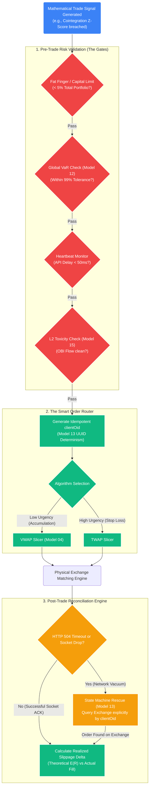

# Strategy 05: Execution & Risk Management

## 1. The Operational Objective
To strictly define the systemic mechanisms that translate theoretical mathematical signals into live, physical market orders while relentlessly protecting the proprietary trading capital from L2 slippage, flash crashes, and algorithmic runaways.

The system inherently distrusts Exchange APIs and operates under the assumption that network environments are perpetually hostile.

## 2. Order Routing & Execution Algorithms (The Hands)

Standard "Market Orders" are unconditionally prohibited within STOCKSTATS to mathematically prevent unpredictable negative slippage impact.

### A. Smart Order Routing (SOR)
For crypto derivatives, the SOR actively maps the Level 2 order books of connected exchanges. It dynamically fractions limit orders based on resting limit liquidity at each physical price level, absorbing the L2 book without moving the consolidated mid-price.

### B. Execution Algorithms (TWAP / VWAP Slicers)
Large, systemically risky block orders are algorithmically sliced into smaller micro-orders over a defined duration to hide the institutional footprint.
*   **Time-Weighted Average Price (TWAP):** Slices an order evenly over time $T$.
    *   *Usage:* Disguises proprietary operations when market urgency is relatively neutral.
*   **Volume-Weighted Average Price (VWAP):** Slices an order dynamically based on the historical volume profile of that specific intraday time period.
    *   *Usage:* If 10:00 AM historically accounts for exactly $5\%$ of daily average volume, the VWAP algorithm (Model 04) will execute exactly $5\%$ of the block order during that window. This theoretically minimizes market impact by only taking liquidity from the pool when it is statistically abundant.

## 3. Dynamic Risk Management (The Vault)
Algorithmic logic bugs or unexpected API failures can destroy capital in seconds. The Execution Engine is physically isolated from the Logic Engine by hard-coded circuit breakers.

### A. Fat Finger & Hard Geometric Limits
*   **The Cap:** A hard-coded architectural cap on the maximum mathematical fraction (e.g., $1.0f^*$) or maximum percentage of the total portfolio (e.g., $5\%$) for any single geometric order subset.
*   **Execution Rule:** If a mathematical outlier produces a normalized order size equating to $\$5,000,000$ when the maximum threshold is $\$500,000$, the SOR outright rejects it at the gate and triggers a Tier 1 Critical notification.

### B. Parametric Value at Risk (VaR)
Standard percentage Stop-Losses are reactive. The system uses dynamic VaR matrices (Model 12) to proactively halt trading.
*   **The Master Kill Switch:** If the aggregate portfolio VaR ($99\%$ confidence) structurally exceeds the High-Water Mark by $X\%$, the localized trading instance is mathematically paralyzed.
*   **Action Protocol:** All active mathematical strategies are immediately halted. Resting limit orders are canceled from the L2 book. Open positions are sequentially liquidated into cash. Exchange APIs are severed until an Admin physically restores the system state via the Operations Dashboard.

### C. Latency & Toxicity Watchdogs
*   **The Heartbeat:** If the WebSocket ping to the exchange API physically exceeds $X$ milliseconds, the system drops into `PENDING_HOLD`. The engine is strictly hard-coded to reject mathematical signals calculated on stale data vectors (e.g., a $\sigma$-band triggered by data that is 3 seconds old).
*   **Order Book Imbalance (OBI):** Before the VWAP slicer fires a micro-order, it polls Model 15. If the L2 book is exhibiting predatory "Spoofing" (OBI ratio $>0.75$), execution is paused to avoid Adverse Selection.

## 4. Execution Auditing (The Slippage Delta)
The execution engine continuously audits its own physical performance against the theoretical models to verify the true Expected Value ($E(R)$).

### A. Realized Slippage Delta calculation
Every execution logs the exact localized microsecond timestamp, the theoretical entry price authorized by the quantitative model, and the actual REST-confirmed fill price.
*   **The Metric:** $Slippage = \frac{|Expected\_Price - Actual\_Fill\_Price|}{Expected\_Price} \times 10,000 \text{ bps}$
*   **Self-Correction:** If the $Slippage$ rolling average structurally exceeds the algorithm's mathematical tolerance threshold (destroying the $E(R) > 0$ requirement), the strategy is dynamically paused. The system must perpetually prove via data that its *Realized* Expectancy perfectly matches its *Theoretical* Expectancy.
