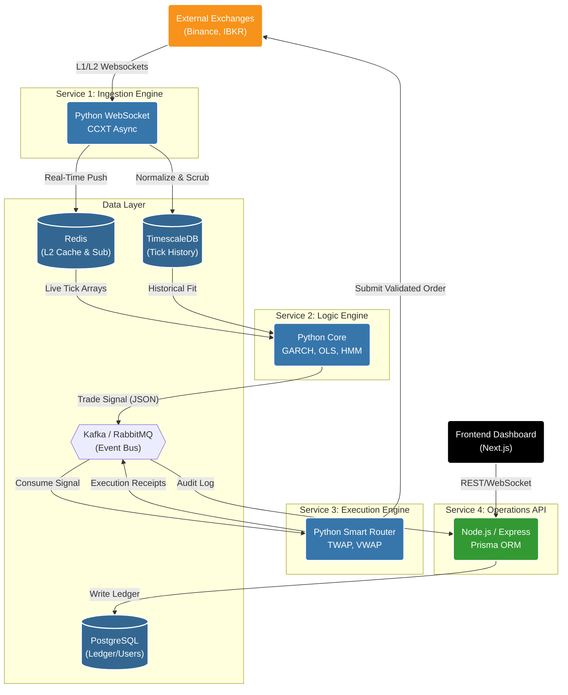

# Backend Architecture & Internal APIs

## 1. Objective
To define the robust, high-performance server-side architecture required to orchestrate data ingestion, execute mathematical models, manage the immutable audit ledger, and serve the Trading Desk Dashboard securely.

## 2. Microservices Methodology
A monolithic architecture is dangerous for algorithmic trading. If the frontend API serving the dashboard crashes due to excessive user queries, it must not affect the execution engine routing a live trade. The backend will be decoupled into independent, containerized services.

### A. The Ingestion Engine (Service 1)
*   **Role:** Solely responsible for maintaining WebSocket connections with external exchanges, normalizing incoming Level 1/Level 2 data, and persisting it to the Time-Series DB and In-Memory Cache.
*   **Resilience:** Designed to auto-restart instantly upon connection drops without affecting any other system component.

### B. The Quantitative Logic Engine (Service 2)
*   **Role:** The "Brain." It continuously streams data from the In-Memory cache, calculates the statistical models (GARCH, OLS, Cointegration), and generates raw JSON Trade Signals.
*   **Compute:** Requires high CPU and memory availability for matrix operations. It has no exposure to external network requests from the frontend.

### C. The Execution & Routing Engine (Service 3)
*   **Role:** The "Hands." Consumes Trade Signals, validates them against the dynamic VaR and Fat Finger limits, and routes them to the exchange APIs via TWAP/VWAP algorithms.
*   **Security:** This is the *only* service that possesses the encrypted private API execution keys for the brokerage accounts.

### D. The Operations API (Service 4)
*   **Role:** The web server that powers the Trading Desk Dashboard. It handles user authentication (JWT), RBAC validation, serves historical PnL queries from the PostgreSQL database, and broadcasts Tier 2 alert WebSockets to the frontend UI.
*   **Isolation:** If a massive historical backtest query bottlenecks this service, the core trading services (1, 2, and 3) remain 100% unaffected.

## 3. Inter-Service Communication

The decoupled services must communicate reliably and securely.
*   **Message Broker (Event Bus):** Kafka or RabbitMQ will act as the central nervous system.
    *   *Example:* The Logic Engine publishes a `Signal_Generated` event to the message queue. The Execution Engine subscribes to that queue, picks up the event, and acts on it. This guarantees no signals are dropped even if the Execution Engine restarts.
*   **Internal REST/gRPC APIs:** For synchronous requirements (e.g., the Operations API querying the Execution Engine to see if an order was filled before updating the UI).

## 4. The Immutable Ledger (Database Design)
The PostgreSQL database (managed by the Operations API) enforces the tracker requirements outlined in the Project Vision.
*   **`trades` Table:** Every order must include a strict `source_type` (`ALGO` vs. `MANUAL`) and an `author_id` (linking to the specific user or specific mathematical model ID). 
*   **`audit_logs` Table:** An append-only table recording every login, every manual override clicked, and every configuration parameter changed by an Admin. Records cannot be `UPDATE`d or `DELETE`d.

## 5. Security & Environment Management
*   **VPC Isolation:** The Ingestion, Logic, and Execution engines must reside in private subnets with no public inbound internet access attached.
*   **Secrets Management:** Hard-coding API keys is strictly prohibited. All exchange API keys, database credentials, and JWT secrets must be injected at runtime via a secure vault (e.g., AWS Secrets Manager or HashiCorp Vault).
