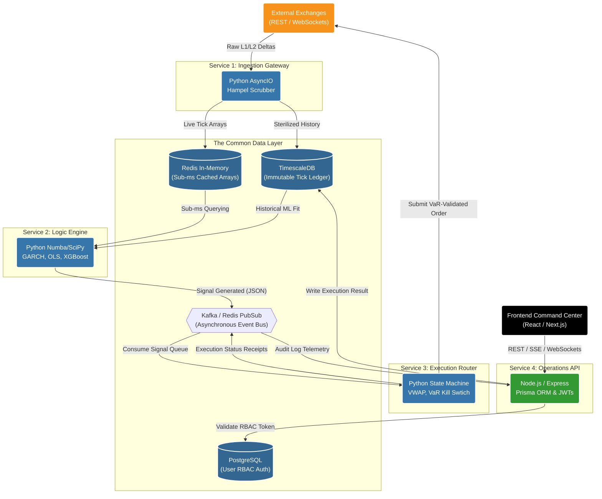

# Strategy 08: Backend Architecture & Containerization

## 1. The Operational Objective
To strictly define the heavily parallelized, high-performance server-side architecture required to orchestrate Point-in-Time data ingestion, compile Numba mathematical matrices, manage the cryptographic audit ledger, and serve the Frontend Command Center natively without single points of failure.

## 2. Microservices Orthogonality (The Golden Rule)
A monolithic backend architecture is mathematically lethal for quantitative trading. If the Node.js REST API serving the React dashboard crashes due to excessive user queries, it *cannot under any circumstances* affect the Python Execution Engine currently routing a live $\$500k$ VWAP slice. 

The backend is permanently decoupled into 4 absolutely independent, Dockerized microservices.

### A. The Ingestion Engine (Service 1)
*   **Role:** Solely responsible for maintaining ultra-low latency WebSocket connections with external exchanges (Binance, Kraken, IBKR). It ingests L1 ticks and L2 depth, chemically scrubs the payloads via the Numba Hampel filter (Model 14), and physically persists the arrays to `TimescaleDB` and `Redis`.
*   **Resilience:** Contains zero internal trading logic. Designed to auto-restart instantly upon structural WebSocket connection drops without affecting any downstream modeling components.

### B. The Quantitative Logic Engine (Service 2)
*   **Role:** The "Brain." It continuously streams localized, scrubbed arrays from the `Redis` cache. It calculates the heavy statistical linear matrices (GARCH, ADF Cointegration, Kalman Filters) and non-linear Artificial Intelligence Overlays (XGBoost).
*   **Compute/Isolation:** Requires maximum CPU multi-threading and RAM availability for linear algebra (NumPy/SciPy/Numba). It has zero exposure to external network requests or the public internet. It strictly outputs raw JSON `Signal_Authorized` payloads internally.

### C. The Execution & Routing Engine (Service 3)
*   **Role:** The "Hands." Consumes isolated Trade Signals from Service 2. It rigorously validates them against the dynamic Parametric VaR limit (Model 12), fractionalizes the size via the Kelly Criterion, assesses L2 OBI Toxicity (Model 15), and physically routes them to the APIs.
*   **Security:** This is the *only* physical service that possesses the decrypted private exchange API execution keys.

### D. The Operations REST API (Service 4)
*   **Role:** The Node.js web server that powers the React Trading Desk UI. It handles strict JWT user authentication, RBAC validation, serves historical PnL queries from `TimescaleDB`, and broadcasts asynchronous Server-Sent Events (SSE) to the frontend.
*   **Isolation:** If a massive 5-year historical backtest query completely bottlenecks the Node.js event loop, the core Python trading services (1, 2, and 3) remain 100% physically unaffected.

## 3. Inter-Service Communication

*   **The Message Broker (Event Bus):** Kafka or Redis Pub/Sub acts as the central asynchronous nervous system.
    *   *The Idempotent Guarantee:* The Logic Engine publishes a `Signal_Authorized` JSON event to the queue. Service 3 subscribes to that exact topic, picks up the event, and acts on it. This guarantees that zero systemic signals are dropped or duplicated if the Execution Engine restarts mid-flight.

## 4. The Immutable Ledger (Database Schema)
The system leverages `TimescaleDB` (a PostgreSQL extension) to enforce the tracker requirements outlined in the Project Vision.
*   **The `trades_ledger` Table:** Every order must mathematically include a strict `source_type` enum (`ALGO_MACRO`, `ALGO_HFT`, `MANUAL_OVERRIDE`) and a `source_origin_id` (linking to the specific user or specific mathematical model ID). 
*   **The `security_audit_logs` Table:** A cryptographically appended table recording every login, every 404/403 access violation, and every risk parameter changed by an Admin. Records cannot be `UPDATE`d or `DELETE`d by the database user role.

## 5. Security & VPC Isolation Management
*   **VPC Private Subnets:** The Ingestion, Logic, and Execution engines (Services 1, 2, 3) must reside strictly in private backend VPC subnets with absolutely $0$ public inbound internet access attached.
*   **Secrets Matrix:** Hard-coding API keys in GitHub is systematically prohibited. All exchange API keys, `TimescaleDB` credentials, and `JWT` token salts must be injected securely at runtime via an encrypted localized vault (e.g., HashiCorp Vault or AWS Secrets Manager).
