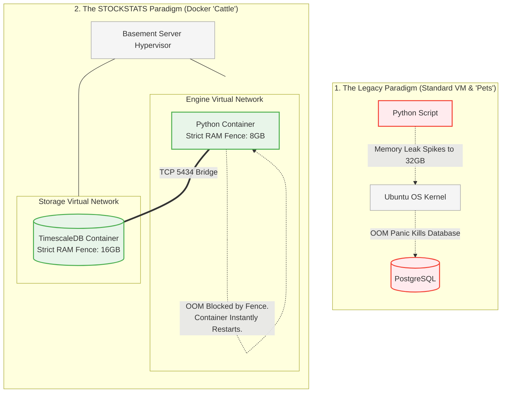

# Strategy 09: The Quantitative Technology Stack

## 1. The Operational Objective
To explicitly define the programming languages, LLVM compilers, frameworks, and infrastructure tooling utilized to build the STOCKSTATS quantitative engine. 

The stack fundamentally prioritizes matrix execution speed, mathematical precision, and scalable CI/CD development over standard web-app paradigms.

## 2. The Core Language Paradigms

### A. Python (The Quantitative Core)
Python is the undisputed institutional standard for mathematical modeling and continuous data science.
*   **Usage:** The Data Ingestion Gateway (Service 1), Quantitative Logic Engine (Service 2), and Execution Router (Service 3).
*   **The Matrix Acceleration (Numba JIT):** Pure Python is mathematically too slow for high-frequency tick scrubbing or real-time OBI volume profiling. We strictly utilize **Numba**, a Just-In-Time (JIT) compiler that translates Python functions directly into optimized machine code using the LLVM compiler library, achieving C-level iteration speeds.
*   **Key Dependencies:**
    *   `numpy` & `scipy`: High-performance vector operations and linear algebra manipulation for continuous time-series arrays.
    *   `statsmodels`: For OLS regression, Cointegration Eigenvalues (ADF tests), and Kalman Filter structural matrix updates.
    *   `arch`: For estimating GARCH(1,1) volatility models.
    *   `xgboost`: For the non-linear Machine Learning Meta-Labeling overlays.
    *   `ccxt` (Async): The unified crypto exchange REST/WebSocket library (handles cryptographic ECDSA signature signing for 100+ exchanges).

### B. TypeScript / Node.js (The Operations Layer)
TypeScript provides the strict architectural type safety required for operational UIs while maintaining the massive asynchronous ecosystem of the modern web.
*   **Usage:** The Operations REST API (Service 4) and the Frontend Command Center.
*   **Why TS over Python for Web:** Node.js/TypeScript handles asynchronous I/O (like pushing thousands of simultaneous WebSocket `ACKNOWLEDGED` updates to the frontend dashboard) structurally more efficiently than standard Python WSGI frameworks.

### C. The Mathematical Mandate: Why Python over Java / C++
It is a common reflexive impulse for enterprise software engineers to demand JVM-tuned Java or C++ for trading systems, citing execution speed. We have aggressively excluded Java and C++ from the STOCKSTATS architecture for three mathematically undeniable reasons:

1.  **The Sub-Millisecond Delusion:** STOCKSTATS is fundamentally a *Statistical Arbitrage* and *Mean Reversion* engine, not a pure High-Frequency Trading (HFT) nanosecond market-making engine. We generate edges measured in seconds/minutes, not microseconds. The $\approx 100$ microsecond execution advantage of a monolithic Java/C++ engine is mathematically neutralized the moment our payload hits the public internet and encounters the standard $20+$ millisecond API latency of global exchanges like Binance. We do not need nanosecond internal execution; we need millisecond execution, which Python easily achieves.
2.  **The LLVM Equalizer (`numba`):** The primary argument against Python is that the Global Interpreter Lock (GIL) and dynamic typing make array iteration unacceptably slow. We solve this not by changing languages, but by utilizing **Numba**. By wrapping our intensive mathematical functions (e.g., Hampel Filters, GARCH matrices) in `@njit`, we bypass the Python interpreter entirely. Numba uses the LLVM compiler library to translate our Python directly into optimized, C-level machine code just-in-time. We achieve Java speeds without writing Java boilerplate.
3.  **The R&D Friction (The Death of Java in Quant):** If a PhD quantitative researcher designs a new Copula dependency matrix, it can be tested in `pandas` and deployed to production in Python within 48 hours. Translating that same multidimensional matrix into Java requires massive boilerplate code, fractured library support, and mechanical engineering overhead that fundamentally destroys the strategy iteration cycle. Furthermore, **Phase 8 (ML Meta-Labeling)** mandates the use of `xgboost` gradient boosted trees. Python is the undisputed native language of global Machine Learning. Forcing an ML-driven quant desk into Java is architectural sabotage. We optimize for Time-to-Market and R&D velocity.

### D. The Mental Model Bridge (For Java/Tomcat/PostgreSQL Engineers)
Transitioning from a traditional Enterprise Java environment to an asynchronous Python Quantitative environment requires a shift in architectural perspective. However, your existing mental models of strictly typed OOP and relational databases apply perfectly here. Here is your direct 1-to-1 translation matrix:

*   **Tomcat / Spring Boot $\rightarrow$ FastAPI & Uvicorn:** You are used to Tomcat spinning up a thread-pool for incoming HTTP requests and Spring Boot managing the REST controllers. In Python, **Uvicorn** is your ASGI server (the Tomcat equivalent), and **FastAPI** is your routing framework (the Spring equivalent). FastAPI heavily utilizes Pydantic, providing the strict interface compliance you expect from Java POJOs.
*   **Java Threads / ExecutorService $\rightarrow$ Python `asyncio`:** Instead of managing raw OS threads and locks, Python manages I/O concurrency via the `asyncio` Event Loop. When a WebSocket waits for a binance tick, it `awaits`, yielding control back to the central loop (similar to Node.js) rather than blocking a physical CPU thread.
*   **JDBC / Hibernate (JPA) $\rightarrow$ `asyncpg` & `pandas`:** Instead of mapping rows to Java Objects via Hibernate ORM, we stream raw SQL tuples via the blazing fast `asyncpg` driver directly into memory-efficient `pandas.DataFrame` matrices. We do not use ORMs (like SQLAlchemy) in the core latency engine; ORM overhead destroys array speed.
*   **JVM Garbage Collection $\rightarrow$ Numba & Memory Pre-Allocation:** You are used to tuning the JVM to prevent GC pauses. In Python, we bypass the standard garbage collector for heavy math by using Numba to compile functions down to C, and we pre-allocate fixed-size Numpy arrays (e.g., `np.zeros(500)`) in memory to prevent allocations during live trading loops.
*   **PostgreSQL $\rightarrow$ TimescaleDB:** You already know Postgres. TimescaleDB **is** PostgreSQL. It strictly inherits all your existing knowledge (Roles, pg_hba.conf, WAL archiving). It simply adds a background C-extension that auto-partitions massive time-series tables into structural "Chunks" (Hypertables) behind the scenes, allowing you to `INSERT` millions of rows without degrading B-Tree index performance.

## 3. The Tech Stack Breakdown (Definitive Selections)

We have permanently eliminated ambiguity from the architectural blueprint. The following technologies are the final, non-negotiable selections for the STOCKSTATS engine.

### I. Frontend (The Command Center)
*   **Framework Selection: Next.js (React)** 
    *   *Why not Vue, Angular, or Vite?* Next.js provides unmatched Server-Side Rendering (SSR) capabilities which perfectly compliment the heavy initial JSON payloads required for initializing 500-period charting matrices. It also natively supports API routes, allowing us to build secure, server-side mid-tier proxies without spinning up a separate Node server.
*   **State Management: Zustand & React Query**
    *   *Why not Redux?* Redux requires massive boilerplate for a UI that fundamentally just acts as a passive surveillance radar. Zustand provides ultra-lightweight global state (JWT Roles), while React Query natively handles the aggressive polling and caching of the JSON feeds.
*   **Design Typography:** Tailwind CSS + shadcn/ui. (Strict dark-mode protocol to reduce optical fatigue during continuous monitoring).
*   **Charting Engine:** TradingView Lightweight Charts natively integrated via WebGL to prevent DOM locking when rendering 10,000+ localized GARCH ticks.

### II. Backend (The Microservices)
*   **The Math/Execution Node Selection: Python + FastAPI**
    *   *Why not Django or Flask?* Django is a heavy, synchronous monolith violently incompatible with High-Frequency WebSocket ingestion. Flask's async support is bolted-on. FastAPI was built from the ground up on `Starlette` and `uvicorn`, offering native asynchronous I/O and Pydantic data validation, which physically guarantees our JSON payloads have not drifted before hitting the Execution Router.
*   **The Operations Web-Tier: Next.js API Routes (TypeScript)**
    *   *Why not a separate Express server?* Consolidating the Role-Based JWT middleware and frontend routes into the singular Next.js monolith drastically reduces Docker overhead on the Basement Server while maintaining strict TypeScript interface parity between the frontend graphs and backend SQL queries.

### III. Data Storage & System Caching
*   **The Quantitative Ledger: TimescaleDB**
    *   *Why not MongoDB or AWS Timestream?* MongoDB is a NoSQL document store; statistical mathematics (like rolling variances and Cointegration) fundamentally demand relational, columnar arrays, which NoSQL mangles. TimescaleDB is a native PostgreSQL extension. It gives us the aggressive, high-velocity `INSERT` speeds required for tick data (via partitioning/hypertables) while preserving 100% standard SQL logic for the complex relational `immutable_execution_ledger`.
*   **The High-Frequency Cache: Redis**
    *   *Why not Memcached?* Memcached is fundamentally ephemeral. Redis offers persistence-to-disk capabilities, advanced data structures (like Sorted Sets for maintaining the exact top 100 L2 Order Book Imbalances), and native Pub/Sub.
*   **The Event Bus Selection: Redis Pub/Sub**
    *   *Why not Apache Kafka?* Kafka is an institutional titan, but deploying an internal ZooKeeper/Kafka cluster on our singular Basement Server requires $>8GB$ of dedicated RAM, creating an unacceptable localized hardware bottleneck. Redis Pub/Sub is incredibly lightweight, perfectly fulfilling the event-driven requirements of Phases 1-8. We will re-evaluate Kafka strictly during the Phase 9 AWS Migration.

## 4. DevOps, Automation, & Production Architecture (VMs vs. Docker)

For engineering teams accustomed to managing traditional "Standard VMs" (e.g., spinning up a Linux EC2 instance, logging in, and manually running `apt-get install python3 postgresql`), transitioning to a Dockerized Microservice architecture requires a fundamental paradigm shift. We must explicitly ban the installation of trading software directly onto the host OS Kernel for the following undeniable reasons:

### A. The "Pets vs. Cattle" Paradigm & Mathematical Reproducibility
*   **The Problem with Standard VMs (Pets):** Traditional VMs are manually cultivated over years. If a Python dependency breaks (`pip install` collision), or if the C-compiler version for NumPy drifts, the underlying quantitative math changes silently. An engineer might say, "*It works on my MacBook, but the VM throws a Hampel Filter calculus error.*"
*   **The Docker Solution (Cattle):** We deploy **Docker Containers**. A Dockerfile physically freezes the exact OS subset, the exact Python 3.11 binaries, and the exact C-compilers into an immutable disk image. If the algorithm executes correctly on a Developer's Macbook, we guarantee an identical, $100\%$ mathematically identical execution on the Basement Server, and later, the AWS Tokyo servers. The host VM (Proxmox/ESXi) acts *only* as a dumb hypervisor providing raw CPU/RAM.

### B. Hardware Protections (The OOM Guardrail)
*   **The Standard VM Risk:** In quantitative trading, manipulating 100,000-row `pandas.DataFrame` matrices creates massive memory spikes. If a memory leak occurs directly on a traditional VM, the Linux Kernel triggers an arbitrary Out-Of-Memory (OOM) panic, randomly killing critical processes (like the PostgreSQL database) and corrupting the entire trading server.
*   **The Docker Orchestrator Guardrail:** By orchestrating services via **Docker Compose** on the Basement Server, we construct physical walled gardens. We explicitly cap the `stockstats_python_math` container to $8\text{GB}$ of RAM, and the `stockstats_timescaledb` container to $16\text{GB}$. If the Python engine suffers a catastrophic memory leak, the orchestrator violently crashes *only* the Python container, instantly restarting it, leaving the TimescaleDB ledger perfectly secure. 

### C. Cryptographic Network Isolation 
*   **The Standard VM Risk:** Installing multiple services directly onto `localhost` or opening generic UFW ports makes tracing internal service communication incredibly difficult and insecure.
*   **The Docker Network Layer:** Using Docker allows us to physically build isolated virtual LANs inside the VM. The `Ingestion_Engine` and the `Execution_Router` can both talk to Redis natively, but they cannot talk to *each other* unless we explicitly draw the routing bridge. This Zero-Trust internal network dramatically limits systemic blast radiuses.

### D. The Path to the Cloud (Basement to AWS)
*   **Phases 1-8 (Local Basement Orchestration):** The system relies entirely on `docker-compose.yml`. All active capital deployment occurs on the local basement hardware to reduce monthly cloud overhead to $\$0$ while testing and calibrating the AI components over several months.
*   **Phase 9 (The Elastic Cloud Shift):** Had we built on a traditional Standard VM, migrating from a Basement Desktop to AWS Tokyo would require week-long data migrations and fragile OS re-installations. Because the entire framework is mathematically frozen inside Docker images, the migration to the Cloud is just an abstract copy-paste. We simply pipe our GitHub Actions CI/CD pipeline to target **AWS Elastic Container Service (ECS)** and RDS instead of the basement's `docker-compose`. 

### E. Continuous Integration / Continuous Deployment (CI/CD)
*   **GitHub Actions:** No human is legally permitted to SSH into the Production VM to execute a `git pull`. 
*   **The Deployment Gate:** Pushing code to the `main` branch automatically triggers a remote GitHub server to boot a virtual instance, download your 500-period Backtesting arrays, and mathematically run your new Python code against the historical 2021 Bitcoin crash data. Only if the automated tests prove the algorithmic edge remains intact ($E(R)>0$) allows the CI/CD pipeline to push the frozen Docker Image directly into the physical Basement Server.
