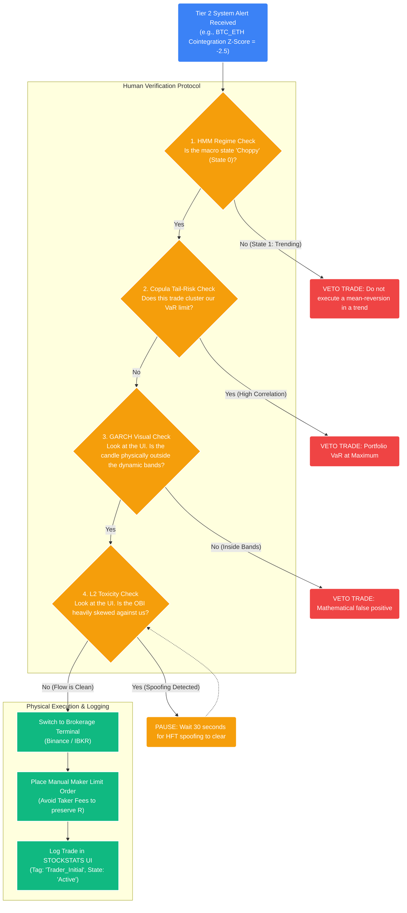

# Strategy 10: The Phase 1 Manual Trading Blueprint

## 1. The Operational Objective
As defined in the [00_roadmap.md](00_roadmap.md), STOCKSTATS will not launch as a fully autonomous black-box. **Phase 1** is the "Human-in-the-Loop" epoch. 

During this initial startup phase, the Quantitative Logic Engine acts entirely as a highly advanced institutional radar. It calculates complex linear algebra, screens for structural anomalies, and generates Tier 2 Webhook alerts. **However, the human trader acts as the physical execution engine.**

This document defines exactly how the human trader is required to interact with the raw mathematical outputs to execute trades safely, ensuring we accurately track the System Quality Number (SQN) while actively building the dataset required to train the Phase 8 Machine Learning (XGBoost) models.

## 2. The Pilot-in-Command Workflow
When the mathematical engine detects a structural advantage (Expectancy $E(R) > 0$), it broadcasts a JSON telemetry payload to the designated Slack/Discord channel and illuminates the Frontend Command Center.

The human trader must follow a strict, unyielding checklist before manually logging into the brokerage (e.g., Interactive Brokers or Binance) to deploy capital.

## 3. Step-by-Step Tactical Interaction

### Step 1: Ingesting the Alert (The $1R$ Target)
The system alerts the trader via the Notification Engine. 
_Example:_ The system flags a GARCH Mean Reversion opportunity on `SOL/USD`. The baseline math determines the current price ($145) is statistically oversold relative to the dynamic baseline ($152). 
*   **Action:** The trader immediately navigates exclusively to the **Execution Terminal** module on the STOCKSTATS frontend.

### Step 2: Visual Verification (The Optical Veto)
The trader looks at the center Lightweight Chart pane.
*   **What they see:** The raw L1 ticks (already scrubbed of glitches by the Hampel Filter), overlaid with the real-time, dynamic GARCH $\pm 2\sigma$ bands.
*   **The Mandate:** The human trader must physically verify that the asset has breached the lower band. If the asset is simply coasting in the middle of the channel, there is a mismatch between the logic engine and the data stream. The trader hits the **[VETO: Data Mismatch]** button, instantly archiving the false positive to train future models.

### Step 3: Assessing Macro Risk (Regime & Copulas)
Before executing, the trader checks the Left Sidebar telemetry.
*   **HMM Regime State:** If the model signals a "Mean Reversion (Buy the Dip)" trade, but the HMM indicator explicitly reads `State: 1 (Aggressive Downtrend)`, the trader is mathematically barred from executing. (Catching a falling knife).
*   **Copula Heatmap:** The system alerts that we are already Long `BTC`, `ETH`, and `AVAX`. The heatmap flashes Orange, warning that adding a `SOL` Long position introduces massive systemic tail-risk. The trader is forced to reject the trade or manually decrease the Fractional Kelly position size from $0.50f^*$ to $0.10f^*$.

### Step 4: Surviving the Microstructure (Execution Delay)
The trader has confirmed the math and authorized the risk. They are ready to act.
*   **The Pre-Flight Check:** They look at the **Order Book Toxicity (OBI)** dial in the UI. 
*   **The Scenario:** The dial reads $-0.85$ (Extreme Sell Pressure). The institutional HFTs are saturating the ask, trying to trap retail logic.
*   **The Action:** The trader *does not execute*. They wait. Phase 1 is about discipline. They watch the OBI dial. After 45 seconds, the HFT algorithms pull their spoof walls. The OBI returns to $+0.12$. The flow is clean.

### Step 5: Manual Slicing & Deployment (The Execution)
Because the automated Smart Order Router (VWAP) is disabled in Phase 1, the human must mimic it manually.
*   **The Action:** Instead of firing a $\$100,000$ market order (destroying the $R$ expectancy via high Taker fees and slippage), the trader switches to their Binance/IBKR screen.
*   **The Slice:** They manually place 5 sequential $\$20,000$ *Maker Limit* orders at the bid over the next 3 minutes, mimicking a basic TWAP algorithm. This earns the exchange rebate and preserves the mathematical edge.

## 4. The Critical Post-Trade Mandate: The Ledger
As soon as the physical exchange fills the manual limit orders, the trader's most important job begins. 

In Phase 1, the system does not automatically know that a physical trade occurred because the Execution Router is locked. The trader must manually append the record to the Operations Dashboard UI.

*   **The UI Input:** The trader clicks **[Log Manual Execution]** on the dashboard.
*   **The Data Entered:**
    *   *System Signal ID:* (Links the manually executed trade to the exact mathematical signal the backend generated).
    *   *Actual Fill Price:* (Logs the real slippage experienced by the human).
    *   *Actual Trade Size:* (How much of the $f^*$ allowance was used).
*   **Why This is Mandatory:** This physical logging creates the "Ground Truth" labels. 6 months from now, when we build the **XGBoost Machine Learning Overlays (Model 10)** in Phase 8, the ML models will analyze this exact database. It will learn: *"When the math said BUY, and the Copula was RED, the human trader took a massive loss."* This data is what allows the system to eventually become highly autonomous.

## 5. Summary of Phase 1 Rules
1.  **The 50-Asset Universe Cap:** The system will only poll, calculate, and alert on a maximum of 50 pre-selected assets. Attempting to scan the entire market in Phase 1 will inevitably overwhelm both the API Rate Limits and the human trader's cognitive execution bandwidth.
2.  **Trust the Math, Validate the Data:** Do not guess market direction. Only execute when the system generates a signal, but always visually verify the chart to ensure the data stream isn't lagging.
3.  **Respect the HMM Regime:** Never execute a mean-reverting strategy during a hard HMM trend state.
4.  **Veto Toxic Flow:** If the OBI dial is red, take your hands off the keyboard. Wait for the HFT engines to turn off.
5.  **Log Everything:** A profitable trade that isn't logged in the Immutable PostgreSQL Ledger is useless to the quantitative system's long-term evolution.
6.  **Isolate Shadow Executions (Strategy 14):** When an algorithm is in the forward-testing incubator, you must explicitly flag all manual mock executions as `SHADOW` in the UI to divert the row to the `shadow_execution_ledger`. Mingling paper-trading PnL with physical Ground Truth mathematically corrupts the Phase 8 Machine Learning dataset.
