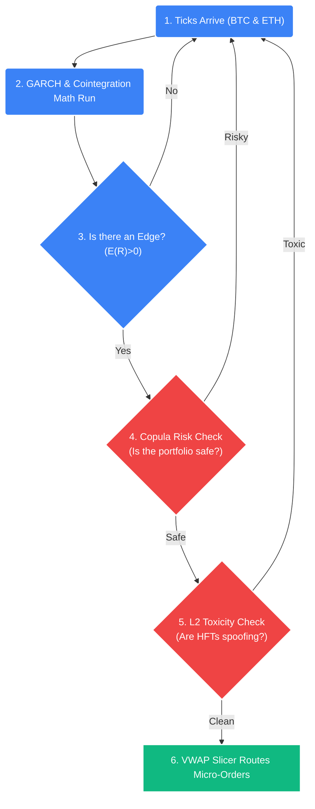

# Strategy 13: Technical Onboarding & Orientation Manual

## Welcome to STOCKSTATS
This document is mandatory reading for all engineers, quants, and operators joining the STOCKSTATS proprietary trading desk. 

**Our Objective:** We are not building a generic "crypto trading bot." We are building a mathematically rigorous, structurally defended Statistical Arbitrage and Volatility Engine. This document will bridge your existing software engineering skills with the specialized quantitative finance concepts ($E(R)>0$, Microstructure, Numba, Copulas) that power our architecture.

---

## Module 1: The Core Philosophy - Surviving the Microstructure

### 1.1 The Market is Hostile
If you build a simple script that says `IF Price > Moving Average THEN Buy`, you will lose all deployed capital within 72 hours. Why?
1.  **Adverse Selection:** The "Market" is actually composed of institutional High-Frequency Trading (HFT) algorithms operating in microseconds. If you send a "Market Order," they see it coming and instantly pull their liquidity, filling you at a terrible price (Slippage).
2.  **Trading Costs (Friction):** Every trade costs money. You pay exchange fees (Taker Fees) and you pay the Bid/Ask spread. 

### 1.2 The Minimum Viable Edge ($E(R) > 0$)
Every algorithm we write must mathematically prove it has a **Positive Expected Value**. This is the absolute, non-negotiable "Law of Gravity" in quantitative finance. If an algorithm cannot prove $E(R)>0$, it is gambling, not trading.
*   **The Baseline Math:** $E(R) = (Win Rate \times Average Win) - (Loss Rate \times Average Loss) - Friction$
*   Retail traders focus on *Win Rate*. Institutional quants focus on *Expectancy*. A 35% win rate strategy is wildly profitable if the average win is 4x the average loss.

### 1.3 Why Basic $E(R)$ Fails (And How We Fix It)
The formula above is a blunt instrument. It evaluates a strategy in a theoretical vacuum. Here is why amateur quant funds blow up using only that formula, and how STOCKSTATS is structurally designed to survive:

#### A. The Blind Spot of Variance (The "Smoothness" Problem)
*   **The Problem:** Strategy A makes $+0.2R$ on every trade. Strategy B makes $+10R$ once, and loses $-0.5R$ twenty times. Basic $E(R)$ says they are identical. In reality, Strategy B's variance will trigger a margin call before the big win ever happens.
*   **Our Solution (Model 05 - SQN):** We don't just calculate $E(R)$; we calculate the **[System Quality Number (SQN)](../models/05_expectancy_and_sqn.md)**, which penalizes "bumpy" equity curves by dividing the Expected Value by the Standard Deviation of the results.

#### B. The Blind Spot of Averages (The Black Swan Problem)
*   **The Problem:** The formula relies on "Average Loss." Financial markets possess "Fat Tails." During a flash crash, stop-losses are skipped due to zero liquidity. Your "Average Loss" suddenly becomes a "Catastrophic Loss," instantly turning your $E(R)$ deeply negative.
*   **Our Solution (Models 06 & 12 - Copulas & VaR):** We assume the "Average Loss" lies to us. We use **[Clayton Copulas](../models/06_copula_kelly_sizing.md)** to mathematically model the probability of an extreme correlation crash (e.g., BTC and ETH both dropping 15% simultaneously) and override execution before the event hits via our **[VaR Kill Switch](../models/12_value_at_risk_var.md)**.

#### C. The Blind Spot of Time (Capital Velocity)
*   **The Problem:** Strategy A has an $E(R)$ of $+1.0R$ per trade, but only trades once a month. Strategy B has an $E(R)$ of $+0.1R$ per trade, but trades 50 times a day. If you only look at the basic $E(R)$ *per trade*, Strategy A looks ten times better.
*   **Our Solution (Model 06 - Kelly Sizing):** We evaluate edges based on **Compound Annual Growth Rate (CAGR)**, not just per-trade $E(R)$. Strategy B is vastly superior because mathematically, turning capital over 50 times a day at $+0.1R$ compoundingly generates massive alpha over a month compared to a single $+1.0R$ event. We use the **[Fractional Kelly Criterion](../models/06_copula_kelly_sizing.md)** to mathematically size these high-velocity trades to maximize that compound growth without risking statistical ruin.

---

## Module 2: The Mathematical Models (The Brains)
You do not need a PhD in statistics to write the code, but you must understand *why* the code exists. We trade **Structural Inefficiencies**, not directional bets.

### 2.1 Volatility & GARCH (Model 01)
*   **The Concept:** Standard indicators like Bollinger Bands are fundamentally flawed because they assume market volatility is static. It is not. Volatility "clusters" (calm periods are followed by violent periods).
*   **Our Solution:** We use **[GARCH(1,1)](../models/01_garch_volatility.md)**. It analyzes the last 500 physical trades (ticks) and mathematically predicts what the volatility will be *in the next 5 minutes*. We only buy when the price physically breaks outside these dynamic, self-adjusting bands.

### 2.2 Statistical Arbitrage & Cointegration (Model 02)
*   **The Concept:** "Pairs Trading." Instead of guessing if Bitcoin (BTC) will go up or down, we look at the relationship between BTC and Ethereum (ETH). 
*   **The Math:** Historically, these two assets move together. If BTC suddenly shoots up but ETH stays flat, the "Spread" between them has widened. 
*   **Our Solution:** We calculate a **[Z-Score via Cointegration](../models/02_cointegration_arb.md)** of that spread. If the Z-Score hits $+2.5$, we mathematically know the spread is broken. We Short BTC and Buy ETH simultaneously. We don't care if the whole market crashes; we only care that the *relationship* returns back to zero.

### 2.3 The Visual Flow of a Trade

---

## Module 3: The Technology Stack (Why We Chose It)

To execute these math models, our code must be unbreakably fast and strictly decoupled.

### 3.1 Python + Numba (The Quant Engine)
*   **Why Python?** It has the best data science libraries (`numpy`, `statsmodels`, `xgboost`).
*   **The Problem:** Pure Python is too slow for processing 10,000 incoming trades per second.
*   **The Solution (Numba):** We use the `@njit` decorator on our heavy math loops. This literally compiles the Python code into C-level machine code just-in-time, making it 100x faster. 

### 3.2 The Dual Database Architecture (Crucial)
You will see two databases in our Docker stack. They never mix.
1.  **TimescaleDB (PostgreSQL):** The permanent SSD ledger. It stores billions of historical ticks. We use this strictly for **Backtesting** and training **Machine Learning** models. It is too slow for live trading.
2.  **Redis (The RAM Cache):** Sub-millisecond memory. When the Python engine needs to know the order book depth *right now* to execute a trade, it reads from Redis. Redis only remembers the last few minutes; TimescaleDB remembers everything forever.

### 3.3 The Pragmantic Command Center (Grafana -> Next.js)
Because we are a bootstrapped startup trading our own retirement capital, we do not waste 100+ hours building a glamorous bespoke React UI before taking our first physical trade. 
*   **Phase 1 (Day 1):** We use **Grafana** natively hooked into TimescaleDB. It visually plots our math (e.g., GARCH bands) allowing the founder to manually authorize or veto executions via physical brokerage accounts.
*   **Phase 5 (The Future):** Only after proving the mathematical edge ($E(R)>0$) with real money will we build the custom **Next.js (React/TypeScript)** Operations Dashboard to manage automated Smart Order Routing.

---

## Module 4: Execution & Risk Management (The Shields)

Making money is secondary. **Not losing capital to bugs or flash crashes is our primary directive.**

### 4.1 The VWAP Slicer ([Model 04](../models/04_vwap_liquidity.md))
Even though we are trading smaller personal capital (e.g., a $\$2,000$ position), we **never** send a $\$2k$ market order. Market orders instantly surrender edge via the Bid/Ask spread and Taker fees.
*   **Our Protocol (Manual Phase 1):** The human founder manually mimics the VWAP slicer. A $\$2,000$ block is mentally sliced into five $\$400$ limit micro-orders deployed over 3 minutes.
*   **Our Protocol (Automated Phase 5+):** The Python Execution Router autonomously slices large parent orders into micro-fractions to completely hide our structural footprint from predatory HFTs.

### 4.2 The UUID State Machine ([Model 13](../models/13_state_machine_reconciliation.md))
*   "Zombie Orders" destroy hedge funds. If we send an order, and my internet drops, did the order fill? Do we send it again?
*   **Our Protocol:** Every order is tagged with a cryptographic `clientOid` (UUID). The system operates a strict state machine (`PENDING` -> `FILLED`). If the API drops, our "Interrogator" loop aggressively pings the exchange using that exact UUID to find out exactly what happened before authorizing any new capital.

### 4.3 Value at Risk (VaR) Kill Switch ([Model 12](../models/12_value_at_risk_var.md))
If a Black Swan event occurs (e.g., an unexpected global crisis), mathematical correlations go to $1.0$. Everything crashes together.
*   **Our Protocol:** The master VaR algorithm constantly calculates our total portfolio risk. If it detects a structural breach (drawdown $> 5\%$), it physically severs our API connections to the exchange, cancels all resting orders, and alerts the team via Slack.

---

---

## Module 5: The Infrastructure Evolution (Phase 9)

As a new engineer on this desk, you must understand our explicit hardware deployment strategy. We are not a venture-backed startup burning $\$10,000/$mo on AWS before we have a verified mathematical edge.

### 5.1 The Basement Server (Phases 1-8)
You will be deploying all code, including the Live Production Engine, physically to the team's internal **Basement Server**.
*   **Why?** It reduces cloud expenses to zero. More importantly, it allows us unrestricted, raw access to the TimescaleDB ledger and Linux system logs during the absolute most dangerous months of the active deployment—when the autonomous Smart Order Router is taking its first live trades.
*   **Safety via Port Isolation:** Even though DEV, STAGING, and PROD sit on the exact same CPU, they are rigidly isolated via Docker Overlay Networks. The Production container operates headlessly and blindly to the Dev container.

### 5.2 The Cloud Migration Mandate (Phase 9)
Once the engine proves a sustained $E(R)>0$ compound growth rate across months of automated market cycles on the Basement Server, we execute **Phase 9: The Cloud Migration**.
*   **The Docker Contract:** This is why you **must build your Docker images to be completely hardware-agnostic**. The exact same `stockstats-prod` Docker image that runs in the basement today must lift and shift instantly to an **AWS EC2 Virtual Private Cloud (VPC)** tomorrow without a single line of Python being rewritten.
*   **Latency Arbitrage:** We do not move to AWS for "scale." We move to AWS for **Latency Arbitrage**. We will physically rent an AWS Linux Server in Tokyo (`ap-northeast-1`), physically co-located on the same internet backbone as the Binance Matching Engine. This drops our API ping latency from $40$ milliseconds (domestic basement) to $<5$ milliseconds, allowing us to actively front-run predatory HFT algorithms.

---

## Conclusion & Next Steps

We are building a machine that expects the environment to be actively hostile. 
1.  **We clean the data ([Hampel Filters](../models/14_data_scrubbing_hampel.md)):** We mathematically scrub out "rogue" exchange ticks caused by API errors so our models aren't triggered by fake data.
2.  **We prove the math ([Cointegration](../models/02_cointegration_arb.md)):** We don't guess direction. We wait for the statistical spread between two highly correlated assets to break.
3.  **We test the risk ([Copulas](../models/06_copula_kelly_sizing.md)):** Before executing that edge, we scan the entire portfolio for hidden correlation traps.
4.  **We hide the execution ([VWAP Slicers](../models/04_vwap_liquidity.md)):** When we deploy capital, we slice large orders into tiny micro-fractions to hide our footprint.

You are now conceptually calibrated to the STOCKSTATS architecture. Your immediate next step is to review `task.md` and the **[Sprint 1 Implementation Plan](12_execution_sprints_and_tickets.md)**, where we begin physically scaffolding the TimescaleDB and Redis pipelines.
